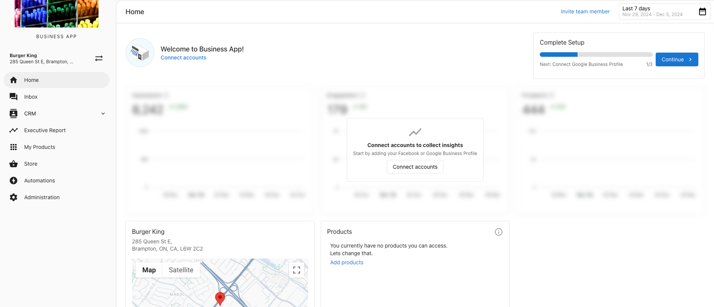

## What is the Get Started Page?

The **Get Started** page streamlines onboarding for new Business App users, ensuring they can quickly access key features that drive engagement and value.

## How to Access It

The Get Started Page appears in the **Home** tab as a card labeled "Complete Setup" if setup steps are incomplete. Once all steps are complete, the page disappears.

## Features and Benefits

- **Personalized Onboarding:** Each user is guided through essential setup tasks based on active products and features.
- **Dynamic Call-to-Actions:**
  - Connect a Google Business Profile to respond to reviews and sync data.
  - Install the AI-powered web chat widget to capture leads and manage them in Inbox.
  - Import customers to streamline operations and maximize review collection.
  - Register for SMS to enable text communication with customers.
- **Customer Journey Section:** Maps out how businesses attract and retain customers, providing actionable strategies for every stage of the journey.

## Why it Matters

By helping users complete initial setup, the page ensures they recognize the platform's value quickly. This leads to higher engagement, better retention, and increased likelihood of converting free users into paying customers.

## Configurability

Partners can enable or disable this page in Partner Center:
- Go to Administration > Customize Business App > Pages > Get Started.
- Uncheck the box to remove the page for all users.
- Modify access to the "Get Started" tab in User Permissions for specific clients.

**Note:** Business App users will not be able to navigate to the "Get-Started Page" in the UI once the set-up has been completed. If they are on the home page, they can access the **Get Started page** by adding **/get-started** after the home in the URL.