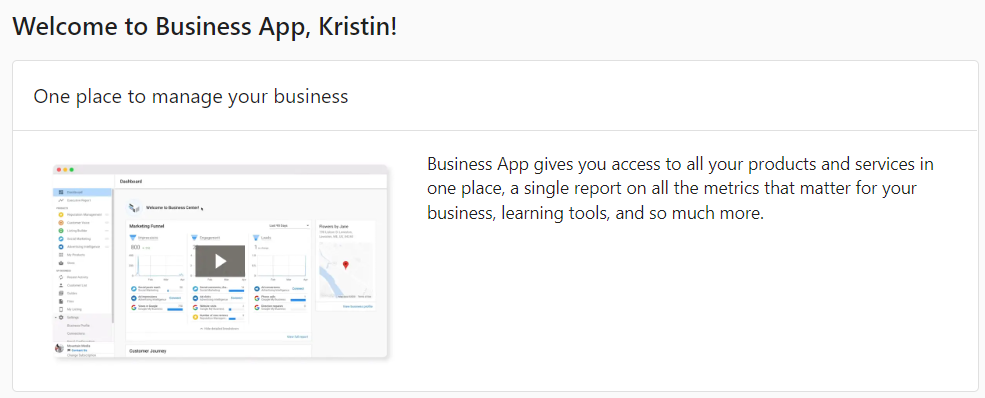

If a prospect or client has a great onboarding experience, that gives them an understanding of the value they can get and they will want to see more.

When a prospect enters their Business App for the first time, it is important that they don't feel overwhelmed and can quickly understand what they are looking at. Onboarding tools such as the walkthrough video help make a better experience and prospects are more likely to become paying clients.

A complete walkthrough video is available in your client-facing app, Business App, as an onboarding tool. When your prospects or clients enter their app for the first time, they will be prompted to watch the walkthrough video. The video shows them:

- Their app's dashboard features include the marketing funnel, business profile, and customer journey.
- A walkthrough of connecting their Google Business Profile, Google Analytics, and Facebook accounts to the app.
- A brief introduction of each product (Reputation Management, Local SEO, Social Marketing, Website E-Commerce, Customer Voice, and Advertising Intelligence).
- An overview of the Executive Report.

If you'd like to see the video, see this [resource article](/business-app/resources/business-app-videos). The first video in this article is what will appear in your clients' Business App. You can also download and use either video as you wish.