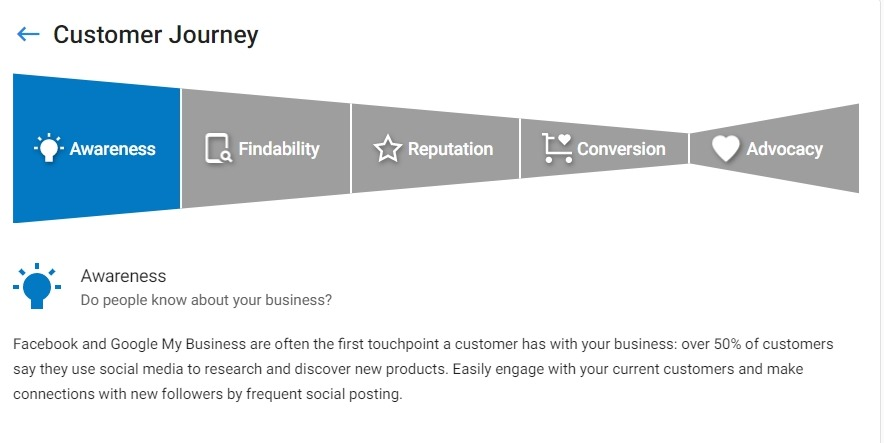

How do local businesses attract new customers? The Customer Journey panel on the Business App Get Started page represents the key stages that people go through to become your clients' customers. It is intended to help your clients understand each stage and to provide tactics to improve their current and prospective customers' experience at each stage of the process.

The Customer Journey is composed of 5 steps, explained in detail below. When users enter your client-facing app, they will see the introductory frame explaining the Customer Journey. Clicking **Get started** will walk a user through each stage. Users can also click on each stage individually to view more information.

Each section contains a key workflow that your clients can do to improve their customer journey. If there is an applicable product activated on the account, there will be a call to action where they can immediately take steps to improve that specific stage of the customer journey.

## Awareness

The first step in the Customer Journey concerns what your client can do to increase their audience within their local market. At this step, we recommend that users maintain an active presence and connect with their current and potential audiences on social media.

Call to action: Users with an active Social Marketing product can click **Make a post** to launch the [Social Marketing composer](/business-app/social-marketing/social-marketing-composer).

## Findability

Potential customers may be aware of a business, but if they can't find consistent and accurate information about that business online, they're less likely to become customers. This step recommends that your clients keep track of their online listings and business information, like hours of operation, address, and contact information, and ensure that the information is up to date wherever it's found.

Call to action: Users with an active Reputation Management product can click **Where am I found today?** to view and verify the accuracy of their current business listings across the web. Alternatively, users can click **Update my business information** to edit their location, hours of operation, and contact information in the Business App.

## Reputation

Potential customers frequently use online reviews to guide their purchase decisions, particularly when deciding among competing businesses. This step recommends that your clients monitor and respond to reviews frequently in order to rank above their competitors in online search and improve their ratings online.

Call to action: Users with an active Reputation Management product can click **Respond to my reviews** to [view and respond to their most recent reviews](/business-app/reputation-management/responding-to-reviews) on sites like Facebook and Google.

## Conversion

Having an informative and up-to-date website is crucial for helping customers find local businesses and learn more about their products and services. When people can easily find, contact, and [buy from a business online](/business-app/ecommerce/about-ecommerce), they're far more likely to become customers. This step recommends that your client edit and update their existing website to reflect their current offerings and provide relevant information to their customers.

Call to action: Users with an active Citation Builder product can click **Edit my website** to create or update their current My Listing page with relevant business information.

## Advocacy

A local business' best advocates are its happy customers. This step recommends that your clients reach out to previous customers for reviews to improve their overall star rating on popular review sites and help inform the purchase decisions of other potential customers in their local market.

Call to action: Users with an active Customer Voice product can click **Email my customers** to create a request for reviews that they can send to past customers.