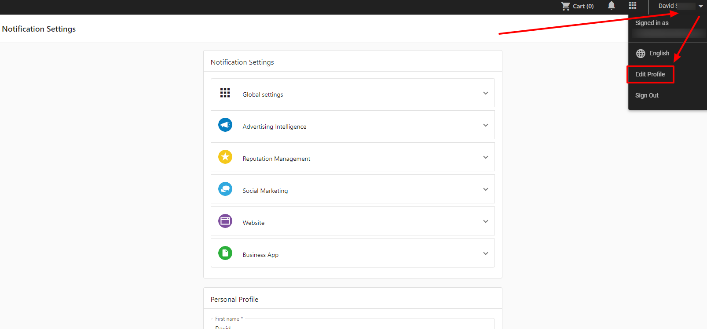
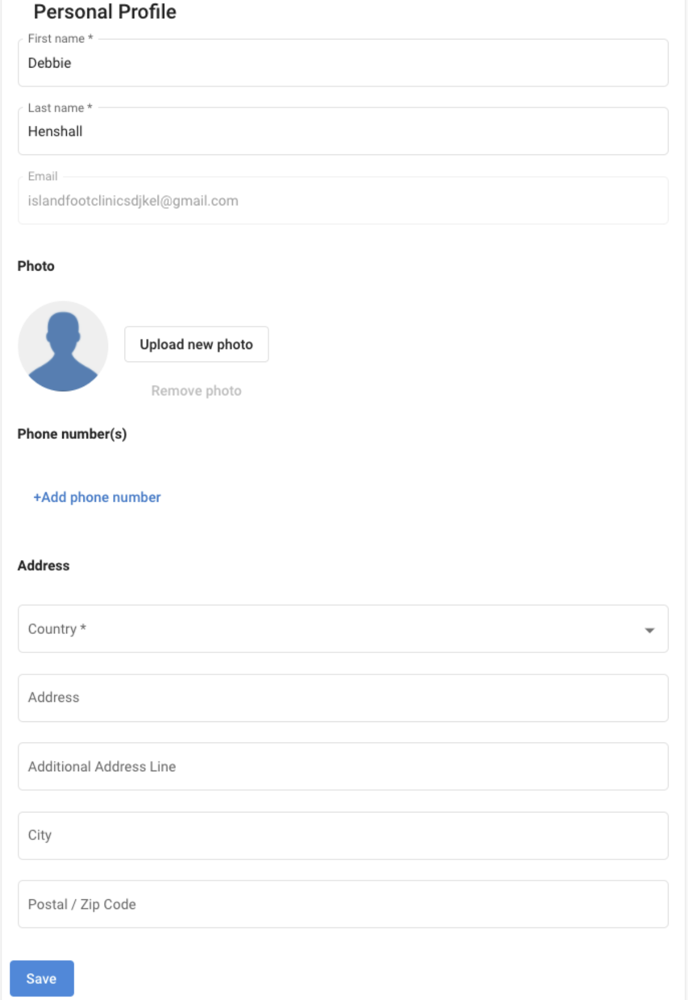
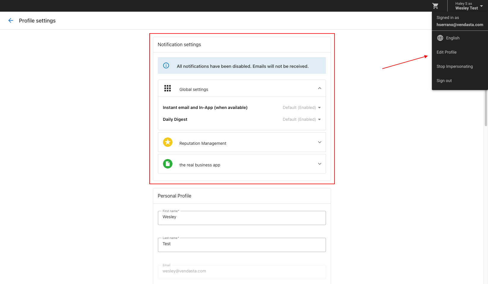

The User profile allows your clients to edit their notification settings, update their personal information, and reset their password within Business App.

Your clients can manage their user profile by clicking on the dropdown next to their name in the top right corner of Business App and then clicking **Edit Profile**.

With the user profile page, empower your clients to resolve some simple issues on their own (example: password reset) rather than waiting impatiently for you to respond to them via emails or phone calls. This page is required to grant users the "Right to Access" and "Right to Rectification" under the General Data Protection Regulation (GDPR).

Here are a few of the features that are included in the user profile page that will excite your clients who are end-users of Business App.

- Clients can view and edit their Personal Profile details which includes:
  - First and Last Name
  - Location address
  - Add a phone number
- Change their password
- Edit their notification settings for the account they're viewing
- Set a profile photo
- Changes made to the profile are reflected in Partner Center, and Task Manager

### How can clients set this up?

Your clients can easily set up their profile by going through the following steps:

- Log in to Business App.
- Select the drop-down arrow of their name at the top right corner.
- Click on **Edit Profile.**

### Editing Notification Preferences

The Vendasta Platform can notify your clients about a variety of events that they care about, triggered by both Business App and active products.

Clients can be notified by email, in-app notification, or a global announcement banner. You can configure what default notifications you want your clients to have when they are created as a new user in your platform, and your clients can adjust these settings or unsubscribe.

Here are resources to help you manage user notifications. These are SMB/client notifications only, and not notifications sent from Partner Center.

- [User Notification Settings](/business-app/user-notification-settings)
- [Examples of Business App email notifications](/business-app/business-app-email-notifications)
- [How to add a notification banner in Business App for all users](/business-app/notification-banner)