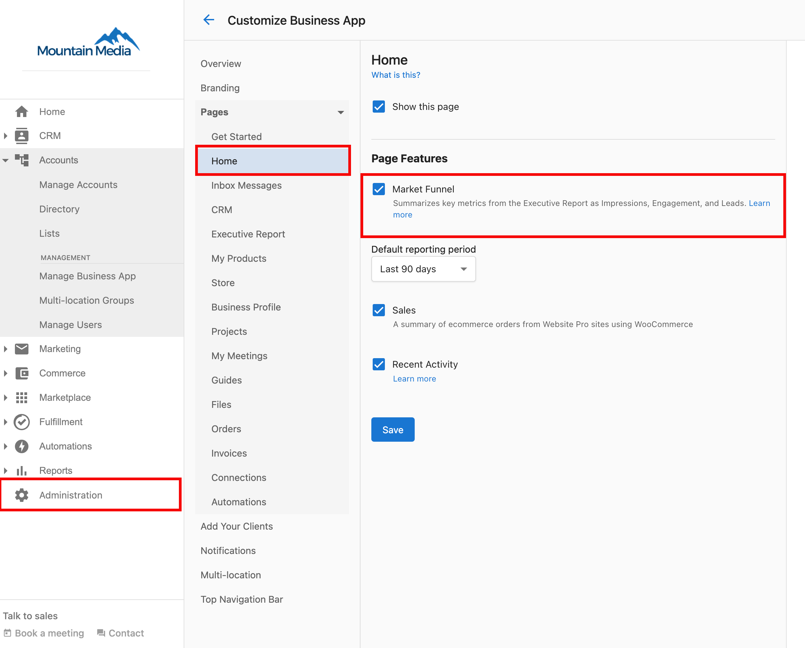

# Can I disable the Marketing Funnel?

You can disable the Marketing Funnel by following these steps:

1. Go to **Partner Center > Administration > Customize Business App**
2. Under **Pages > Home >** Uncheck **Market Funnel.**
3. Click **Save.**

