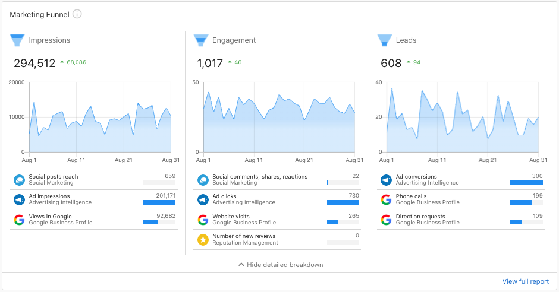

# Marketing Funnel – Overview

**What is the Marketing Funnel?**

The **Marketing Funnel** rolls up key metrics from the Executive Report into Impressions, Engagement, and Leads – helping your clients see how their marketing efforts are contributing to increased brand awareness and more customers.

The **Marketing Funnel** in Business App enables users to see how their marketing efforts perform. It is divided into 3 distinct sections:

- **Impressions:** The number of views of online content received.
- **Engagement:** The number of interactions with a business' online content.
- **Leads:** The number of interactions from people interested in a business' online content.

Within each section, you can find important statistics that drive Marketing Funnel. These include statistics such as Google Business Profile views, social post comments, ad clicks, and the number of new reviews.