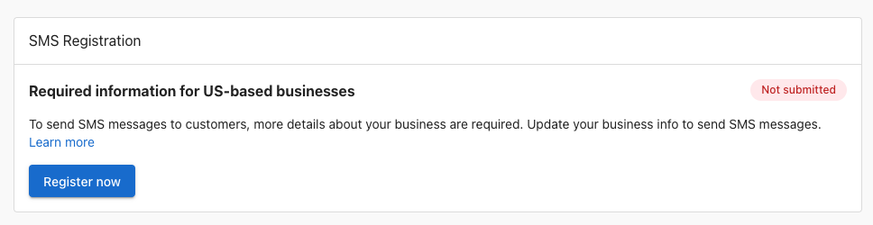

To prevent spam and other widespread SMS abuse, phone carriers in the United States now require businesses to register their phone numbers before sending SMS messages to customers (A2P 10DLC).

For US-based businesses to use Inbox SMS messaging in Inbox Pro, they are now required to register their business.

## How to register

To register a US-based business, a business can go to Business App > Administration > Inbox Settings to see a new registration card. Click "register now" to view the form.

Fill out the form completely, and then click "Submit information". You can also save your progress if you are unsure of some fields and return to complete the registration later.

## FAQ

**Q: How long does registration take?**

A: Once the form has been submitted, registration through third-party verification can take anywhere from one week, up to one month. A third-party agency is being used by telecom carriers in the United States to verify business registration data with government databases.

**Q: How can I ensure my application is approved?**

A: The most common reason for a business's application being rejected is because the information entered in the form does not match the information the IRS has for the business, associated with the EIN / Tax ID. Make sure the business information submitted matches exactly the same information associated with the EIN.

**Q: How does a business find their business registration number a.k.a. EIN / Tax ID?**

A: An EIN is a nine-digit number the IRS uses to identify a business for tax purposes, much like a Social Security number identifies an individual business. In the US, the Internal Revenue Service (IRS) issues a CP 575 EIN Confirmation Letter to confirm the unique Employer Identification Number (EIN) issued to a new business. The EIN provided in a CP 575 letter is required to file your company's taxes, open a business bank account, and apply for a business credit card, loan, or payroll processing. If a business does not know their EIN, they can apply for an EIN by submitting IRS Form SS-4 online.

**Q: Can sole-proprietor businesses without an EIN register for SMS?**

A: Not at this time. We are investigating supporting this in the future, for both US- and Canada-based businesses.

**Q: The business has already registered through the Customer Voice app. Do they need to register again?**

A: Yes, for now. In the future, we will be automatically registering businesses for both products when they fill out the form the first time. Right now, you will need to submit the form a second time, but you will see your data that was previously entered is saved for the second submission.

**Q: The business is located outside of the United States. Do they need to register?**

A: Registration is strictly for businesses that wish to send messages to US numbers, through US telecom carriers. Some businesses may be located outside of the United States, but wish to send SMS messages to US numbers. This is not possible currently, but will be in the future.

**Q: I don't see the registration option in Inbox?**

A: Registration is only available for US-based businesses, with Inbox Pro product active. Ensure the account has an address located in the United States.