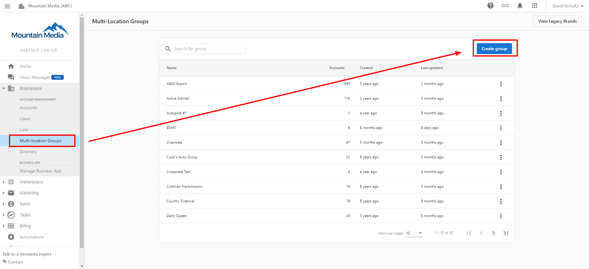
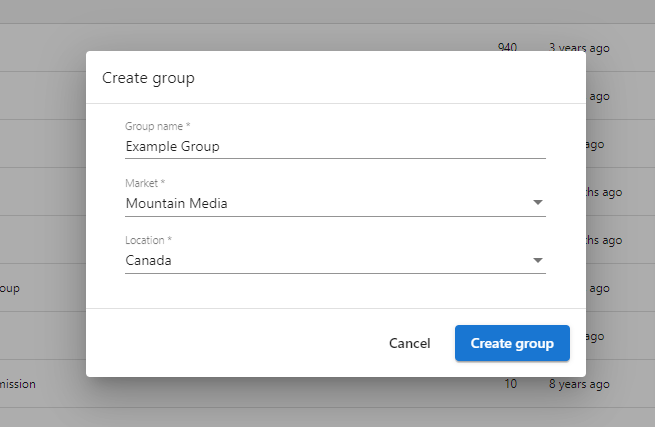
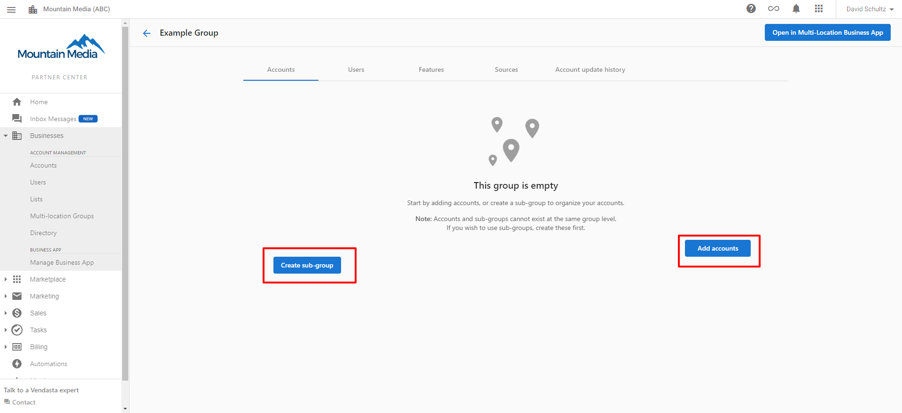
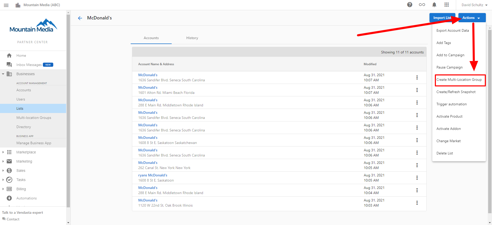

# Multi-Location Business App Overview

The Multi-Location Business App enables Partners to assist their business clients in managing and monitoring multiple store or service locations within a single platform. This powerful tool introduces several key features to streamline multi-location management.

## Key Features

### Business Groups

Organize multiple business locations into intuitive groups for structured management and targeted operations. Create logical groupings based on geography, business type, or other organizing principles important to you.

### Consolidated Dashboard

Gain comprehensive insights across all locations through a unified dashboard that displays aggregated data and performance metrics.

{/*  */}

### Streamlined Management

Enhance operational efficiency with tools that facilitate multi-location oversight. Manage cross-location campaigns, communications, and coordinate strategies effectively.

{/*  */}

## Creating Business Groups

Partners can create Business Groups in two ways:

### Method 1: From the Multi-Location App Homepage

1. Navigate to the Multi-Location app homepage
2. Click on the "Create Group" button
3. Enter the group details and save

### Method 2: From the Business List

1. In Business App, navigate to the Business List section
2. Select multiple businesses using the checkboxes
3. Click "Add to Group" from the actions menu
4. Choose an existing group or create a new one

### Creating from the List View

You can also create a group directly from the list view:

1. Select multiple businesses in the list
2. Click "Create Group"
3. Complete the required details

## Importing Business Locations

To quickly add multiple business locations:

1. Prepare a CSV file with all location details
2. Navigate to Import in the Multi-Location app
3. Upload your CSV file
4. Map the columns to the required fields
5. Submit the import

## Managing Business Groups

Once created, you can easily manage your business groups:

- Edit group details and members
- View aggregated analytics
- Apply bulk actions across all locations in a group
- Create targeted marketing campaigns for specific groups

## Benefits for Partners

- **Enhanced Efficiency**: Manage multiple locations without switching between accounts
- **Better Insights**: View aggregated data to identify trends across locations
- **Streamlined Operations**: Apply changes, updates, and campaigns to multiple locations simultaneously
- **Organized Structure**: Create logical groupings that match your business organization

## Next Steps

Dive deeper into the Multi-Location Business App to transform how you manage multiple business locations for your clients.