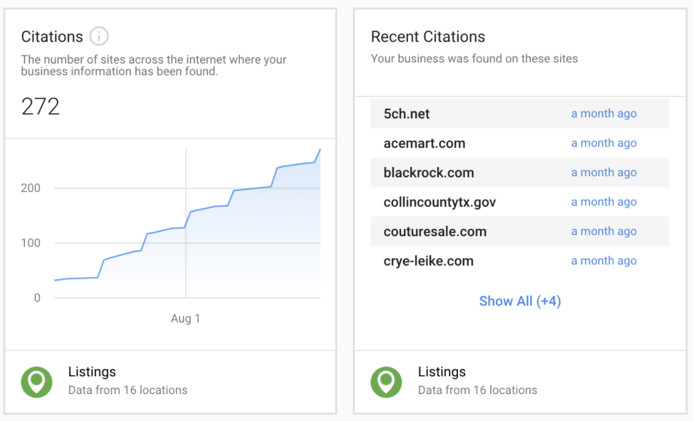

Citation tracking in the Executive Report offers better proof of performance under the Listings category, so your clients get more proof that the solutions they are paying for are improving their online performance.

Citations are mentions of a business found online. A citation is a business name along with another piece of information about that business, like a phone number, website, or address. Citations are an important factor in search engine optimization because they increase a business's domain authority to search engines and increase that business's chance of being found online.

Citations reporting is available in Business App, in both single-location and multi-location executive reports.

Citation data is powered by Reputation Management Pro, and the cards will appear for accounts with Reputation Management Pro active. Citations are also affected by Citation Builder and Listing Sync Pro products, which can help drive an increase in citations found.

If your client does not have Reputation Management Pro active, the citations card will not appear in their Executive Report.