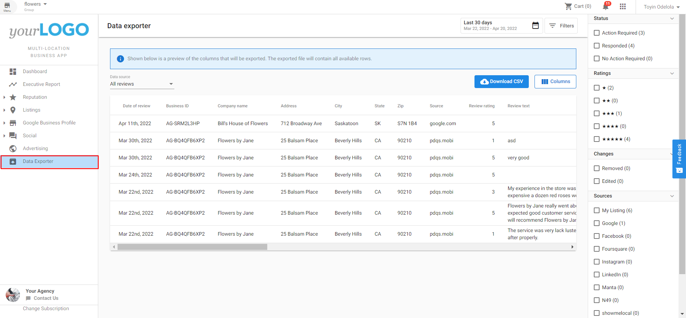

Users of the Multi-Location Business App can export review, listing, or Google Business Profile data to a CSV, to allow flexibility in their workflows, auditing, and internal reporting for many locations.

In the Multi-Location Business App, navigate to "Data Exporter" on the left-hand navigation menu. Once in the data exporter screen, click the data source drop-down to choose between All reviews, Review summary by source, Google Business Profile summary, and Listing data. Once your data source has been selected, click 'export data to CSV.' Filter options allow you to customize the data you want to export.

### Configuration

The Data Exporter can be enabled or disabled on a group-by-group basis for all users, by navigating to Partner Center > Accounts > [Multi-location Groups](https://partners.vendasta.com/brands/manage?marketId=default) > Choose a Group > Features and toggling the feature on or off.

(Note: The configuration screen image was not available.)