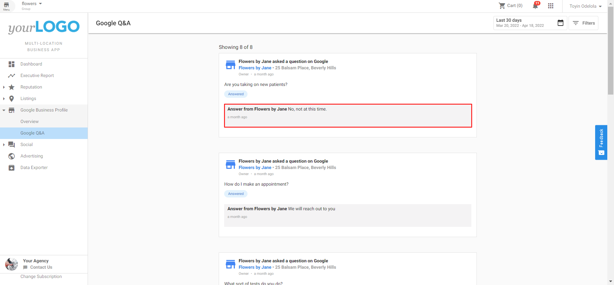
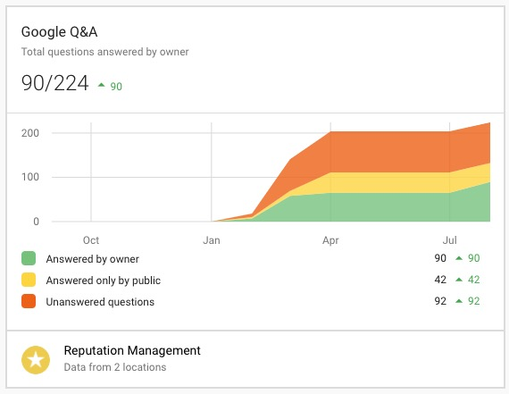

# Multi-Location Business App: Google Q&A

Brand managers now have the ability to monitor Google Q&A across all their locations from Multi-Location Business App. See a stream of questions across all your locations and answer questions right within the dashboard. Plus, see a concise report of Google Q&A activity in the Executive Report.

Google Q&A is another highly visible way for customers and the public to interact with brands online. Just like with online reviews, it is important to monitor and respond to Google Q&A activity. Any Google user can write a question and any Google user can answer that question. This makes it lucrative that business owners to be alerted to new questions so they can be the first to respond.

Keeping up with Google Q&A across multi-location businesses can be a lot to manage. Going into different Google Business profiles to see and answer the various questions is time-consuming and repetitive.

Google Q&A in Multi-Location Business App allows the business to:

- Create meaningful communication with current and potential customers
- Have an effortless exchange of requests, advice, and help between brands and consumers
- Highlight a brand's most important FAQs to save time for both owners and customers (coming soon)
- Avoid confusing or wrong information about a business or brand
- Capture data about customer needs and desires
- Boost rankings in search results

## How does Google Q&A in Multi-Location work?

Go to Multi-Location Business App > **Google Business Profile** > **Google Q&A.** Here you will see a feed of questions and answers. Type an answer into the text field and click **Answer** to have it posted directly to Google.

## Multi-Location Executive Report

