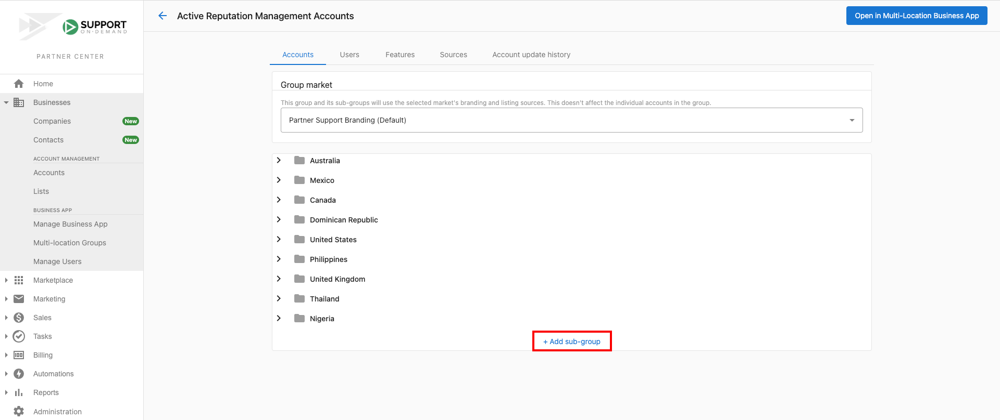
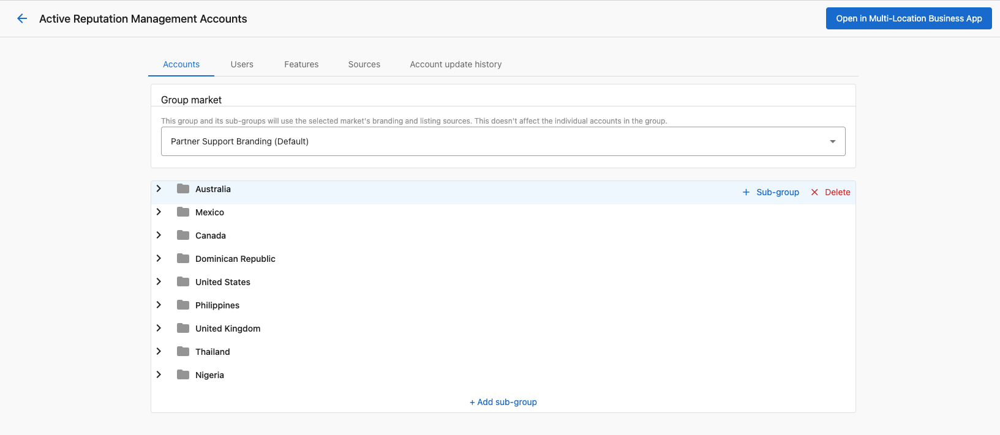

Sub-groups allow you to further segment your accounts. These sub-groups can then be viewed in Business App by any assigned users. These are especially useful for reporting purposes.

If you've just created a new group, you can add sub-groups by going to the **Accounts** tab > **Multi-location groups** > Click on the **Group name** > click on **+Add sub-group** button.

Once you've created your sub-group, you can add further sub-groups to it or begin adding accounts. If you wish to create sub-groups within sub-groups, hover over the existing sub-group and click **+ sub-group**.

:::note
You can only have either sub-groups or accounts at each level of a sub-group. For this reason, it is advised that you create all sub-groups before adding accounts.
:::