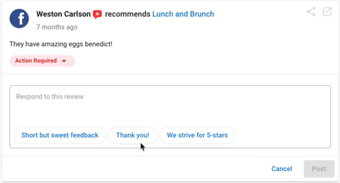
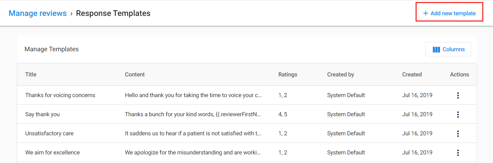

# Multi-Location Business App Review response suggestions

Review response suggestions make it easy to quickly respond to customer reviews. There are several suggested responses for different star ratings, making it easy to find a response that matches your review.

## Responding to reviews

1. Open the Multi-location Business App from your Partner Center or white-label dashboard.
2. Click into a location that has a review you'd like to respond to.
3. Click **Reviews** from the left navigation menu.
4. Find the review you'd like to respond to and click **Reply** in the bottom right corner of the review.

5. When the reply box opens, click **Use suggested response**.

6. A list of responses will appear in a pop-up. The suggested responses are tailored based on the star rating of the review.
7. Select the response that best fits the review. The text will appear in the reply box and you can edit it if needed.
8. When you're ready, click **Reply**.

## Saving a response as a template

When selecting a suggested response, you have the option to save it as a template to use for future review responses.

1. Select a suggested response.
2. Click the checkbox for "Save as template for future use".
3. Click **Use this response**.

## Using saved templates

Saved templates appear alongside the suggested responses. You can access them in the same way.

1. Click **Reply** on a review.
2. Click **Use suggested response**.
3. Your saved templates will appear at the top of the suggestion list.

## Best practices for responding to reviews

- Always personalize the suggested responses before posting them.
- Address the customer by name when possible.
- Reference specific points mentioned in the review.
- For negative reviews, offer to make things right and provide contact information for further assistance.
- Keep responses professional and courteous, even for negative reviews.
- Respond promptly to all reviews, both positive and negative.