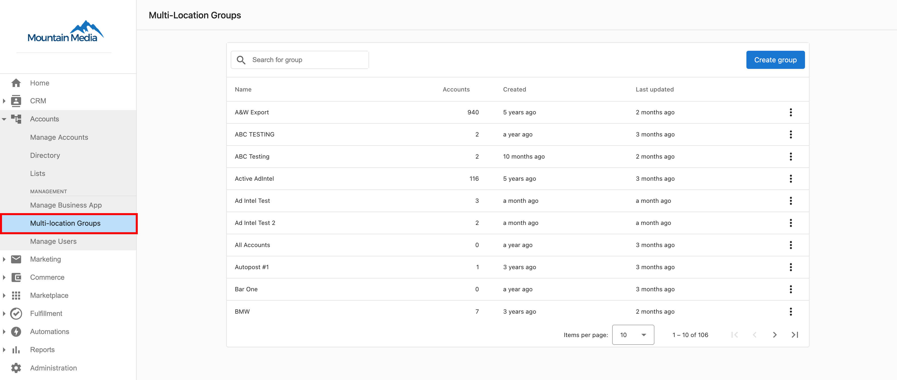
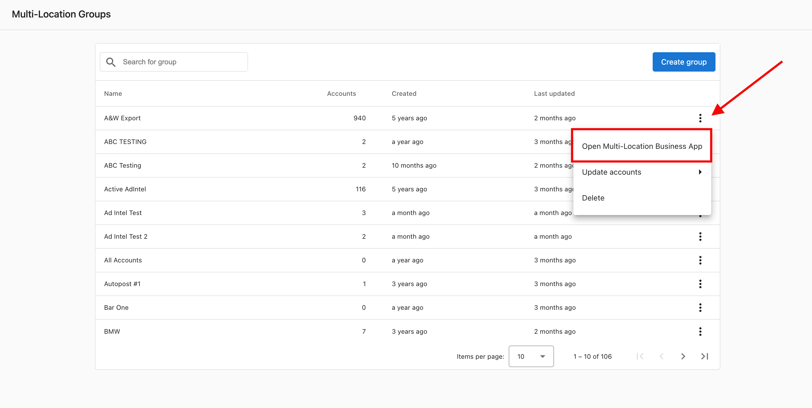
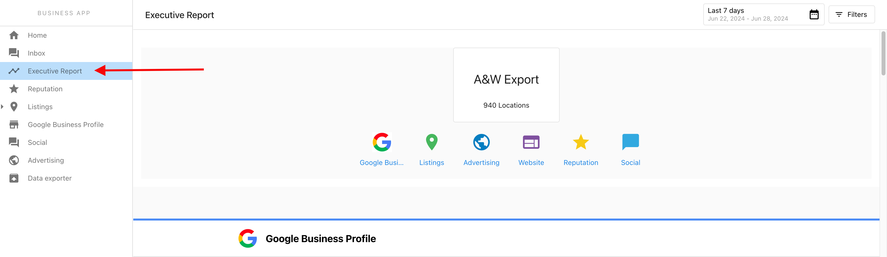

Multi-Location users can view the Executive report for their multi-location businesses within the Multilocation Business App.

At this time our platform does not send out Executive Reports to Multi-location Business App users.

As a Partner, here is how you can view the report:

**Step 1:** Navigate to the Multi-Location Groups under the Accounts tab in Partner Center.

**Step 2:** Click on the Kebab Menu on the Group name, and open the Multi-Location Business App.

**Step 3:** Click on the Executive Report on the left panel of the dashboard to view the report.

