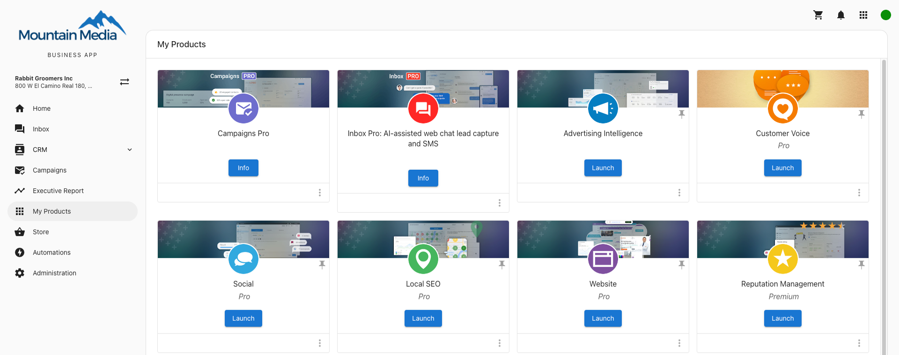
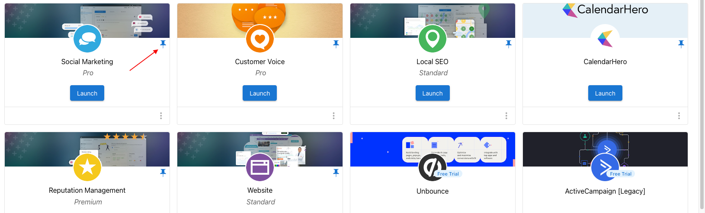

# My Products

Your clients can view and access their products right from their Business App. On the Products page in Business App, your clients will be able to see all of the products they have active. They can also select the ones that they use the most to appear in the side panel.

### **Configuring My Products in Business App**

You can remove access to the My Products page for all of your clients by going to **Partner Center > Administration > Customize Business App > My products** and unchecking the box that shows the page.

You can hide this tab or remove access for individual products on a user-by-user basis by [configuring their permissions](/business-app/business-app-users/configuring-permissions-of-the-user).

### **How can I organize the products on the side panel of Business App?**

By clicking on the Products page and clicking on the pin icon in the top right of each product, you can choose which products will appear on the Business App side panel, for yourself. Each user can set these independently.

