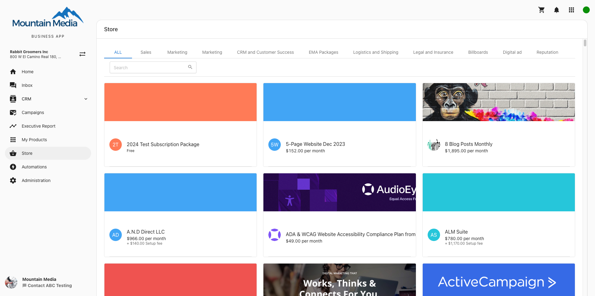
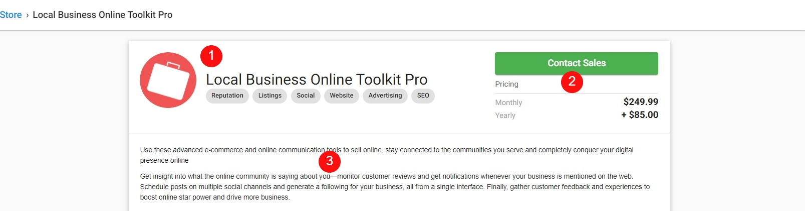
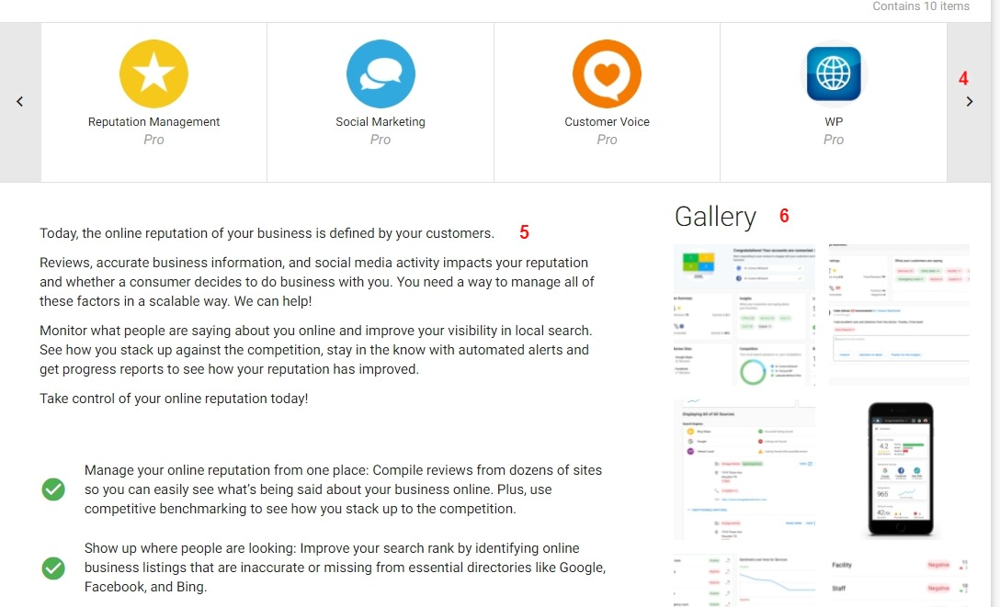
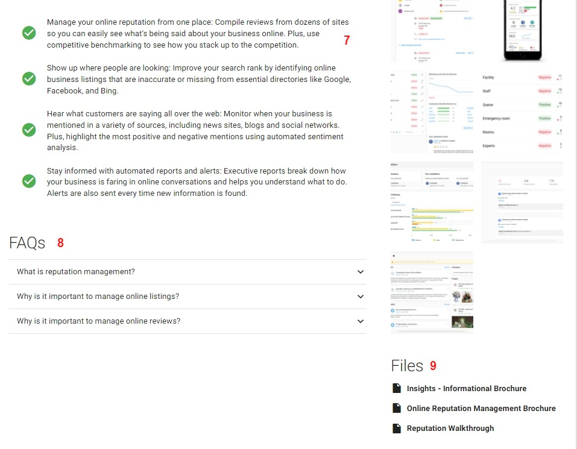
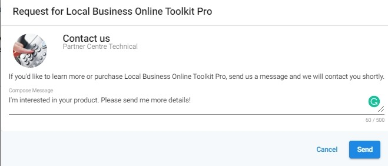

# Store in Business App

The Store tab allows your clients to express interest or purchase products directly from Business App. Upon navigating to the store tab, clients will be able to see all the products and packages you have published to your store.

Clicking on any package will bring the user to that package's information page. Here, they can see package marketing materials, product details, pricing, and more.

1. **Package information** – Features the package name, tagline, and solution type.
2. **Pricing** – Pricing information for the package. Also includes the purchase button (covered below).
3. **Package description** – Marketing information surrounding the package as a whole.

   

4. **Product selection** – Users can select which product they wish to view more information on.
5. **Product Description** – Information explaining the purpose of the product.
6. **Gallery** – Media to showcase how the product functions.

   
   
7. **Key selling points** – Points designed to showcase how the product will help the user.
8. **FAQs** – Additional information designed to explain any questions the user needs answers to prior to purchasing.
9. **Files** – Case studies, walkthroughs, brochures, etc.

Once the client has made their decision and would like to purchase, they will have the option to **Contact Sales** or **Add to the Cart** depending on the package's purchase button behavior.

This will prompt a window in which the client can either email their salesperson to express interest in the product or purchase it on their own.

