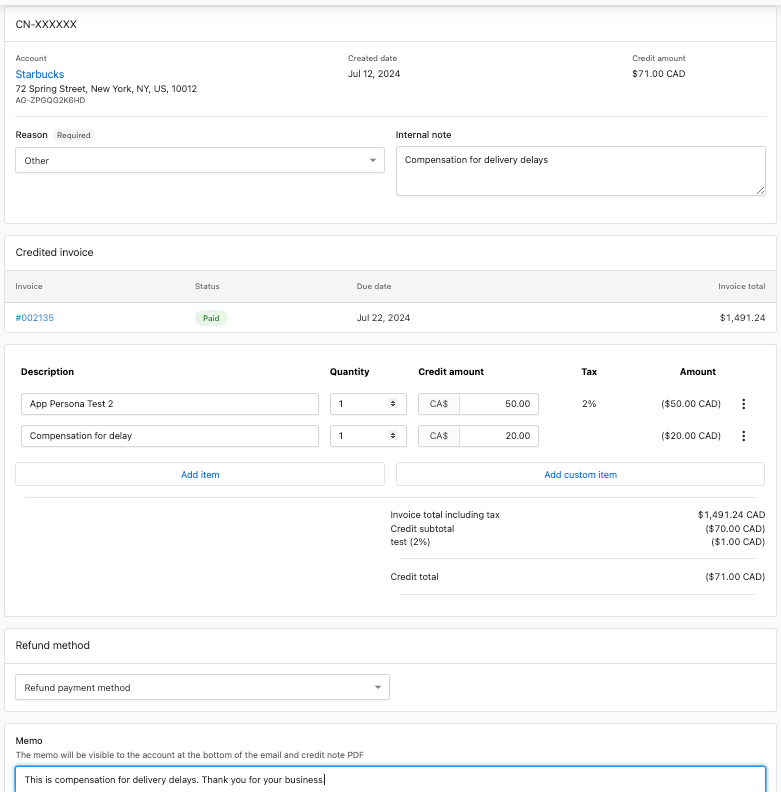

## Issue credit notes

Credit notes are documents issued by merchants to their customers to decrease the amount on a due or paid invoice. This may be necessary due to a mistake on an order or invoice, or to refund an amount paid for products or services. In the context of Vendasta Partner to client transactions, a credit note acts as the opposite of an invoice, reversing the amount owed by the client to the Partner.

## Common reasons to issue credit notes

- Accidental over-billing of a customer.
- Compensating the customer.
- Customer requested a refund.
- Offering a discount on a due or paid invoice.

## Types of credit notes

For a due invoice, **Adjustment Credit Notes** reduce the amount due to be paid. For already paid invoices, **Refundable Credit Notes** can be used to issue a refund to the client's bank account. Credit notes also help maintain a record of all such reverse transactions for reporting and reconciliation.

## Applying a credit note to an invoice

1. **Select the Invoice:** Navigate to the invoice you want to apply a credit note to. It can be a due or paid invoice.
2. **Issue Credit Note:** Click the kebab menu (three vertical dots) in the top right corner of the invoice page and select "Issue credit note" to load the credit notes page.
3. **Auto-Load Details:** The details of the original invoice, including the description, quantity, tax, and amount, are automatically loaded on the page.
4. **Edit Line Items:**
   - Adjust the credit amount, quantity, tax, etc., on the line item you wish to credit.
   - Remove other line items if necessary or set the credit amount to zero.
   - You can also add a custom line item to be credited or edit the description of existing line items.
   - **Note:** The credit amount is the amount you would like to credit on the invoice.
5. **Select Refund Type** (only for already paid invoices): 
   - Refund payment method: Automatically initiates a refund to the client's bank account.
   - Refund manually: Updates the invoice record so you can handle refunds offline (e.g., cash, cheque).
6. **Additional Fields:**
   - Required: Reason for issuing the credit note.
   - Optional: Internal note for your internal use.
   - Optional: Memo notes to provide more context to the client.
7. **Review and Apply:**
   - Review the credit total.
   - Click "Create and apply credit note" in the top right corner of the page.

## FAQs

What is a credit note?

A credit note is a document issued by a merchant to a customer to reduce the amount owed on an invoice. It acts as a reversal of the original invoice amount and is typically issued due to billing errors, refunds, discounts, or compensations.

When should I issue a credit note?

Credit notes are commonly issued for reasons such as accidental over-billing, compensating a customer for a mistake or inconvenience, responding to a customer request for a refund, or offering a discount on a due or paid invoice.

What are the types of credit notes?

There are primarily two types:
- **Adjustment Credit Notes:** These are used for due invoices to reduce the amount that needs to be paid.
- **Refundable Credit Notes:** These are used for already paid invoices and facilitate refunds directly to the client's bank account.

Can a credit note be issued for both due and paid invoices?

Yes, credit notes can be issued for both due and paid invoices. Adjustment credit notes are used for due invoices to adjust the amount owed, while refundable credit notes are used for paid invoices to initiate refunds.

How do credit notes help with record-keeping and reconciliation?

Credit notes maintain a record of all reverse transactions, which is essential for accurate financial reporting and reconciliation of accounts. They ensure transparency and clarity in financial transactions between merchants and customers.

What happens after a credit note is applied?

After applying a credit note, the invoice balance is adjusted accordingly. If the credit note is for a paid invoice and a refund is selected, the refund process is initiated either automatically to the client's bank account or manually as specified.

Do retail credit notes for partner to SMB transactions apply to future payments?

No, retail credit notes for partner to SMB transactions currently do not apply to future payments.

Can credit notes be used instead of issuing a refund?

Yes, credit notes can be used in place of just issuing a refund. They provide an alternative way to adjust the amount owed or paid.

Are credit notes automatically sent to clients when applied?

No, credit notes are not automatically sent when applied. Partners have the option to send the credit note to the client if they choose.

Can I issue a credit note for an EFT transaction like ACH or PADs?

Yes, you can issue credit notes on an invoice paid through ACH or PADs, but only after the payment has settled. Since ACH payments take a few days to settle, you must wait until the payment is fully processed before issuing a credit note.

Is there a limit to how much I can refund my client?

No, but refunds over $1000 will require Support on-Demand to issue the refund. Please submit SMB refund requests over $1000 to support@vendasta.com.

Can I cancel or reverse a payment after it has been made?

No — once a payment has been processed, it cannot be cancelled. To return funds to a client, issue a credit note on the paid invoice and select **Refund payment method** as the refund type. The refund will appear on the client's statement within **5–10 business days**.

What should I do if I get an error when creating a credit note?

Common causes of credit note errors:

- **Credit amount exceeds the invoice total** — The credit note amount cannot be greater than the original invoice amount minus any previously issued credit notes on that invoice. Reduce the credit amount and try again.
- **Invoice is not in a refundable state** — Credit notes can only be issued on invoices with a **Due** or **Paid** status. Void or Draft invoices are not eligible.
- **ACH/PAD payment not yet settled** — For invoices paid by ACH or Pre-Authorized Debit, the payment must fully settle before a refund credit note can be issued. Wait until the payment status shows as settled, then retry.

If you continue to see errors after checking these conditions, contact [support@vendasta.com](mailto:support@vendasta.com).

What is the difference between "Refund payment method" and "Refund manually"?

When issuing a credit note on a **paid invoice**, you are asked to choose a refund type:

- **Refund payment method** — Automatically initiates a refund to the client's original payment method (credit card or bank account). The client receives the funds within 5–10 business days. Use this for standard refunds.
- **Refund manually** — Records the credit note in the platform without sending funds through Stripe. Use this when you are issuing the refund outside of Vendasta Payments (for example, by cheque or cash), and you want to keep your records accurate.

