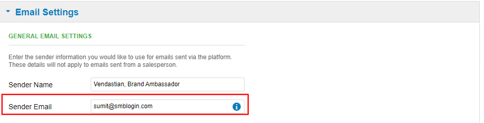

# Change email address on invoices sent to clients

The email address showing at the bottom of the invoice sent to clients can be changed by going to **Partner Center > Administration > Customize >** Under partner defaults tab; click on **Email Settings > Sender Email > Change it and then apply the changes.**

This is also the email address from which the platform will send reports, to which recipients can reply.

For Partners with multiple markets, repeat the same steps under the '**Markets**' heading > click the pencil icon to select market and update email accordingly or simply apply the Partner branding configurations to the additional market(s).