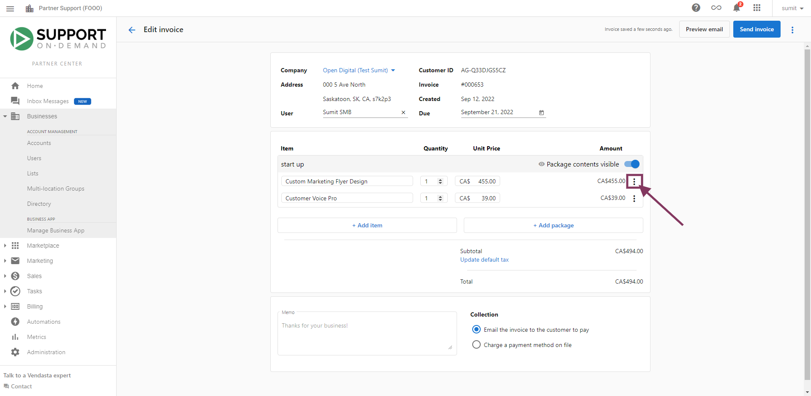
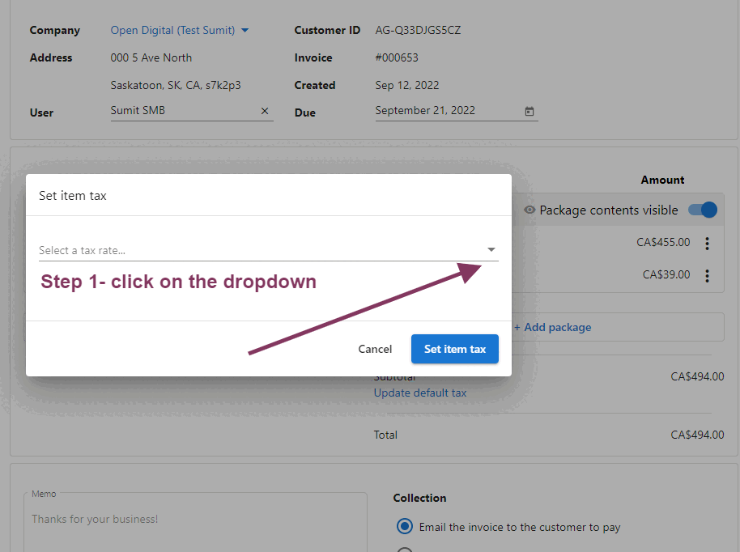
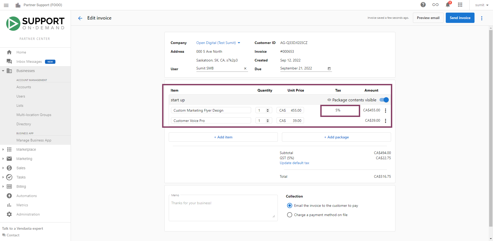

Partners invoicing their customers or accepting purchases through Shopping Cart using Vendasta Payments may find it necessary to charge taxes on the products and services they sell. Tax rates can be specified and applied to invoice line items, as well as Shopping Cart purchases and sales orders, to ensure that you are collecting the appropriate taxes from your customers.

Note that partners are responsible for creating and maintaining the appropriate tax rates for the regions in which they do business. 

*For a video walkthrough on creating and applying tax rates, [click here](#video-walkthrough).*

### Create and manage tax rates

To create a tax rate, go to **Partner Center > Administration > Tax Rates** and click **Create Tax Rate**.

Fill out the following values:

- Country 
- State/Province
- Tax Name 
  - Suggested values include GST, PST, HST, State Tax
- Rate (a percentage)
- Description / Tax number
  - This optional description will be displayed on the tax column of the invoices you generate, on your sales orders, and in the Shopping Cart checkout.

Depending on the locations of your customers, you may need to define each tax rate that is applied to a country and state or provincial region. For example, if you were defining taxes to apply in Ontario, Saskatchewan, and Alberta, you would define the following:

- Canada, Ontario, HST, 13%
- Canada, Saskatchewan, GST, 5%
- Canada, Saskatchewan, PST, 5%
- Canada, Alberta, GST, 5%

### Apply a tax rate to an invoice line item

Several Digital Marketing and Digital Goods Laws have changed since January 2022, and many items need to be taxed or don't need to be taxed moving forward. With our invoicing platform, you can selectively levy tax on an invoice line item or an entire invoice.

**To get started with adding tax to invoices:**

1. Open the invoice builder by navigating to **Partner Center > Commerce > Invoices**
2. Add an Item or a Package if the invoice is blank
3. Click on the Kebab Menu **⋮** for more options on a line item

4. Set Item Tax rate

5. Select Tax Rate (Note: To create a tax rate, go to **Partner Center > Administration > Tax Rates** and click **Create Tax Rate**.)

6. Review Final Tax

7. Charge or send invoice

Alternatively, to apply a tax rate to a line item on an invoice, you can click the Options **⋮** menu on the line item, select **Set Item Tax**, and choose a tax rate to apply.

### Set a tax rate for a Sales Order or Shopping Cart purchase

The tax rates that you have defined will be automatically applied to Shopping Cart purchases, as well as sales orders generated from Shopping Carts containing items that can't be purchased with a credit card. The application of tax rates is based on the address of the account, according to the regions for which you have specified tax rates.

Note that if no tax rates for a given region have been created, purchases and sales orders conducted through the Shopping Cart by customers located in the region will not have a tax rate applied to them.

### Taxes on Sales Orders and the invoice gap

Tax rates configured for an account's location will appear in the **Retail Summary** section of a Sales Order. However, when you **create an invoice from a Sales Order**, those taxes do **not** automatically carry over to the invoice.

This happens because the Sales Order stores the tax *rate* (a percentage), but the invoice requires a specific *tax ID* (the named tax rate you created in Administration > Tax Rates). Since the tax ID isn't stored on the order itself, the invoice builder cannot apply it automatically.

**What to do:**

When creating an invoice from a Sales Order:

1. Open the invoice after it is generated
2. For each taxable line item, click the **⋮** menu and select **Set Item Tax**
3. Choose the appropriate tax rate from your configured list
4. Review the total and send or charge the invoice

**If taxes aren't appearing on your Sales Order at all:**

- Confirm the account has a complete address (city, state/province, country, postal code)
- Confirm you have created a tax rate for that location in **Administration > Tax Rates**
- Tax rates apply based on the account's address — if the address is missing or in an unconfigured region, no tax is shown 

## Video Walkthrough

<iframe src="//www.loom.com/embed/7a58fd36374a4d4ab706ed9b4f5ac829" width="560" height="315" frameborder="0" allowfullscreen></iframe>

### Tax Application Walkthrough

<iframe 
  src="https://drive.google.com/file/d/1xb4inTcWSzfvAc9jGfu4Ys4PXHpI9sKx/preview" 
  width="640" 
  height="480" 
  allowFullScreen
></iframe>