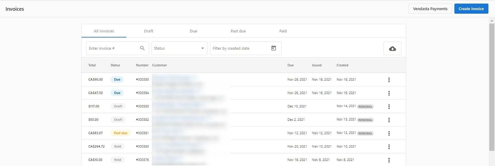

Partners can use invoices to request and collect payment for the products and services that they provide their customers. Invoices can be manually created or can be [automatically generated](/getting-started/commerce/invoices/automatic-invoicing) according to an account's subscriptions and product renewal dates.

Invoices will function differently depending on whether or not a partner has [set up Vendasta Payments](/getting-started/commerce/payments/setup-vendasta-payments). Partners who have not set up Vendasta Payments are able to create, edit, and send invoices to their customers, but cannot collect payments from directly within the invoice email.

Note that it is possible to invoice a customer for any product you're selling or any package (draft or published) in your Store. However, if you are invoicing a customer for a product that is not already active on their account, the product will not automatically activate once the invoice has been paid. Partners can instead activate the product by following the usual [steps for product activation](/getting-started/accounts/manage-products/activate-products) at any stage of the invoicing process

  <iframe 
    style={{ position: 'absolute', top: 0, left: 0, width: '100%', height: '100%' }} 
    src="https://www.loom.com/embed/1d669023e0ed44ef96cebb6a115616d5" 
    frameBorder="0" 
    allowFullScreen
  ></iframe>

### Preparing to use invoices

Invoices can be used most effectively when the following criteria are met:

- You have set retail prices and added the product/ package to your Store
- Your Store uses packages that are priced using the [new package pricing model](/getting-started/commerce/store/package-pricing-model)
- An account exists for the business that you intend to invoice
- You have set up Vendasta Payments and are capable of accepting payments and receiving payouts
- You have created [tax rates](/getting-started/commerce/taxes/create-tax-rates) (if applicable)

### Creating an invoice

Invoices can be created at any time from the **Commerce > Invoices** tab in Partner Center. or by simply going into the account you wish to create an invoice for and clicking on the invoice tab. 

- Click **New > Invoice** and select an account to create a draft invoice
- Select a **Due date** for the invoice 
- Select a **User** (recipient) for the invoice
- Click **Add Item** to add an individual product to the invoice. You can add any product that you're currently selling in your Marketplace, or type any text into the text box to represent a line item that does not exist in your Marketplace
  - If the product you select already has a retail price set, it will automatically populate the Unit Price and currency for that item. The price and currency can also be overwritten on an individual invoice (note that invoices can currently only accept payments in USD and CAD)
  - To add a discount as a line item, input the description of the discount and enter a negative dollar amount. The negative value entered will be subtracted from the invoice total
- You can also click **Add Custom Item** to create your own line item. 
- If your invoice includes more than one of a certain item, this can be specified using the Quantity column
- Use the Options **⋮** menu to remove an item from the invoice or [apply a tax rate](/getting-started/commerce/taxes/create-tax-rates) to a line item.
- If necessary, add additional information to the invoice using the **Memo** field at the bottom of the invoice

Invoices can also be created at any time when viewing an individual account in **Partner Center > Manage Accounts** by clicking the Options **⋮** menu next to the **Open Business App** button.

Invoices can be generated from an order in **Partner Center > Sales > Orders** by viewing an order and clicking the **Create Invoice** button.

### Sending or charging an invoice

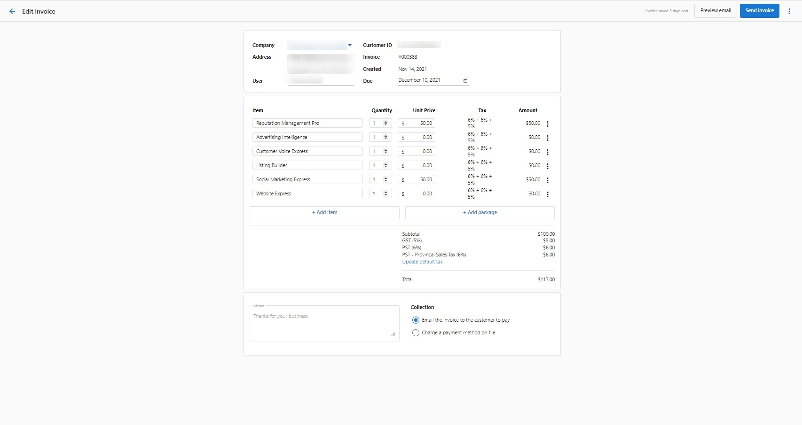

Before sending an invoice, we recommend reviewing the Subtotal, Discount, and Total fields to ensure that the invoice was properly assembled. A draft invoice can be edited as many times as necessary, but once an invoice has been sent, it cannot be edited.

When your invoice is ready, click **Send Invoice** to choose one or more recipients from the users that exist on the given account. The window will also display a preview of the email that each recipient will receive. 

Alternatively, you may instantly charge your customer for the contents of the invoice by selecting **Automatically charge a payment method on file** under the **Collection** section. This will change the **Send Invoice** button at the top-right of the page to **Charge invoice**. After a successful charge, your customer will receive a receipt via email. This requires your customer to have at least one payment method saved in Vendasta Payments. Your customer will have a payment method saved if they have previously paid an invoice or made a purchase using the Shopping Cart. If your customer does not have a saved payment method, it is possible to enter a payment method on behalf of your customer by clicking **Edit** next to the payment method field in the **Collection** section.

Sent invoices can be viewed at any time from the table on **Partner Center > Commerce > Invoices**.

If an invoice has been missed or misplaced by its recipient, it can be sent again at any time. Clicking **Resend Invoice** while viewing a Due invoice will allow you to choose any recipient on the account to resend the invoice.

### Paying an invoice

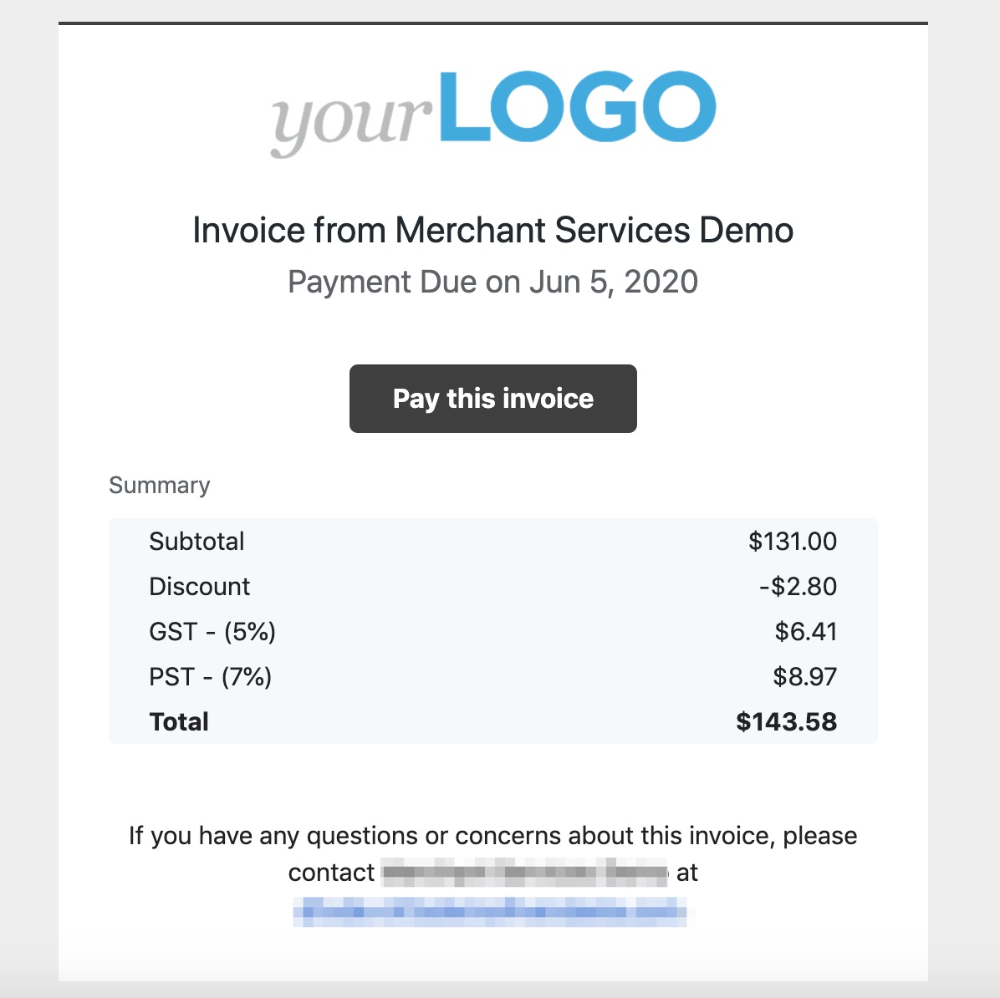

After sending an invoice, the recipient that you've chosen will be emailed a digital copy of the invoice. Invoices sent to an account will also appear under the **Invoices** tab in Business App.

If Vendasta Payments is enabled when the invoice is sent, the recipient will have the option to pay the invoice directly by clicking **Pay this invoice** while viewing the invoice. This will direct the recipient to a landing page that displays all line items on the invoice and allows them to pay via credit card.

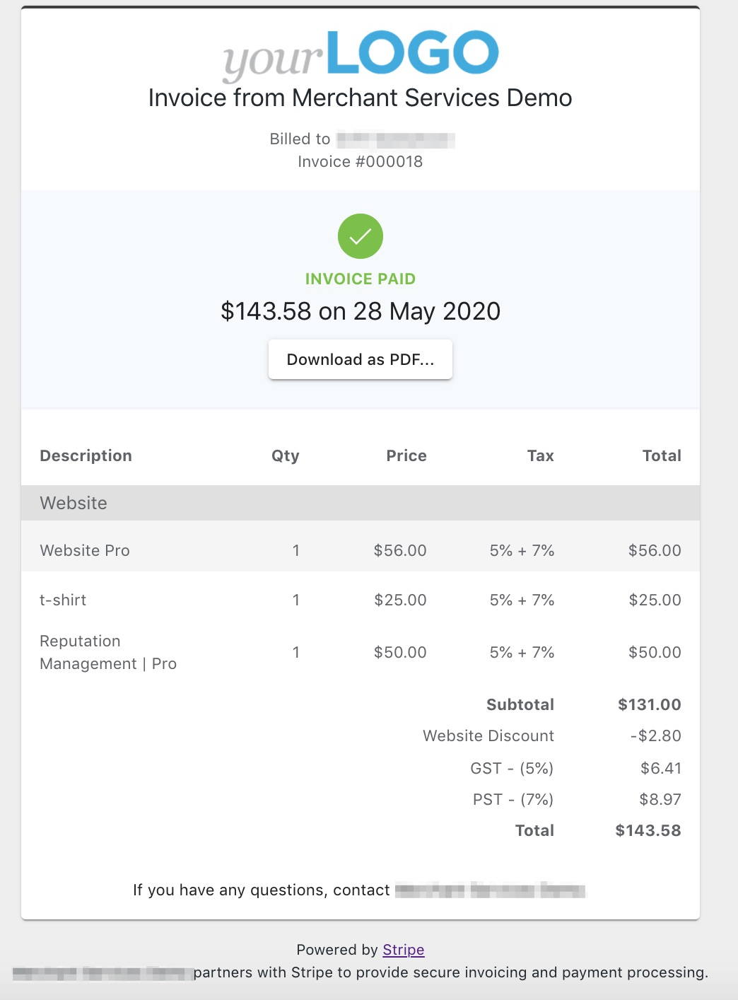

After an invoice has been paid, the recipient can click **Download as PDF** to save a receipt in PDF format.

### Managing invoices

All invoices can be viewed at any time from the table on **Partner Center > Commerce > Invoices**. Clicking the Options **⋮** menu on an invoice allows users to edit or delete a draft invoice, download a copy of an invoice in PDF format, or download a receipt for a paid invoice in PDF format.

Business App users can view the complete list of invoices they have received using the **Invoices** tab in the Business App.

Partners can download a complete table of all sent non-voided invoices by clicking the ☁ **Download** button in the top right corner of the Invoices table.

### Invoice statuses

An invoice's status is displayed in the Status column on the table in **Partner Center > Commerce > Invoices**. An invoice can have one of the following statuses.

- **Draft**: A draft invoice can be edited, and has not yet been sent to a recipient.
- **Due**: A Due invoice has been sent to a recipient and can no longer be edited. Clicking **Resend Invoice** allows you to reselect a recipient and send the invoice again.
- **Paid**: A Due invoice will be marked as Paid when its recipient pays for it via the **Pay this invoice** button. Alternately, if payment was collected outside of Vendasta Payments, an invoice can be marked as Paid by clicking the Options **⋮** menu, selecting **Change invoice status**, and selecting **Paid**.
- **Void**: If an invoice has been sent in error or is no longer relevant, an invoice can be marked as Void by clicking the Options **⋮** menu, selecting **Change invoice status**, and selecting **Void**.

Note that an account's **Invoicing settings** are all off by default. To edit these settings for a particular account, go to the **Products** section on the account's page under **Partner Center > Accounts > Manage Accounts > Select account** and click **Invoices.**

### Customize invoice numbers

Next invoice number customization allows new and existing partners to define the next number sequence for their upcoming invoices. This customization ensures seamless transitions, enhances professional appearance, and maintains a coherent invoicing system for your business.

**Common reasons to customize invoice numbers:**

1. **Continuity from Previous Platforms:** New Partners can continue the numbering sequence from their previous billing system.
2. **Professional Appearance:** New Partners can avoid starting their invoice number sequence from 001.

**To customize the next invoice number:**

1. Navigate to **Partner Center > Commerce > Invoices**
2. To access the setting, select the **three dots** in the top right hand corner of the page, and click **Set new invoice number**
3. Input the desired **next invoice number**. **Note:** The number must be greater than any previously used invoice number

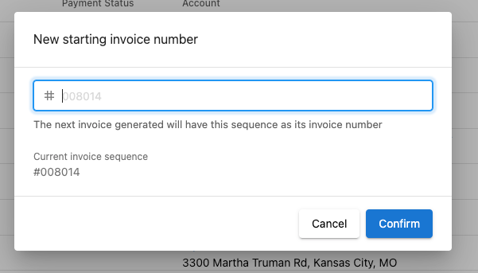

4. Click **Confirm**, and your next invoice generated will follow the new number sequence

**Invoice number customization notes:**

- The invoice number only supports numeric values (no alphanumeric prefixes)
- You can only set the next invoice number to a value greater than any number already used on an invoice
- The invoice number sequence applies to all your transactions across all customers

### Change invoice email settings

The email address showing at the bottom of the invoice sent to clients can be changed by going to **Partner Center > Administration > Customize >** Under partner defaults tab; click on **Email Settings > Sender Email > Change it and then apply the changes.**

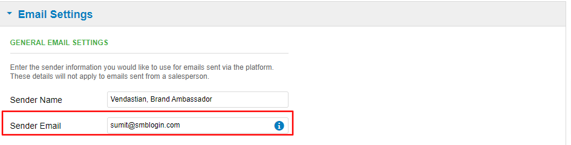

This is also the email address from which the platform will send reports, to which recipients can reply.

For Partners with multiple markets, repeat the same steps under the '**Markets**' heading > click the pencil icon to select market and update email accordingly or simply apply the Partner branding configurations to the additional market(s).

## Frequently Asked Questions

Can I change an invoice status after it is marked "paid"?

**No** - Once an invoice has been marked as "paid," it cannot be adjusted to another status (such as "due" or "past due.") If an invoice needs to be sent to a client again, recreate the original invoice and send it again.

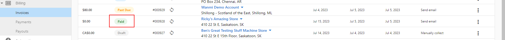

Can I delete an invoice?

Currently, Partners cannot retract or delete an invoice that has already been sent.

If you have sent an incorrect invoice, create and send a new invoice to your customer.

If you have sent an invoice to the incorrect recipient, an invoice can be sent to a different recipient at any time by clicking **Send Invoice** and choosing a different recipient.

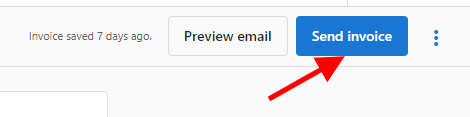

If the invoice is still under the status 'due,' it can also be voided.

To void the invoice, navigate to **Partner Center > Commerce > Invoices > Click the 3 dots next to the invoice and select Change Invoice Status.** Select the **void** status, and **save.**

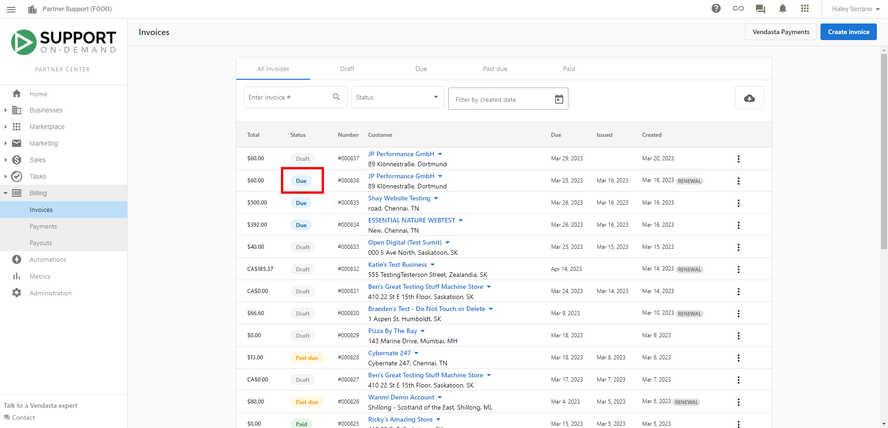

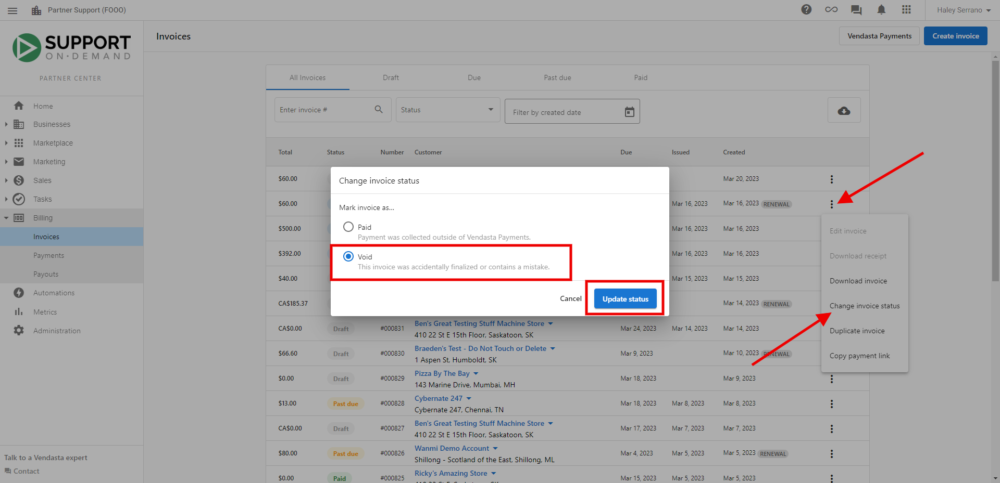

How do I mark an invoice as "paid" if it has not been paid through Vendasta Payments?

If you want to generate an invoice on an account but do not want to send it to your client, or the client has already paid, you can mark the invoice status as "Paid" for your records:

In **Partner Center > Commerce > Invoices > Select the invoice** (any invoice that is Past Due, or Due status) > **Click the three dots at the end of the row > Change invoice status > Paid:**

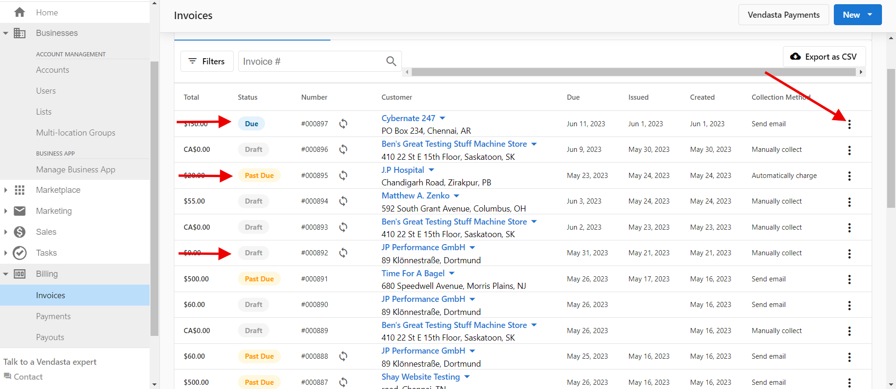

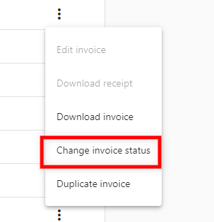

***Please note that invoices with the status "Paid" or "Void" do not have the option to change the invoice status.***

Can invoices and receipts from Vendasta be sent to multiple users?

**Yes** - a comma-separated list of email addresses can be added to the Billing Contact Information card in **Partner Center > Administration > My Billing**. Addresses listed here will receive invoices and email notifications regarding successful and failed payments, etc.

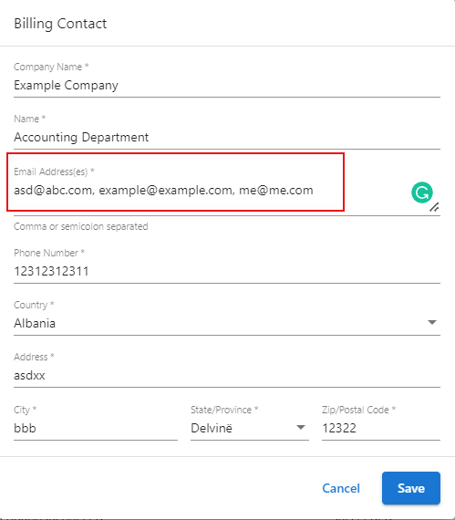

Will I be notified when an invoice is sent to my customer?

**Yes!** You will receive an email every time an invoice is generated and sent to your customer.

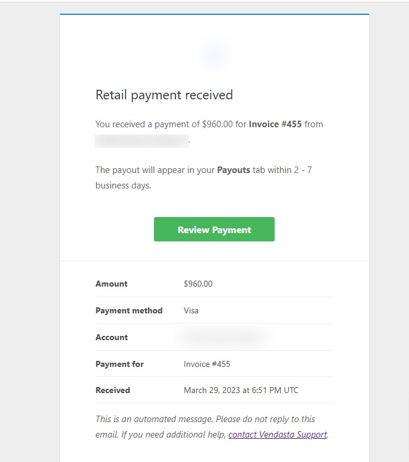

The customer will also receive an email invoice (if you have chosen the payment option to **Email Invoice**). Otherwise, the customer will receive an email receipt for the charge to their Credit Card.

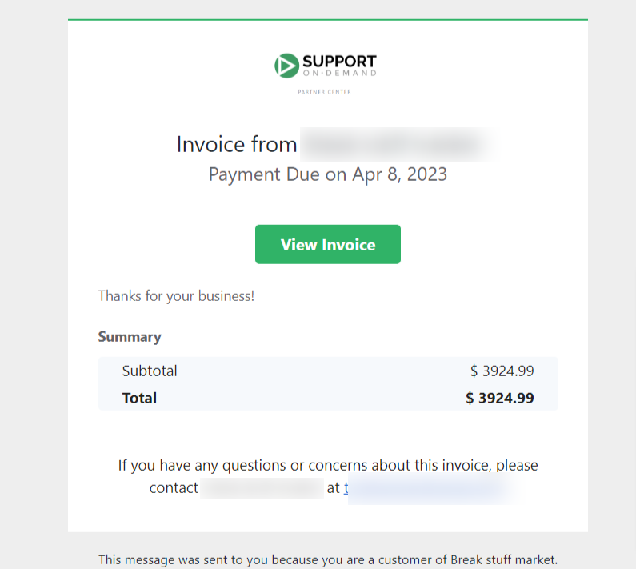

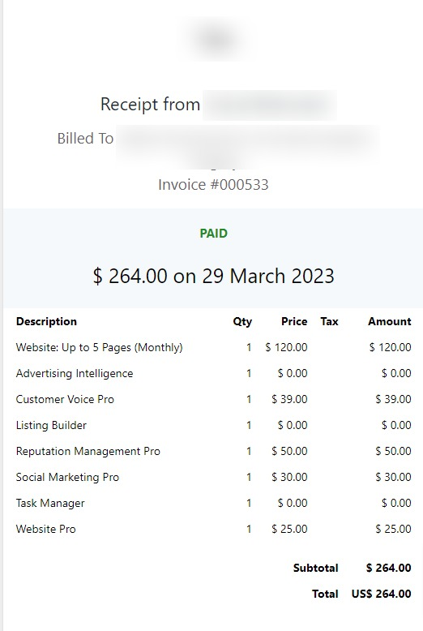

Why is my invoice showing the wrong currency?

If the invoice appears in a different currency than expected, it's possible that the invoice was **duplicated**. When an invoice is duplicated, it retains the currency of the original invoice along with the same line item values.

If you create a new invoice from scratch, the default currency will be **CAD**, which can be identified by the **"CA$"** prefix in the dollar values.

**How to Differentiate Between CAD and USD:**
- **CA$**: Indicates the invoice is in **CAD (Canadian Dollars)**.  
- **$ (without "CA")**: Indicates the invoice is in **USD (US Dollars)**.

Why isn't my package appearing when I try to add it to an invoice?

If a package is not using the new package pricing model based on the retail prices of the individual products contained in the package, it cannot be added to an invoice.

Partners can update their packages to use the new pricing model at any time.

**Note:** Packages using the old pricing model also cannot be purchased through the Shopping Cart.

Is the client payment transaction fee calculated before or after tax?

Transaction fees are calculated based on the **total amount** the client has paid. 

If a Partner has set up their invoicing to include taxes, the transaction fee is calculated from the total amount which already includes taxes. 

If taxes haven't been set up, the transaction fee is still based on the total invoice amount the client paid, but without taxes, since taxes wasn't indicated on the invoice.

Are client account owners allowed to remove stored Credit Card on file?

Yes, the Billing Settings functionality within Business App allows users within an account the ability to 'replace' a credit card provided another one has been added.

What is a recurring invoice template?

:::caution Discontinued Feature
The Recurring Invoice functionality has been discontinued for new Partners. Please familiarize yourself with the enhanced Subscription Billing feature, which has been introduced as a replacement.
:::

Templates can not only ease your workload but also make you feel less stressed and at the same increase your efficiency. It helps to save time and money while improving consistency.

A recurring invoice template can be used to repeatedly invoice a customer for products or services they have bought that have a monthly renewal and can be automatically invoiced every month.

The processes will run continuously according to your set schedule in the template.

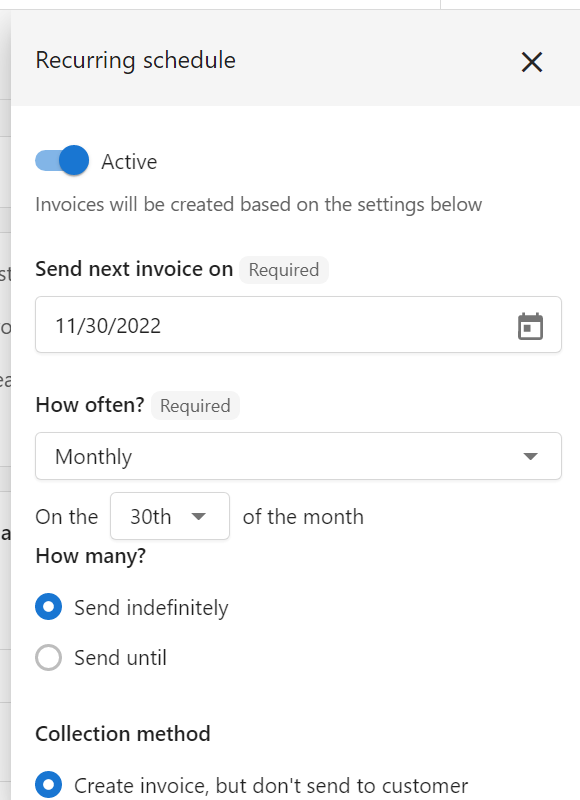

Why is my invoice showing past due before the due date?

If your invoice is showing as past due before the actual due date, this could be due to timezone differences or system processing timing. Check the due date and time zone settings in your invoice configuration.

Why does my package product have an unexpected price when I add it to an invoice?

If a package shows an unexpected price when added to an invoice, it may be using the old package pricing model. Packages need to use the new package pricing model based on the retail prices of individual products to work properly with invoicing.

Partners can update their packages to use the new pricing model at any time through their Store settings.

