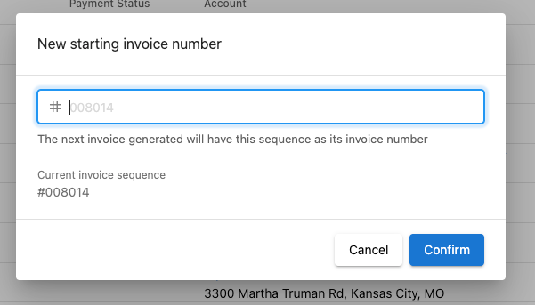

# Customize Next Invoice Number

## What is next invoice number customization?

Next invoice number customization allows new and existing partners to define the next number sequence for their upcoming invoices. This customization ensures seamless transitions, enhances professional appearance, and maintains a coherent invoicing system for your business.

**Common reasons to customize invoice numbers:**

1. **Continuity from Previous Platforms:** New Partners can continue the numbering sequence from their previous billing system.
2. **Professional Appearance:** New Partners can avoid starting their invoice number sequence from 001.

## How to customize the next invoice number

**Step 1:** Navigate to **Partner Center > Commerce > Invoices.**

**Step 2:** To access the setting, select the **three dots** in the top right hand corner of the page, and click **Set new invoice number.**

**Step 3:** Input the desired **next invoice number**. **Note:** The number <u>must be greater than</u> any previously used invoice number.

  

**Step 4:** Click **Confirm**, and your next invoice generated will follow the new number sequence.

## FAQs

**Q: Can I apply an alphanumeric prefix to the invoice number?**

**A:** No, the invoice number only supports numeric values.

**Q: Can I enter a next invoice number that is lower than the current sequence?**

**A:** No, you can only set the next invoice number to a value greater than any number already used on an invoice.

**Q: Can I customize different invoice number sequences for each customer?**

**A:** No, the invoice number sequence applies to all your transactions across all customers.