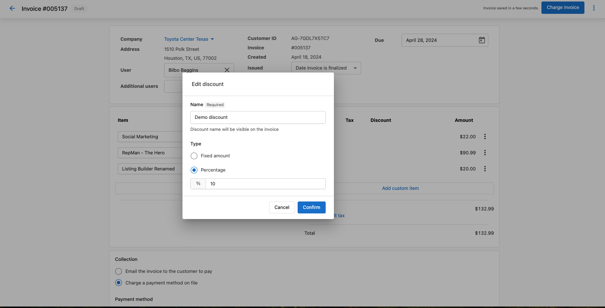
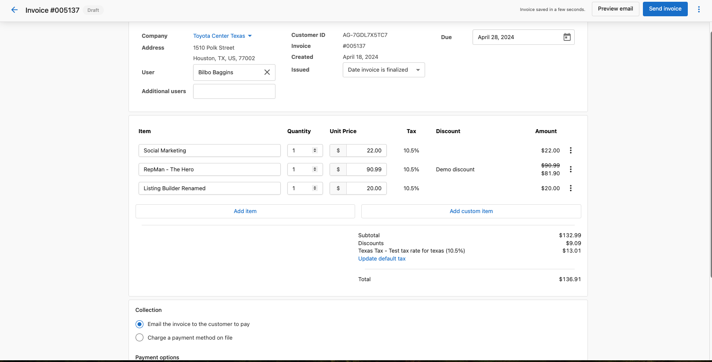
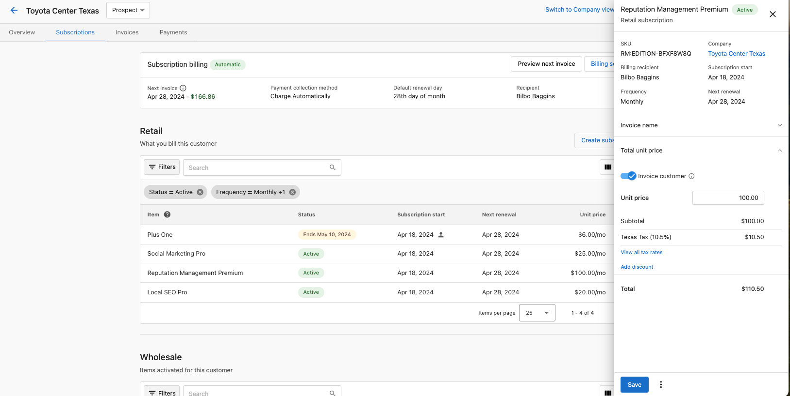
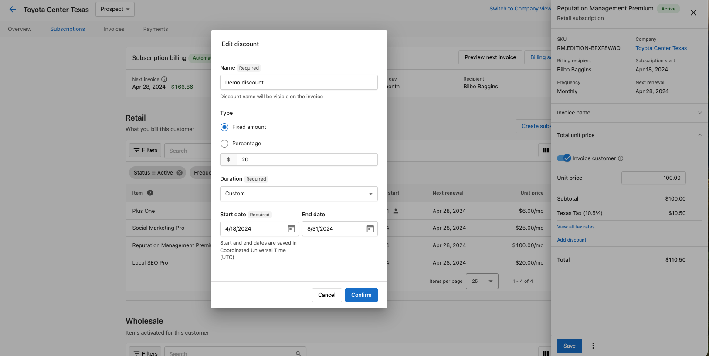
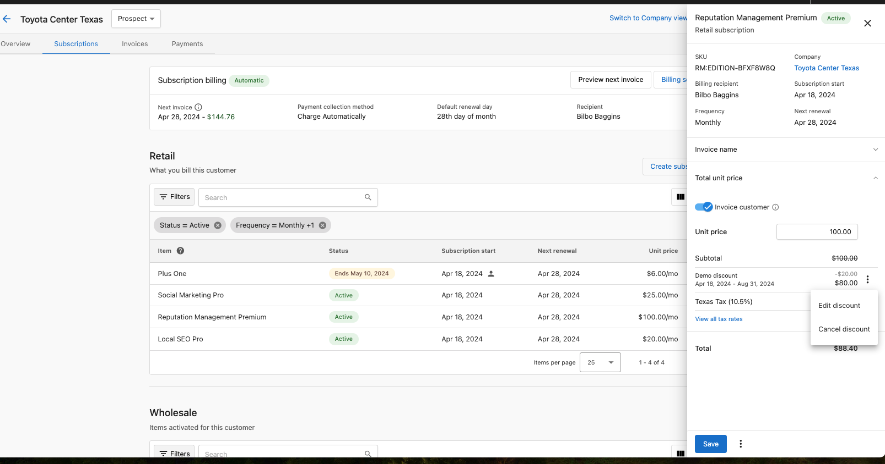

# Discounts in Invoices and Subscriptions

As a merchant, you can apply discounts to your invoices in the Billing section of Commerce. Discounts can be applied as a percentage of the total or a fixed amount, and they can be applied to one-time invoices or recurring subscriptions.

## One-Time Discount

To add a one-time discount to an invoice:

1. Go to the **Billing** section in Commerce
2. Select **Invoices**
3. Click on the invoice you want to modify
4. Click the **Discount** button in the upper right corner

5. In the setup page, choose:
   - **Type**: Percentage or Fixed Amount
   - **Value**: The percentage or dollar amount
   - **Reason**: Why you're applying the discount (optional)

6. Click **Apply**

The discount will be applied to the invoice total.

## Subscription Discount

For recurring subscriptions, you can apply discounts that will be applied to all future invoices generated from that subscription.

1. Go to the **Billing** section in Commerce
2. Select **Subscriptions**
3. Click on the subscription you want to modify
4. Click the **Discount** button

5. In the setup page, choose:
   - **Type**: Percentage or Fixed Amount
   - **Value**: The percentage or dollar amount
   - **Duration**: 
     - **Forever**: Applied to all future invoices
     - **For a limited time**: Select the number of billing cycles to apply the discount
     - **Once**: Applied only to the next invoice
   - **Reason**: Why you're applying the discount (optional)

6. Click **Apply**

## Editing or Canceling a Discount

To modify or remove an existing discount:

1. Go to the invoice or subscription with the discount
2. Click the **Pencil icon** next to the discount to edit it, or the **X icon** to remove it

3. If editing, adjust the values and save your changes

## Notes on Discounts

- Discounts are applied after taxes
- You can have only one discount per invoice or subscription at a time
- Discounts do not apply to past invoices, only current or future ones
- For subscriptions, you can see which future invoices will have discounts applied in the subscription details page