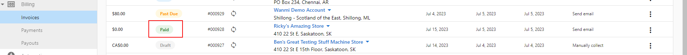

# Can I change an invoice status after it is marked "paid"?

**No** - Once an invoice has been marked as "paid," it cannot be adjusted to another status (such as "due" or "past due.") If an invoice needs to be sent to a client again, recreate the original invoice and send it again.

