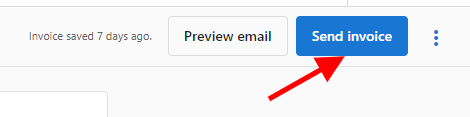
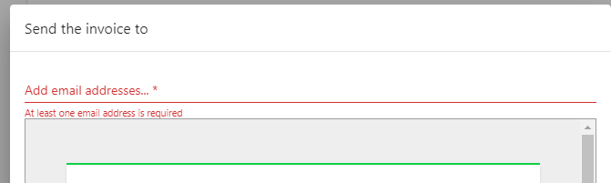
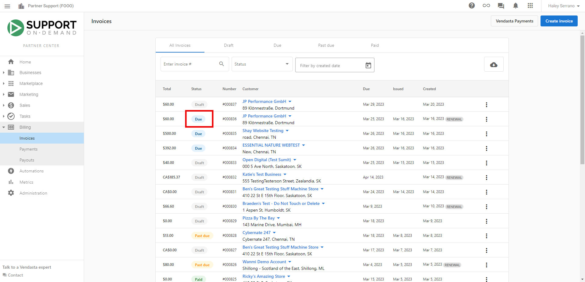
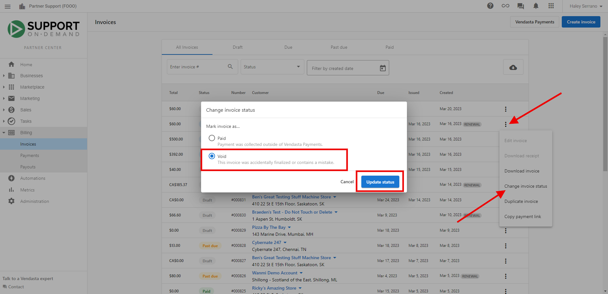

Currently, Partners cannot retract or delete an invoice that has already been sent.

If you have sent an incorrect invoice, create and send a new invoice to your customer.

If you have sent an invoice to the incorrect recipient, an invoice can be sent to a different recipient at any time by clicking **Send Invoice** and choosing a different recipient.

If the invoice is still under the status 'due,' it can also be voided.

To void the invoice, navigate to **Partner Center > Commerce > Invoices > Click the 3 dots next to the invoice and select Change Invoice Status.** Select the **void** status, and **save.**

