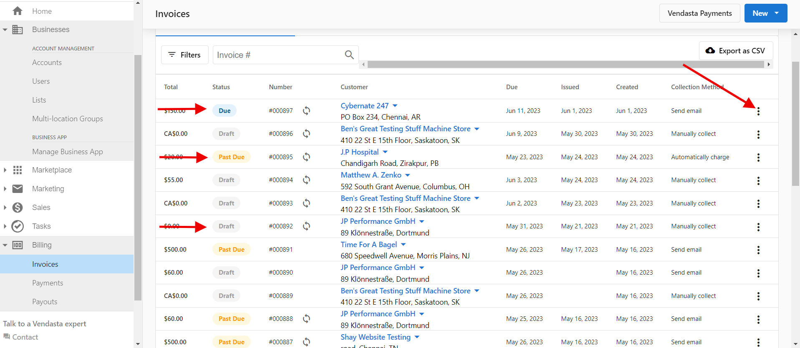
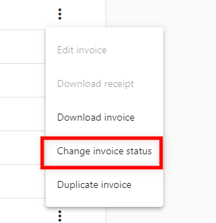

If you want to generate an invoice on an account but do not want to send it to your client, or the client has already paid, you can mark the invoice status as "Paid" for your records:

In **Partner Center > Commerce > Invoices > Select the invoice** (any invoice that is Past Due, or Due status) > **Click the three dots at the end of the row > Change invoice status > Paid:**

**[Watch Walkthrough Video](#walkthrough-video)**

***Please note that invoices with the status "Paid" or "Void" do not have the option to change the invoice status.***

## Walkthrough Video

<iframe 
  src="https://drive.google.com/file/d/1SVnXlfStv3VuAHawjf0-IFLc8Hw-SVzC/preview" 
  width="640" 
  height="480" 
  allowFullScreen
></iframe>