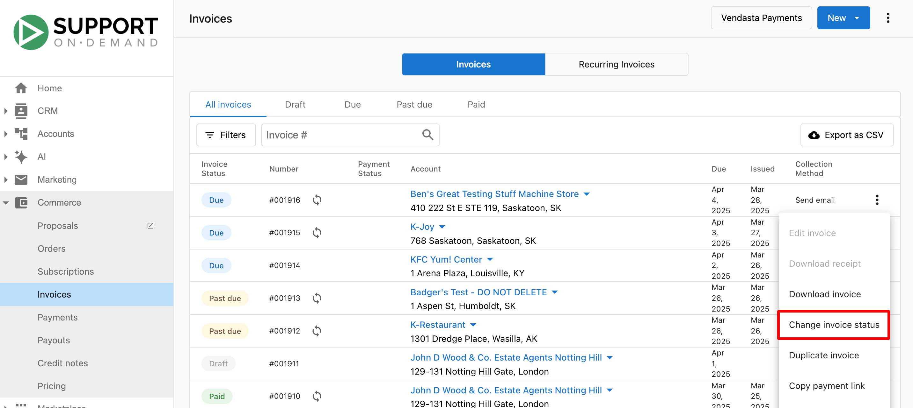
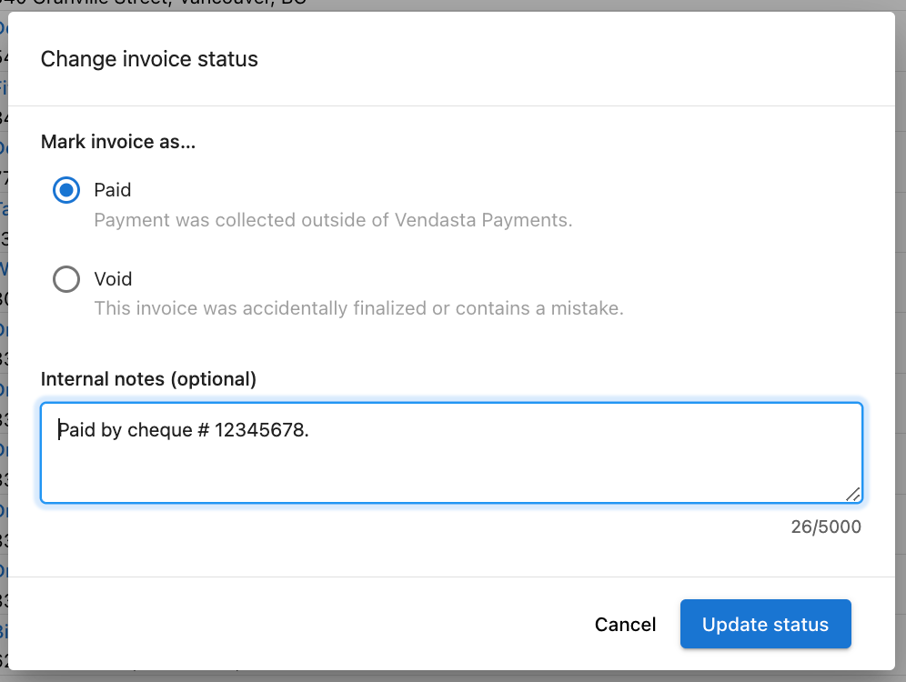
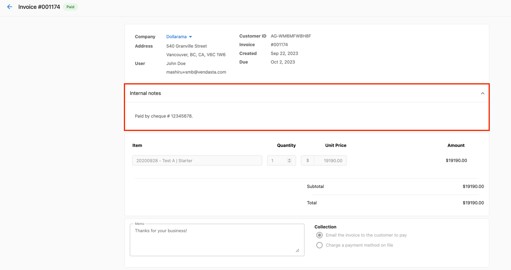

# Invoice Status Notes FAQ

## What are Invoice Status Notes?

Invoice Status Notes allow Partners to add internal notes to invoices to track payment status. These notes are visible only to your organization.

## How do I add a note to an invoice?

To add a note to an invoice:

1. Navigate to the invoice you want to add a note to
2. Look for the "Status Notes" section on the right side of the invoice page
3. Click on "Add Note"
4. Enter your note and click "Save"

## Who can see Invoice Status Notes?

Invoice Status Notes are **internal only**. They are visible only to users in your organization. Your customers will not see these notes.

## Can I edit or delete an Invoice Status Note?

Yes, you can edit or delete a note by:

1. Hovering over the existing note
2. Clicking on the edit (pencil) icon to modify the note, or
3. Clicking on the delete (trash) icon to remove the note

## What kind of information should I add to Invoice Status Notes?

Invoice Status Notes are ideal for tracking:
- Payment status information
- Customer communications about an invoice
- Internal processing notes
- Follow-up reminders
- Special payment arrangements

## Do Invoice Status Notes appear on the customer-facing invoice?

No, Status Notes never appear on the customer-facing invoice. They are strictly for internal use within your organization.

## Can I filter or search invoices by Status Notes?

Currently, the system does not support filtering or searching invoices based on the content of Status Notes. We recommend using standardized note formats to make manual scanning easier.