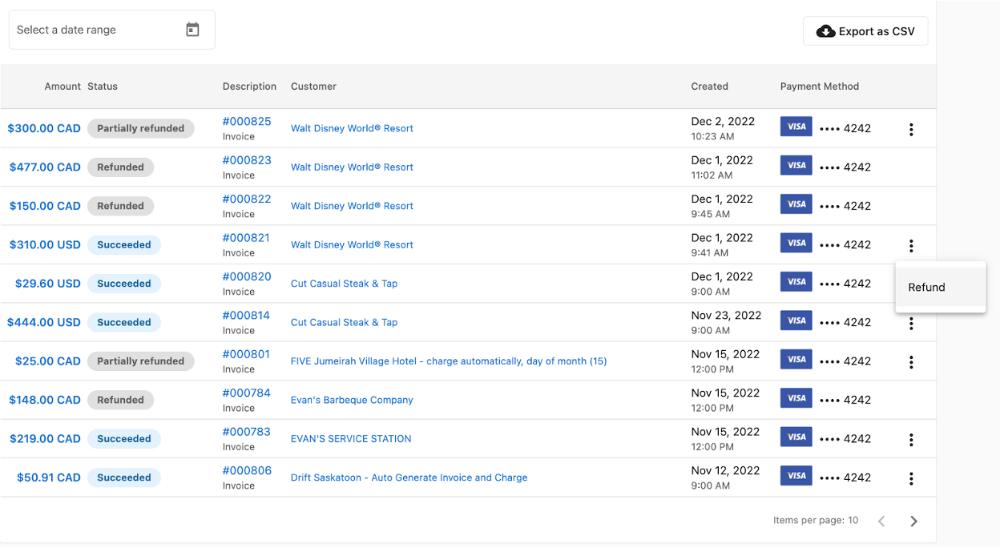
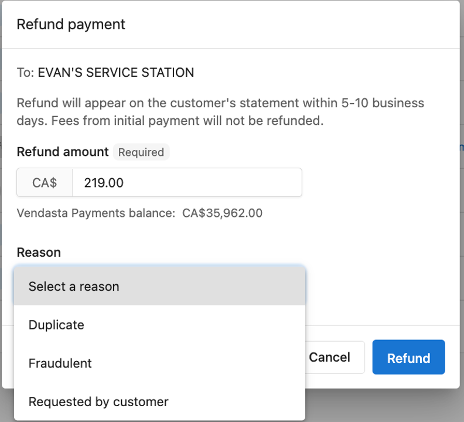
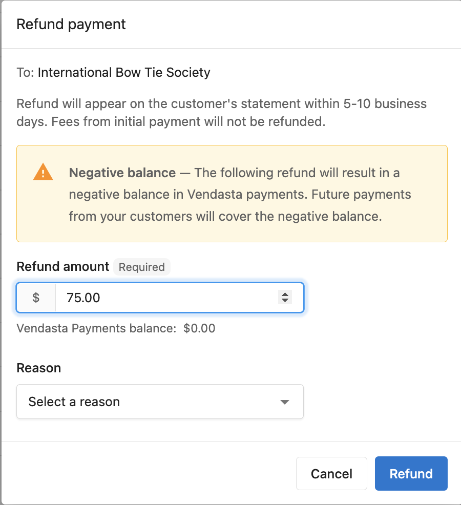
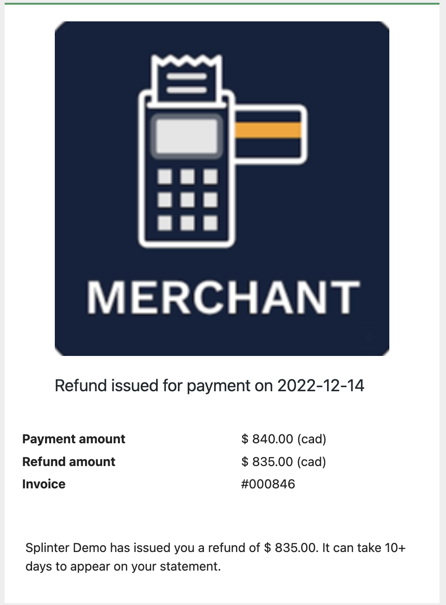

While we always hope clients will be happy with a purchase, we understand that there are times when issuing refunds is necessary. There are a few steps to this process:

1. In Partner Center, go to **Commerce > Payments** and select the payment you're trying to refund. On the kebab menu to the right, you will see a refund option.  
   

2. Enter the amount you would like to refund (you can refund the full payment or partial refund).  
   

3. Select the reason for the refund. The selected reason is for your records only and it is not shared with your client.

4. Finally, click the Refund button at the bottom right to issue the refund.

Your client will receive an email from you, informing them that a refund has been initiated and the payment will hit their account within 5-10 days.

:::note
Requests for refunds to your clients do not guarantee the deactivation of any products. Please ensure that you deactivate the product or products on the account to prevent any additional charges.
:::

## How long does it take for a refund to be paid to my client's bank account?

- Refunds take 5 - 10 business days to process from the date they are issued.

## How much can I refund?

- You can issue a full or partial refund on a payment.

## I have already received the payout in my bank account, can I issue a refund?

- Yes, you can issue refunds even when you don't currently have funds on the platform. We allow you to issue refunds up to a Vendasta payment balance of - $1000. This means that the negative balance will be recovered from your next payment.

- The Vendasta payment balance is the payment you have received but is yet to be paid out into your bank account.

## How do I know if a refund is issued on a payment?

- The status of the payment will change from "succeeded" to "Refunded" or "Partially refunded".

## Is there a fee for issuing refunds to my clients?

- When requesting a **FULL** refund on behalf of your client, the transaction fees (2.99% +$0.30) will be taken from the Partner's connected bank account to complete the amount to be repaid to the client.

## Will the email notification to the client be white-labeled?

- Yes, the email notification to your client informing them that a refund has been issued is white-labeled and will carry your own branding. Here is a sample:

