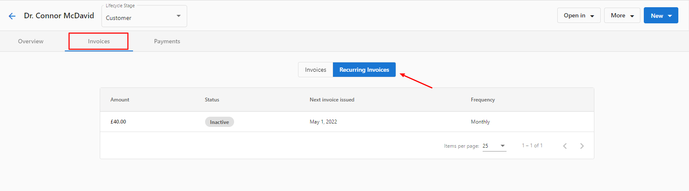

:::caution Discontinued Feature
The Recurring Invoice functionality has been discontinued for new Partners. Please familiarize yourself with the enhanced Subscription Billing feature, which has been introduced as a replacement.
:::

To see the recurring invoices on an account, simply go to **Partner Center > Accounts > Manage Accounts > choose account > Invoices > Recurring Invoices.**

