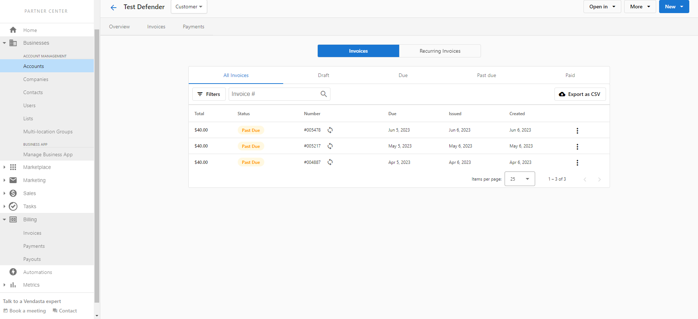
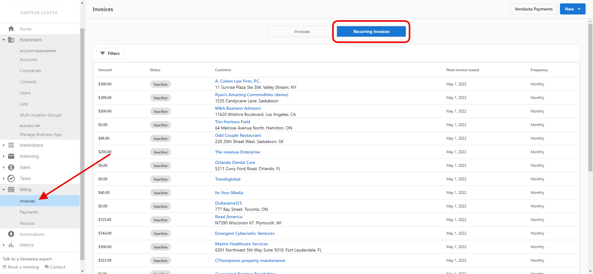

# Where do I find the invoices generated by a recurring invoice?

All generated invoices can be found in two places.

1. Under the customer account in the **Partner Center > Accounts > Manage Accounts > choose account > Invoices**. Here you will see all the generated invoices along with their status, the date the invoice was created, the issued date, and the due date.

2. Under the Billing section in the Partner Center. Go to **Invoices**, here you will find **_all_** generated invoices across **_all_** accounts.

