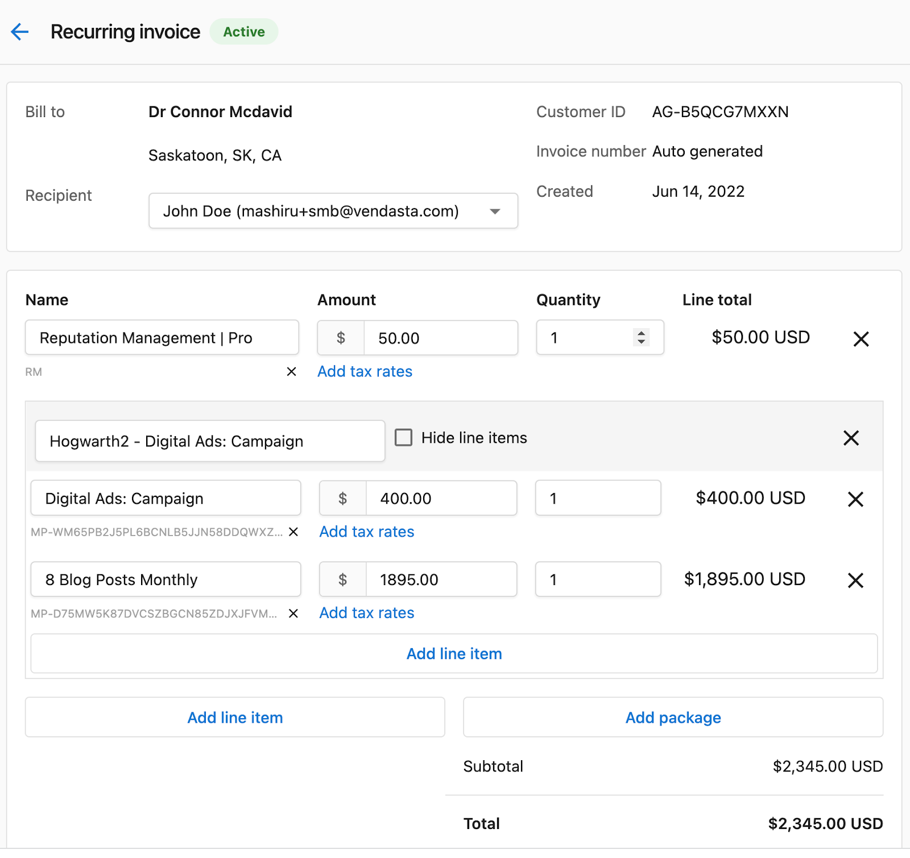

# Which products can I add to a recurring invoice?

:::caution Discontinued Feature
The Recurring Invoice functionality has been discontinued for new Partners. Please familiarize yourself with the enhanced Subscription Billing feature, which has been introduced as a replacement.
:::

Recurring invoices give you the flexibility to add:

1. **Line items:** This option allows you to add products directly from the Marketplace. The product name, price and SKU will be pulled in from the Marketplace. You can edit the values if you wish to.

2. **Packages:** This will add packages directly from your store. The package name along with all the sub-product names, price and SKU will be pulled in from your Store. You have the flexibility to add or delete line items within the package. You can also select to hide the sub-products so that your customer can only see the Package name and price without visibility into the sub-products.

3. **Custom products:** This allows you to enter the product name, price and quantity.

