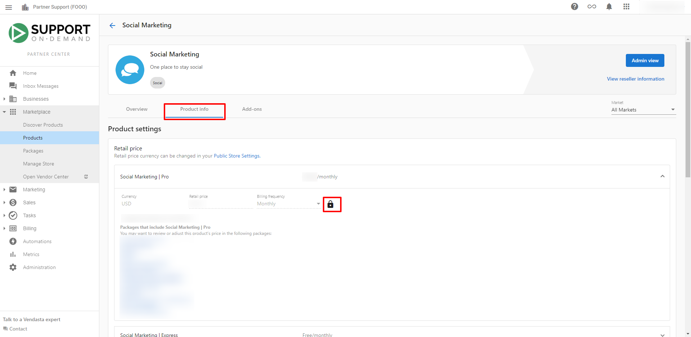

# Why does my package/product have an unexpected price when I add it to an invoice?

If you do not set a retail price for the products you sell, the packages and invoices you create will default to the Suggested Retail Price for a specific product in your store's currency. You may need to set your products' prices by following these steps: **Marketplace > Products > Specific Product > Product Info > Retail Pricing > click on the lock to allow editing of the product's price > edit the retail price > click the lock again to save changes**.

Note that you can adjust the price of any line item on an invoice using the **Unit Price** field.