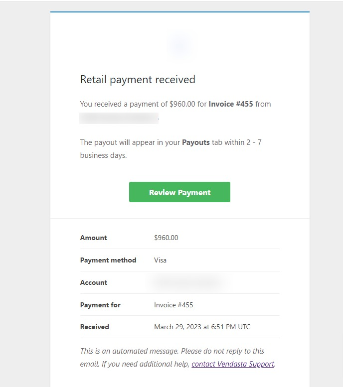
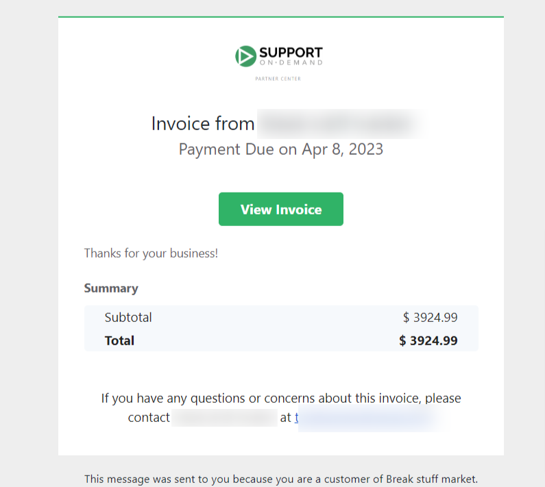
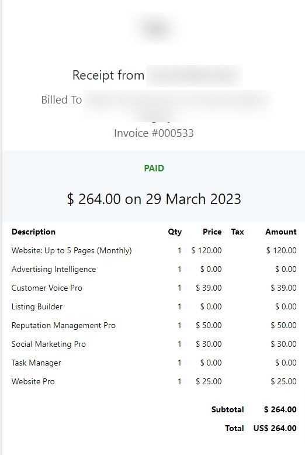

**Yes!** You will receive an email every time an invoice is generated and sent to your customer.

The customer will also receive an email invoice (if you have chosen the payment option to **Email Invoice**). Otherwise, the customer will receive an email receipt for the charge to their Credit Card.

