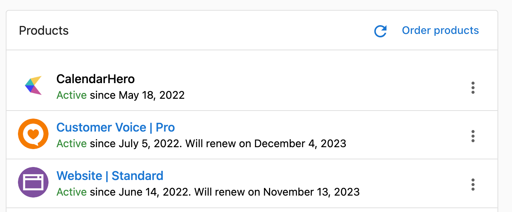

# Activate Products

## Ordering workflow

To give your customers access to your products and services, you'll need to activate them on their accounts. This can be done either individually or in bulk.

- [Individual accounts](#individual-accounts)
- [Multiple accounts](#multiple-accounts)

## Individual accounts

To activate a product or package for an individual account, go to **Partner Center** > **Accounts** > Manage **Accounts** and view an account.

1. Click **Order Products**.
   

2. Select the items you want to activate.
   - **Want to activate Reputation Management from the demo?** When your Salespeople create a prospect in the CRM, they automatically create a Reputation Management demo. As such, the activation process for the Reputation Management demo is a little different than it is for any other product—you'll need to [convert the demo to "paid."](https://support.vendasta.com/hc/en-us/articles/4406959613719)
   - **Can't find a certain item in the list?** Make sure to start selling it first. It may take a few minutes to appear after you start selling.

3. Click **Proceed to Next Step**.

4. Fill out any order form questions required for the items you've chosen, then click **Next**.

5. Review the order contents and edit item prices.

6. Choose a method for collecting payment.

7. Choose an activation date for the items in the order.

8. Once you've confirmed that the order is correct, click **Purchase** to complete the order and pay the wholesale cost of the items ordered.

Once wholesale payment for the order is received, and once approval is received from any vendors that require approval before activating their products, the items in the order will be activated according to the activation date you chose.

You can also activate products from the **Account Details** screen. To access this page, go to **Partner Center** > **Accounts** > Manage [**Accounts**](https://partners.vendasta.com/manage-accounts) and click on the account name.

If your customers have access to Business App they'll now be able to access these products from the **My Products** tab.

## Multiple accounts

This feature is only available for Partners on a *paid* subscription.

To activate products for multiple accounts at once, you need to first add those accounts to a list. Once you have created the List:

1. Go to **Partner Center** > **Accounts** > [**Lists**](https://partners.vendasta.com/action-lists/manage).

2. Click on the List you want to activate products for. Click the **Actions** button in the top right, then click **Activate Product** or **Activate Add-on**.

3. Select the product(s) you want to activate.

   **Can't find the product in the list?**
   - Make sure to start selling the product.
   - If you've just started selling the product, refresh your browser. It may take a few minutes to appear on the list.

4. Click **Activate**.

If your customers have access to Business App, they'll now be able to access these products from the **My Products** tab.

## FAQs

**Q: I activated a product on the wrong account. Is there a way to transfer the product to the correct account?**

**A: No -** If you activate a product on the wrong account, it will need to be cancelled, and re-activated on the correct account. To request a billing adjustment, please reach out to [support@vendasta.com](mailto:support@vendasta.com).