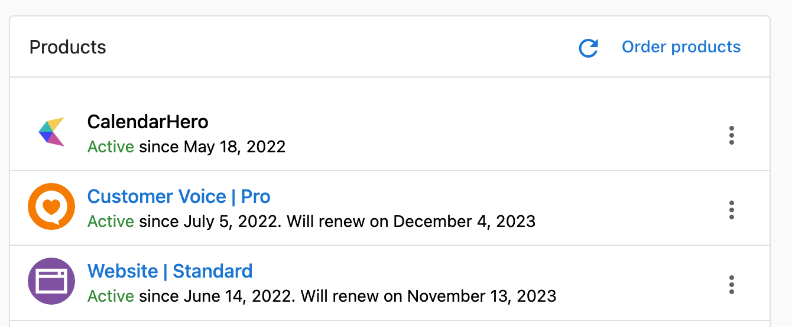

# order Products

## Ordering workflow

To give your customers access to products and services, you'll need to order them for their accounts. This can be done either individually or in bulk.

- [Individual accounts](#individual-accounts)
- [Multiple accounts](#multiple-accounts)

## Individual accounts

You can order products from **CRM** (Partner center -> CRM -> Companies -> Orders), **Commerce** (Partner Center -> Commerce -> Orders -> Create Order), or from the account details page as directed below. 

To order a product or package for an individual account, go to **Partner Center** > **Accounts** > Manage **Accounts** and view an account.

1. Click **Order Products**.
   

2. Select the items you want to order.
   - **Want to order Reputation Management from the demo?** When your Salespeople create a prospect in the CRM, they automatically create a Reputation Management demo. As such, the activation process for the Reputation Management demo is a little different than it is for any other product—you'll need to [convert the demo to "paid."](https://support.vendasta.com/hc/en-us/articles/4406959613719)
   - **Can't find a certain item in the list?** Make sure to start selling it first. It may take a few minutes to appear after you start selling.

3. Fill out any order form questions via the Order Forms tab or Fulfilment Forms tab 

4. Review the order contents and edit item prices.

5. select **Process Order**

6. Select prefered way to process order if settings permit (collecting via vendasta payments or sending to customer for approval)

One the order is successfully processed the prodcuts will appear as acitvated on the account. 
If your customers have access to Business App they'll now be able to access these products from the **My Products** tab.

## Multiple accounts

This feature is only available for Partners on a *paid* subscription.

To order products for multiple accounts at once, you need to first add those accounts to a list. Once you have created the List:

1. Go to **Partner Center** > **Accounts** > [**Lists**](https://partners.vendasta.com/action-lists/manage).

2. Click on the List you want to order products for. Click the **Actions** button in the top right, then click **order Product** or **order Add-on**.

3. Select the product(s) you want to order.

   **Can't find the product in the list?**
   - Make sure to start selling the product.
   - If you've just started selling the product, refresh your browser. It may take a few minutes to appear on the list.

4. Click **order**.

If your customers have access to Business App, they'll now be able to access these products from the **My Products** tab.

Note: 
Bulk actiations are not permitted for products that require an order form. 

## FAQs

**Q: I ordered a product on the wrong account. Is there a way to transfer the product to the correct account?**

**A: No -** If you order a product on the wrong account, it will need to be cancelled, and re-ordered on the correct account. To request a billing adjustment, please reach out to [support@vendasta.com](mailto:support@vendasta.com).