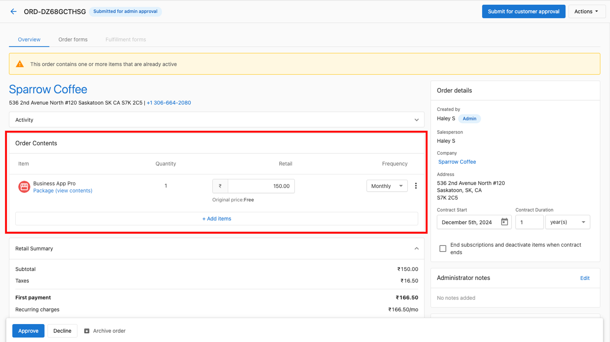

As a salesperson, it is not possible to add items to an order once it has been submitted, but, as an administrator you can add or remove items before approving. You also have the option to decline the order, or the salesperson can cancel and create a new order.

1. Go to the **Commerce** tab **> Orders >** Select the pending **Order.**
2. Click to Add Items, or change pricing.

