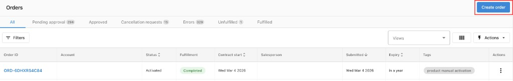
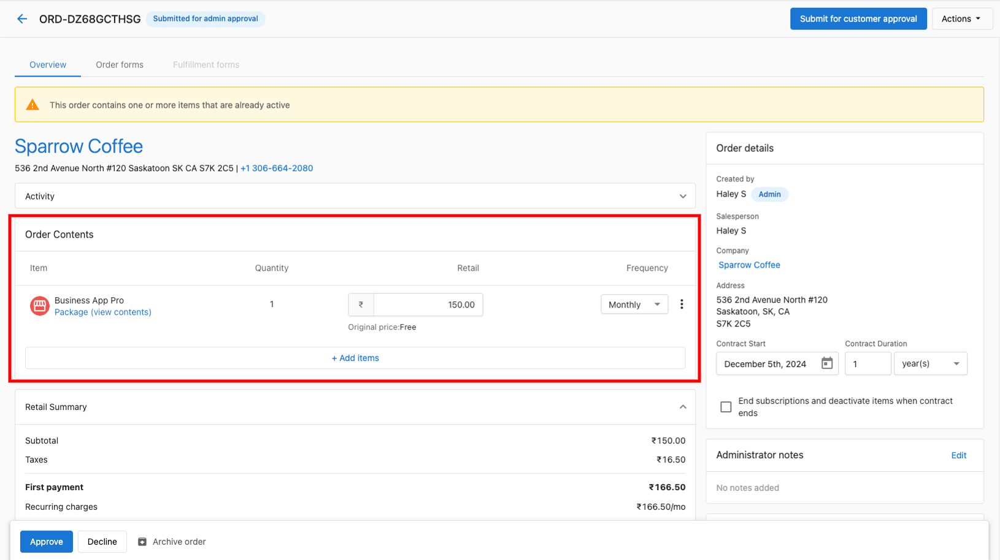

# Creating and Managing Orders

## What are Orders?

Orders in Partner Center are the primary way to activate products and services for your customers. The order system allows you to create professional sales orders, manage the approval process, collect payments, and activate products efficiently. With simplified workflows and comprehensive management tools, you can streamline the entire sales process from creation to activation.

## Why are Orders Important?

Creating orders provides you with the ability to activate products through the Vendasta platform even if your customers' purchasing experience occurs outside of Partner Center. Orders create automatic subscriptions at the time of processing and handle billing on renewal dates. The system reduces administrative tasks, improves collaboration between salespeople and administrators, and ensures all necessary information is available upfront to minimize errors.

## What You Can Do with Orders

With the Orders system, you can:

- Create sales orders for individual accounts or bulk ordering
- Use simplified workflows with draft states and autosave functionality
- Submit orders for customer approval or admin approval
- Manage order approval, decline, and activation processes
- Add or remove products from pending orders
- Track order progress and statuses
- Collect payments directly within orders
- Handle billing terms and pricing configurations
- Activate products individually or in bulk

## How to Set Up

### How to Create Sales Orders

There are multiple ways to create sales orders in Partner Center:

**Method 1: Commerce Section**
1. Go to **Partner Center > Commerce > Orders > Create Sales Order**
2. Add products and add-ons, choosing the desired Edition where applicable
3. Configure retail pricing and quantities
4. Click the 3 dots next to products to edit billing terms
5. Review the order
6. Choose your submission method (customer approval or admin approval)

**Method 2: From Company Profile**
1. From a company profile page, click on **Orders** and select **Create Order**
2. Follow the same process as above

**Method 3: From Account Details**
1. Go to **Partner Center > Accounts > Manage Accounts** and view an account
2. Click **Order Products**
3. Select the items you want to order
4. Fill out any order forms or fulfillment forms
5. Review and edit retail prices if desired
6. Select **Process Order**

### How to Use Simplified Sales Orders

The simplified sales orders workflow provides an enhanced experience with these key features:

- **Draft State**: Orders start as drafts with automatic progress saving
- **Reduced Steps**: Minimized steps to complete an order
- **Autosave Functionality**: Work saves automatically as you go
- **Instant Visibility**: Order Forms and Work Orders appear immediately upon product selection
- **Enhanced Validation**: Easily see what's required before submitting
- **Bulk and Line-by-Line Edits**: Apply contract terms across the order or individually

**Benefits:**
- Saves time by reducing administrative steps
- Improves collaboration between salespeople and administrators
- Ensures all necessary information is available upfront
- Makes order management more flexible and efficient

### How to Order Products for Multiple Accounts

For bulk ordering (available only for Partners on paid subscriptions):

1. Create a list of accounts in **Partner Center > Accounts > Lists**
2. Click on the list you want to order products for
3. Click the **Actions** button, then click **Order Product** or **Order Add-on**
4. Select the product(s) you want to order
5. Click **Order**

:::tip
Bulk activations are not permitted for products that require an order form.
:::

## Managing Orders

### How to Approve Orders

As an administrator with "Can Manage Orders" permissions:

1. From **Partner Center > Commerce > Orders**, click the **Order ID**
2. Review the order for accuracy, including:
   - Any warnings at the top of the page
   - Retail pricing (price changes will be indicated)
   - Wholesale cost adjustments for variable products
3. Click **Approve** at the bottom of the screen
4. Click **Approve & Continue**

After approval, the salesperson receives an email confirmation.

### How to Decline Orders

1. From **Partner Center > Commerce > Orders**, click the **Order ID**
2. Review the order and identify concerns
3. Click **Decline** at the bottom of the screen
4. Enter a message explaining why you've declined the order
5. Click **Decline** on the confirmation modal

### How to Activate Orders

After approving an order, you need to activate it to enable products and create subscriptions:

1. From **Partner Center > Commerce > Orders**, click the **Order ID**
2. Fill in any required information not populated by the salesperson (marked with asterisks)
3. Click the **I understand...** checkbox at the bottom
4. Click **Activate Now**

### How to Add Products to Pending Orders

As an administrator, you can modify pending orders before approval:

1. Go to **Commerce > Orders** and select the pending order
2. Click to **Add Items** or change pricing
3. Make your modifications
4. Proceed with the approval process

:::tip
Salespeople cannot add items once an order is submitted, but administrators can modify orders before approval.
:::

## New Admin Actions

With simplified sales orders, administrators can:

- Submit drafts directly without impersonation
- Duplicate or cancel orders within the order workflow
- Perform key actions without needing to impersonate salespeople
- View and edit orders even without "can manage order" permissions (with salesperson-level access)

## Order Creation Workflows

### Creating Orders for Customer Approval

1. Create your order following the steps above
2. Click **Send For Customer Approval**
3. Select if payment is required
4. Choose a contact to receive the order
5. The order status becomes "Submitting for customer approval"

You can track delivery in the Order Activity card and resubmit to new or same contacts using the "Resubmit for Customer Approval" button.

### Creating Orders for Admin Approval

1. Create your order following the steps above
2. Click **Submit**
3. The order enters "Pending" status
4. An administrator with "Can Manage Orders" permissions must review and approve or decline

## Best Practices

- Keep orders focused on customer needs and requirements
- Use consistent pricing across your team
- Review all order details before submission to prevent activation errors
- Utilize bulk ordering for efficiency when applicable
- Take advantage of simplified workflows to reduce administrative overhead
- Ensure all required fields are completed before submission
- Use draft states to save progress on complex orders

Can I transfer a product ordered on the wrong account?

No - If you order a product on the wrong account, it will need to be cancelled and re-ordered on the correct account. To request a billing adjustment, please reach out to support@vendasta.com.

What's the difference between customer approval and admin approval?

Customer approval sends the order directly to your selected customer contact for their review and approval. Admin approval sends the order to administrators with "Can Manage Orders" permissions for internal review before customer interaction.

Can I edit an order after submission?

Salespeople cannot edit orders once submitted. However, administrators can add or remove items from pending orders before approval. Alternatively, orders can be declined and recreated with corrections.

How do I know if a product requires an order form?

Products requiring order forms will display form fields during the order creation process. These products cannot be activated through bulk ordering and must be ordered individually.

What happens if I can't find a product in the order list?

Make sure you've started selling the product first. It may take a few minutes to appear after you begin selling it. Refresh your browser if you've recently started selling the product.

Can I export my orders to a CSV file?

Yes! You can export the table of orders into a CSV file. Go to **Partner Center > Commerce > Orders** and click the **Export** button in the top right-hand corner of the page.

