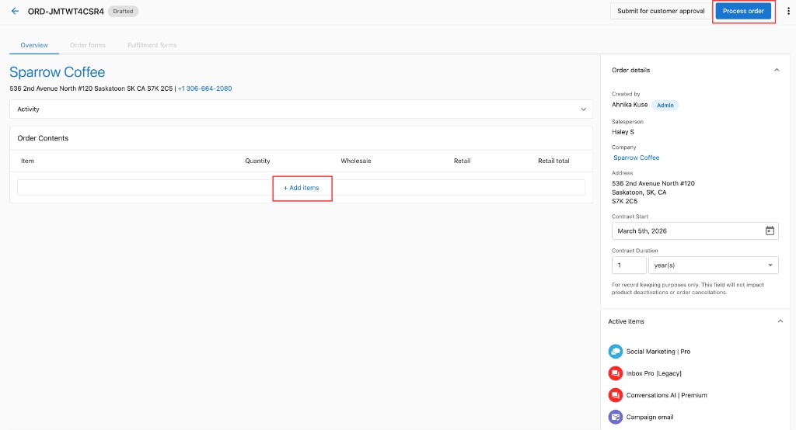

# Creating and Managing Orders

## What are Orders?

Orders in Partner Center are the primary way to activate products and services for your customers. The order system allows you to create professional sales orders, manage the approval process, collect payments, and activate products efficiently. With simplified workflows and comprehensive management tools, you can streamline the entire sales process from creation to activation.

## Why are Orders Important?

Creating orders provides you with the ability to activate products through the Vendasta platform even if your customers' purchasing experience occurs outside of Partner Center. Orders create automatic subscriptions at the time of processing and handle billing on renewal dates. The system reduces administrative tasks, improves collaboration between salespeople and administrators, and ensures all necessary information is available upfront to minimize errors.

Proper order processing also ensures customers receive their products and services without delays while maintaining business controls and quality assurance. Understanding order statuses helps teams track progress, identify bottlenecks, and resolve issues quickly.

## What You Can Do with Orders

With the Orders system, you can:

- Create sales orders for individual accounts or bulk ordering
- Use simplified workflows with draft states and autosave functionality
- Submit orders for customer approval or admin approval
- Manage order approval, decline, and activation processes
- Add or remove products from pending orders
- Track orders through various status stages
- Collect payments directly within orders
- Handle billing terms and pricing configurations
- Control when and how products are activated, including scheduling activation for future dates
- Access activated products through multiple methods
- Resolve activation errors when they occur

## Order statuses

Understanding order statuses is crucial for managing your sales process effectively. Here are the complete order statuses and their meanings:

| **Status** | **What it means** | **Notes** |
|------------|-------------------|------------|
| Drafted | The order has been created but not submitted | Drafted orders can be archived by both salespeople and admins |
| Awaiting customer approval | The order was sent to the customer to approve or decline | Orders in this status cannot be altered. If there's an error, they can be cancelled or archived and then duplicated to edit details |
| Pending | The order has been submitted to an admin to approve or decline | Pending orders require action from an administrator to move to the next step |
| Approved | The order was approved by the customer or admin | Intermediary status used for actions like collecting payment before activation |
| Processing | The products in the order are being activated | This status generally appears for only a few moments |
| Scheduled activation | The order was approved and set to activate on a future date | Products will not be activated until the scheduled date |
| Activated | All products in the order were activated | Products and services have been successfully activated |
| Activation errors | Some products couldn't be activated and action is needed | Hover over the "Activation Error" badge to see details. Action is typically needed to correctly activate products |
| Declined | The customer or admin has declined the order | Includes a reason provided by whoever declined the order |
| Archived | The order is kept for historical purposes only | These orders are only visible by filtering and are not visible in Business App |
| Cancellation request | A salesperson or admin has requested cancellation | Includes a reason for the cancellation request |
| Canceled | The order has been canceled | Useful for tracking churn. Note: canceling an order does not cancel retail or wholesale subscriptions |
| Resubmitted | A salesperson has sent a previously rejected order for approval again | Used when addressing decline reasons and resubmitting |

**Orders can be accessed via:**

- **Partner Center** → **Commerce** → **Orders**
- **Partner Center** → **Accounts** → **Account Details** → **Orders** card
- **Partner Center** → **Companies** → **Company Details** → **Orders** card

## Creating orders

### How to create sales orders

There are multiple ways to create sales orders in Partner Center:

**Method 1: Commerce Section**
1. Go to **Partner Center** → **Commerce** → **Orders** → **Create Order**
2. Choose correct account
3. Add products and add-ons, choosing the desired Edition where applicable
4. Configure retail pricing and quantities
5. Click the 3 dots next to products to edit billing terms
6. Review the order
7. Choose your submission method (customer approval or admin approval)

**Method 2: From Company Profile**
1. From a company profile page, click on **Orders** and select **Create Order**
2. Follow the same process as above

**Method 3: From Account Details**
1. Go to **Partner Center** → **Accounts** → **Manage Accounts** and view an account
2. Click **Order Products**
3. Select the items you want to order
4. Fill out any order forms or fulfillment forms
5. Review and edit retail prices if desired
6. Select **Process Order**

### How to use simplified sales orders

The simplified sales orders workflow provides an enhanced experience with these key features:

- **Draft State**: Orders start as drafts with automatic progress saving
- **Reduced Steps**: Minimized steps to complete an order
- **Autosave Functionality**: Work saves automatically as you go
- **Instant Visibility**: Order Forms and Work Orders appear immediately upon product selection
- **Enhanced Validation**: Easily see what's required before submitting
- **Bulk and Line-by-Line Edits**: Apply contract terms across the order or individually

**Benefits:**
- Saves time by reducing administrative steps
- Improves collaboration between salespeople and administrators
- Ensures all necessary information is available upfront
- Makes order management more flexible and efficient

### How to order products for multiple accounts

For bulk ordering (available only for Partners on paid subscriptions):

1. Create a list of accounts in **Partner Center** → **Accounts** → **Lists**
2. Click on the list you want to order products for
3. Click the **Actions** button, then click **Order Product** or **Order Add-on**
4. Select the product(s) you want to order
5. Click **Order**

:::tip
Bulk activations are not permitted for products that require an order form.
:::

## Managing orders

### How to add products to pending orders

As an administrator, you can modify pending orders before approval:

1. Go to **Commerce** → **Orders** and select the pending order
2. Click to **Add Items** or change pricing
3. Make your modifications
4. Proceed with the approval process

:::tip
Salespeople cannot add items once an order is submitted, but administrators can modify orders before approval.
:::

### New admin actions

With simplified sales orders, administrators can:

- Submit drafts directly without impersonation
- Duplicate or cancel orders within the order workflow
- Perform key actions without needing to impersonate salespeople
- View and edit orders even without "can manage order" permissions (with salesperson-level access)

### Editing an order after it has been placed

Orders can only be edited freely while in **Draft** status. Once submitted:

- **Salespeople** cannot edit the order at all
- **Admins with "Can Manage Orders"** can add or remove items from a **Pending** order before it is approved

If you need to change something on a submitted order that is not in Pending status (for example, changing a contract start date), you must **decline or cancel the order** and create a new one with the correct details.

### Cancelled orders cannot be restored

Once an order is cancelled, it cannot be uncancelled or restored. If you need to re-create the order, use the **Duplicate** option from the order's action menu to copy it into a new draft, then update as needed and resubmit.

## Approval workflows

Based on partner configuration, orders can be sent to one of two places after submission: to your customer for approval, or to an administrator for internal review.

### Creating orders for customer approval

1. Create your order following the steps above
2. Click **Send For Customer Approval**
3. Select if payment is required
4. Choose a contact to receive the order
5. The order status becomes "Submitting for customer approval"

You can track delivery in the Order Activity card and resubmit to new or same contacts using the "Resubmit for Customer Approval" button.

### Creating orders for admin approval

1. Create your order following the steps above
2. Click **Submit**
3. The order enters "Pending" status
4. An administrator with "Can Manage Orders" permissions must review and approve or decline

### Manual vendor approval

Some marketplace products require the vendor to manually approve the order before it can be activated. When this is the case, the order will show a **"Manual vendor approval required"** indicator on the relevant line item. No action is required from you—the vendor is notified automatically. Activation proceeds once the vendor approves on their end.

If an order has been waiting on vendor approval for longer than expected, contact the vendor directly through **Marketplace** → **[Product]** → **Contact Us**.

### Resending the approval email

If a customer hasn't received or can't find their approval email:

1. Open the order in **Commerce** → **Orders**
2. Click **Resend to a customer** in the order toolbar
3. Confirm the contact and send

:::note Why customers may receive the approval email more than once
Orders approaching their expiry date trigger an automatic reminder re-send job (typically 1–2 days before expiry). If your customer receives the approval email multiple times, this is why. To stop the re-sends, either ask the customer to approve the order or cancel it.
:::

### How to approve orders

As an administrator with "Can Manage Orders" permissions:

1. From **Partner Center** → **Commerce** → **Orders**, click the **Order ID**
2. Review the order for accuracy, including:
   - Any warnings at the top of the page
   - Retail pricing (price changes will be indicated)
   - Wholesale cost adjustments for variable products
3. Click **Approve** at the bottom of the screen
4. Click **Approve & Continue**

After approval, the salesperson receives an email confirmation.

### How to decline orders

1. From **Partner Center** → **Commerce** → **Orders**, click the **Order ID**
2. Review the order and identify concerns
3. Click **Decline** at the bottom of the screen
4. Enter a message explaining why you've declined the order
5. Click **Decline** on the confirmation modal

## Processing and activating orders

### Does an approved order automatically activate products?

**Not immediately!** Additional steps are required after approval:

1. **Approve the Order**: Review and approve the order first

2. **Billing Agreement**: Check the box to agree to be billed for selected products

3. **Choose Activation Timing**: Select when products should be activated:
   - **Activate Immediately**: Products activate right away
   - **Activate on Contract Start Date**: Products activate when contract begins

4. **Confirmation**: Products activate according to your selected timing

:::tip
Products will NOT activate until you explicitly agree to billing and choose an activation option.
:::

### How to activate orders

After approving an order, you need to activate it to enable products and create subscriptions:

1. From **Partner Center** → **Commerce** → **Orders**, click the **Order ID**
2. Fill in any required information not populated by the salesperson (marked with asterisks)
3. Click the **I understand...** checkbox at the bottom
4. Click **Activate Now**

### How to approve an order without activating products

Some partners prefer to collect payment before activating products—for example, during staged onboarding or when a customer needs to pay before services begin. You can approve a sales order and collect payment without activating the products by leaving the billing agreement checkbox unchecked.

**Step-by-step:**

1. Create and submit the sales order as usual.
2. When approving the order, you will see a **billing agreement checkbox** ("I understand that I will be billed for activated products").
3. **Leave this checkbox unchecked** and proceed to approve the order.
4. The order moves to **Approved** status. Products are not activated. The customer can be invoiced at this point.
5. To activate the products later, a Partner Center admin must return to the order, check the billing agreement checkbox, and select an activation timing option.

:::info
Products remain in **Approved** status until a Partner Center admin explicitly agrees to billing and activates them. Approval alone—without the billing agreement—does not trigger activation.
:::

## Accessing activated products

Once products are activated, there are several ways to access them:

### Method 1: Via Permissions
1. Navigate to **Partner Center** → **Business Details** → **Clients & Prospects**
2. Find the business and click the edit icon (three dots)
3. Go to **Permissions** → **Settings**
4. Activated products and services display in this section

### Method 2: Via Impersonation
1. Navigate to **Partner Center** → **Business Details** → **Clients & Prospects**
2. Find the business and click the impersonate icon (three dots)
3. Look for the red banner confirming successful impersonation
4. Business products and services display under **Apps**

### Method 3: Via Business Details
1. Navigate to **Partner Center** → **Business Details** → **Clients & Prospects**
2. Click on the business name
3. Click on the **Products & Services** tab
4. All active products and services display here

### Method 4: Via Order Details Page
1. Navigate to **Partner Center** → **Commerce** → **Orders**
2. Find the order with the activated product
3. Click **View** next to the order
4. Click on the order item that says **Setup**, **Access**, or **Launch**

## Post-activation: notifications, refunds, and SMB-initiated orders

### Activation email notifications

Activation emails to clients are **off by default**. To notify clients when a product activates, set up an Automation:

1. Go to **Automations** → **Create Automation**
2. Set the trigger to an order or product activation event
3. Add a **Send Email** or **Send Notification** action targeting the client contact

This replaces the legacy activation email behavior and gives you full control over the message content and timing.

### Rejected-order refunds are automatic

If an order fails to activate and is rejected, any payment collected for that order is automatically refunded as a **credit note**. You do not need to request a refund manually.

To find the credit note:
- Go to **Administration** → **My Billing** to see the credit applied to your account
- Go to **Commerce** → **Financial Documents** → **Credit Notes** for the formal credit note document

### Reviewing SMB-initiated orders before activation

If your clients can place orders themselves (through the store), those orders activate automatically by default. To hold SMB-initiated orders for Partner review before activation:

1. Go to **Administration** → **Order Settings** → **Default Content**
2. Add a custom form with an **Administrative Questions** section to every order
3. Mark a required field as hidden from the customer—the order cannot activate until an admin fills in that field

This effectively gates activation on an admin completing the internal field, giving you a review step before products go live.

### Stair-step pricing and bulk activations

If your products use stair-step pricing (where the first tier is free and the price increases with volume), activating large batches of accounts at once can trigger the higher tier unexpectedly. **Recommendation:** use a **free-unit discount** instead of a free first tier to avoid unintended charges during bulk activations.

## Handling activation errors

### What is an activation error?

The **Activation Error** status appears when there's a problem activating one or more items on an order. This status ensures you're aware of issues requiring attention before the order can be fully activated.

### How to resolve activation errors

1. **Open the order** with Activation Error status
2. **Check the Fulfillment card** in the order:
   - Red badge appears next to affected items
   - Hover over badge for error details
3. **Get additional information**:
   - Go to the Account Group
   - Review rejection reason in the Products card
4. **Take corrective action**:
   - Select `Edit and resubmit` from the menu (kebab icon), **OR**
   - Dismiss the error, resolve the issue, and submit a new order
5. **Complete the process**:
   - After submitting corrected order and reviewing subscriptions
   - Return to the error order
   - Select kebab menu and choose `Ignore All Errors`
   - Status updates to **Activated**

:::warning
Only ignore errors after reviewing and resolving issues that could affect product delivery.
:::

## Best practices

- Keep orders focused on customer needs and requirements
- Use consistent pricing across your team
- Review all order details before submission to prevent activation errors
- Utilize bulk ordering for efficiency when applicable
- Take advantage of simplified workflows to reduce administrative overhead
- Ensure all required fields are completed before submission
- Use draft states to save progress on complex orders

## Frequently asked questions

Can I transfer a product ordered on the wrong account?

No - If you order a product on the wrong account, it will need to be cancelled and re-ordered on the correct account. To request a billing adjustment, please reach out to support@vendasta.com.

What's the difference between customer approval and admin approval?

Customer approval sends the order directly to your selected customer contact for their review and approval. Admin approval sends the order to administrators with "Can Manage Orders" permissions for internal review before customer interaction.

Can I edit an order after submission?

Salespeople cannot edit orders once submitted. However, administrators can add or remove items from pending orders before approval. Alternatively, orders can be declined and recreated with corrections.

How do I know if a product requires an order form?

Products requiring order forms will display form fields during the order creation process. These products cannot be activated through bulk ordering and must be ordered individually.

What happens if I can't find a product in the order list?

Make sure you've started selling the product first. It may take a few minutes to appear after you begin selling it. Refresh your browser if you've recently started selling the product.

Can I export my orders to a CSV file?

Yes! You can export the table of orders into a CSV file. Go to **Partner Center** → **Commerce** → **Orders** and click the **Export** button in the top right-hand corner of the page.

Will Activation Error stop my entire order from activating?

It may affect only specific items with errors, but the order remains in Activation Error status until resolved or ignored.

Can I fix only one item and leave others in error?

Yes. You can edit and resubmit individual line items in account details, then choose to ignore specific errors on the order after reviewing them.

Where can I find error details?

Details appear in the Fulfillment card (red badge tooltip) and in the Products card of Account details.

When should I use "Ignore All Errors"?

Use it only after confirming that remaining issues will not impact your customer's services.

Can I prevent Activation Errors?

Most errors occur due to missing information, incorrect form entries, or account setup issues. Reviewing all order details before submission can help prevent them.

What happens if I select "Activate on Contract Start Date"?

Products will be scheduled for activation when the contract officially begins. Ensure the start date is correctly configured to avoid delays.

How long does the Processing status last?

The Processing status generally appears for only a few moments while products are being activated in the system.

Can I change activation timing after approval?

Once you've agreed to billing terms and selected activation timing, you cannot change it. You would need to create a new order if different timing is required.

What's the difference between Canceled and Archived orders?

Canceled orders are specifically marked as canceled (useful for tracking churn), while Archived orders are simply moved out of active view for historical purposes. Neither status cancels existing subscriptions.

Can I disable auto-activation when a customer pays during approval?

No. When a customer pays during the approval step, product activation triggers automatically—this cannot be disabled. If you need to delay activation after payment, use one of these workarounds:

- **Set a future contract start date** on the order line items so products activate on that date instead of immediately
- **Use a manual invoice flow** instead of the customer-approval payment flow, then activate manually when ready

The MatchCraft Ads Express order form shows a timeout page — what do I do?

This happens when MatchCraft Ads Express is not yet activated on the account before the order form is accessed. To resolve it:

1. Activate **MatchCraft Ads Express** on the account first
2. Then submit the order — the order form will load correctly

"Proceed to next step" is grayed out for an add-on product — why?

This usually means the parent product is **suspended** in Vendor Center. To resolve it:

1. Go to **Vendor Center** → **Products** and check if the parent product is suspended
2. Resume activations on that product
3. Return to the order — the "Proceed to next step" button should become active

An order shows "Deferred" status — what does that mean?

**Deferred** means the order approval email failed to deliver to the recipient. This is typically an email deliverability issue. To resolve it:

- Check that the recipient email address is correct and reachable
- Confirm your sending domain has valid **SPF** and **DMARC** records configured
- Try resending the order to a different contact or email address

If deliverability is confirmed but the issue persists, contact support.

