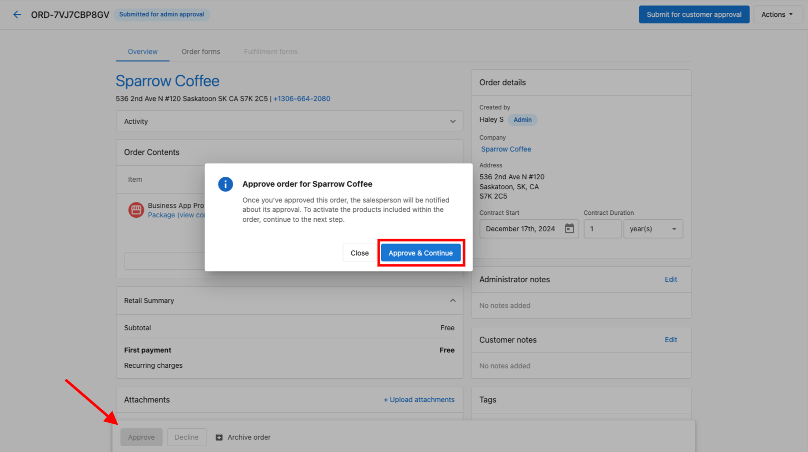
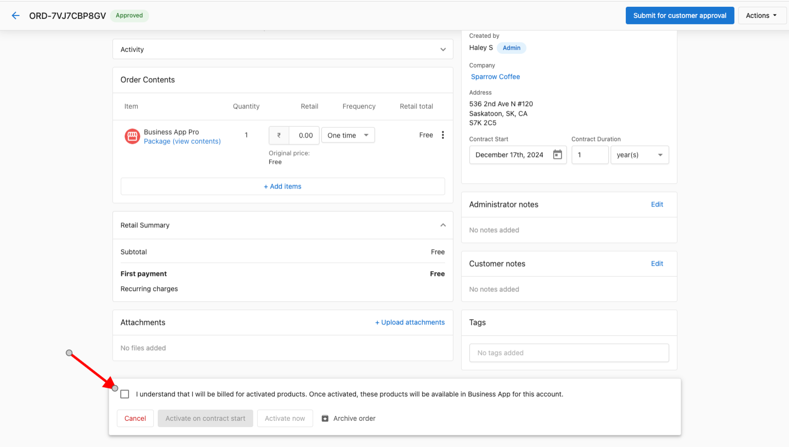
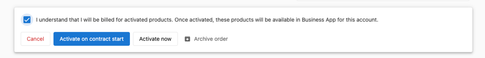

# Does an Approved Order Automatically Activate Products on Accounts?

**Not immediately!** Once you approve an order, additional steps are required to activate the products on account groups. Here's the process:

1. **Approve the Order**: Start by reviewing and approving the order.
   

2. **Billing Agreement**: After approving, you must check the box to agree to be billed for the selected products.
   

3. **Choose Activation Timing**: You will be prompted to choose when the products should be activated. There are two options:
   - **Activate Immediately**: Products will be activated right away.
   - **Activate on Contract Start Date**: Products will be activated when the contract officially begins.
   

4. **Confirmation**: Once you agree to the billing terms and select an activation timing, the products will be activated accordingly.

### Notes

- Products will *not* activate until you explicitly agree to billing and choose an activation option.
- If you select "Activate on Contract Start Date," ensure the start date is correctly configured to avoid delays.

By following these steps, you can ensure products are activated at the appropriate time for your account groups.