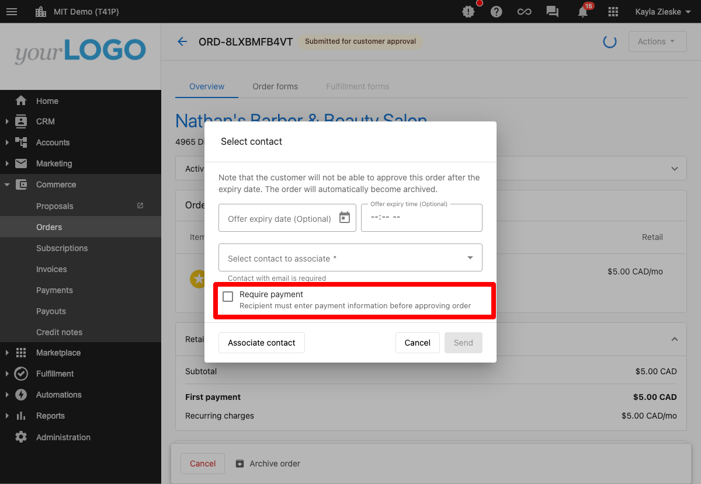
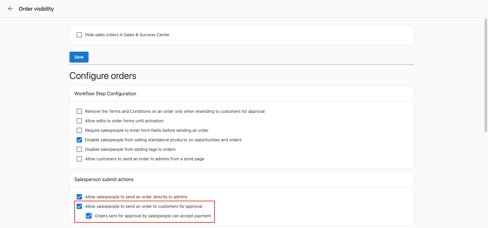

# Order Payments and Billing

## What are Order Payments?

Order payments in Partner Center allow you to collect and process payments directly within the order workflow. This includes collecting first payments when orders are created, enabling customer payment collection during approval processes, and automating billing setup for ongoing subscriptions. The system securely handles credit card information and streamlines payment processing to reduce manual effort.

## Why are Order Payments Important?

Payment collection within orders eliminates manual steps, reduces processing time, and ensures secure handling of sensitive payment information. By collecting payments directly in the order workflow, you can automatically activate orders, create subscriptions, and establish billing relationships. This streamlined approach improves cash flow and reduces the risk of payment delays or errors.

## What You Can Do with Order Payments

With order payment features, you can:

- Collect first payments directly within orders
- Enable customer payment collection during approval
- Store credit card information securely for future billing
- Automatically process payments and activate orders
- Set up default billing settings during order creation
- Handle payment declines and reprocessing
- Configure payment collection permissions for salespeople
- Generate invoices automatically upon successful payment

## How to Set Up Order Payments

### How to Collect First Payments Directly from Orders

This feature allows you to collect and charge credit card information directly within an order:

**Key Benefits:**
- Secure credit card storage within orders
- Automated payment processing and order activation
- Efficient permission management for non-admin users
- Reduced manual effort in payment collection
- Payment method visibility for existing customers
- Simplified billing setup for ongoing subscriptions

**Process:**
1. **Access the Order**: Open the order requiring payment collection
2. **Enter or Select Credit Card**:
   - If a credit card is on file, select it
   - If a new card is required, enter credit card details
3. **Submit the Order**: Submit for processing

**Automated System Actions - Credit Card Approved:**
- Order is activated (or scheduled for activation)
- Products are activated based on scheduled dates
- Order history is updated
- Subscriptions are created
- Invoice is generated
- Payment details recorded in "PAYMENT" tab
- Billing information becomes default if none previously set

**Automated System Actions - Credit Card Declined:**
- Payment details recorded in "PAYMENT" tab
- "Payment declined" tag added to order
- Order status set to "DECLINED"
- Order history updated
- Order can be converted to "draft" for reprocessing

:::tip
All payment details can be found in the "PAYMENT" tab of the order.
:::

### How to Enable Customer Payment Collection

Partner Center allows sales orders sent for customer approval to include payment collection capabilities:

**Features:**
- Credit card collection during customer approval
- Customer signature input for order approval
- Streamlined transaction process
- Enhanced security for customer payments

**Configuration Steps for Administrators:**

1. **Navigate to Administration**:
   - Go to **Administration > Customize > Sales > Configure sales orders and processes**

2. **Configure Sales Orders**:
   - Find the "Salesperson submit actions" card

3. **Enable Customer Approval and Payment**:
   - Ensure "Allow salespeople to send an order to customers for approval" is checked
   - Check "Orders sent for approval by salespeople can accept payment"

**Salesperson Workflow:**
1. Salespeople can select **Submit for customer approval** on an order
2. Order is sent to customer for approval and payment
3. Customer approves order and provides payment information
4. Upon successful payment, invoice with 'Paid' status is generated
5. Order processes and changes to 'Activated' status

## Payment Collection Process

### Direct Payment Collection

**For Sales and Admin Users:**
- Users with necessary permissions can utilize payment collection features
- Secure credit card storage within the order system
- Automatic processing and activation upon successful payment
- Clear payment tracking in dedicated PAYMENT tab

### Customer Approval with Payment

**Enhanced Customer Experience:**
- Customers receive approval request with payment collection capability
- Signature input ensures secure transaction process
- Streamlined approval and payment in single workflow
- Automatic invoice generation and order processing

## Payment Handling

### Successful Payments

When payments are successfully processed:
- Orders automatically activate (or schedule activation)
- Products become available to customers
- Subscriptions are created for ongoing billing
- Invoices are generated with 'Paid' status
- Payment information is securely stored
- Default billing settings are established

### Payment Declines

When payments are declined:
- Clear indication of decline reason in PAYMENT tab
- Order status updated to reflect payment issue
- Option to convert order to draft for reprocessing
- Opportunity to update payment information
- Ability to retry payment collection

## User Permissions

### Sales Users
- Can collect payments with appropriate permissions
- Can send orders for customer approval with payment
- Can view payment status in orders
- Cannot access full administrative payment features

### Admin Users
- Full access to payment collection features
- Can configure payment collection settings
- Can enable/disable customer payment collection
- Can manage payment-related permissions for salespeople

## Best Practices

- Verify customer payment information before processing
- Use customer approval with payment for better customer experience
- Monitor payment declines and follow up promptly
- Ensure proper permissions are set for payment collection
- Review payment details in PAYMENT tab for all transactions
- Set up default billing information during first payment collection
- Use secure payment processing for all credit card transactions

What happens if a customer's payment is declined during approval?

The order status is set to "DECLINED," payment details are recorded in the PAYMENT tab, and the order can be converted to draft for reprocessing with updated payment information.

Can I collect payments without full admin permissions?

Yes, sales and admin users with the necessary permissions can utilize payment collection features without requiring full administrative access.

How do I know if a customer has an existing payment method?

The system provides payment method visibility, showing if a customer has an existing credit card on file during the order creation process.

What happens to billing information after the first payment?

If no default billing settings were previously set, the payment information entered during order collection becomes the default for future billing, subject to your billing configurations.

Can salespeople collect payments independently?

Salespeople can collect payments if administrators have enabled "Orders sent for approval by salespeople can accept payment" in the sales order configuration settings.

Where can I find all payment details for an order?

All payment information, including successful payments and declines, can be found in the "PAYMENT" tab of the order details.

How secure is the credit card storage in orders?

Partner Center uses secure credit card storage methods that comply with payment industry standards, ensuring sensitive payment information is properly protected.

Can I reprocess a declined payment?

Yes, orders with declined payments can be converted to "draft" status, allowing you to update payment information and reprocess the order.

What triggers automatic invoice generation?

Successful payment collection automatically generates an invoice with 'Paid' status, providing a complete record of the transaction.

