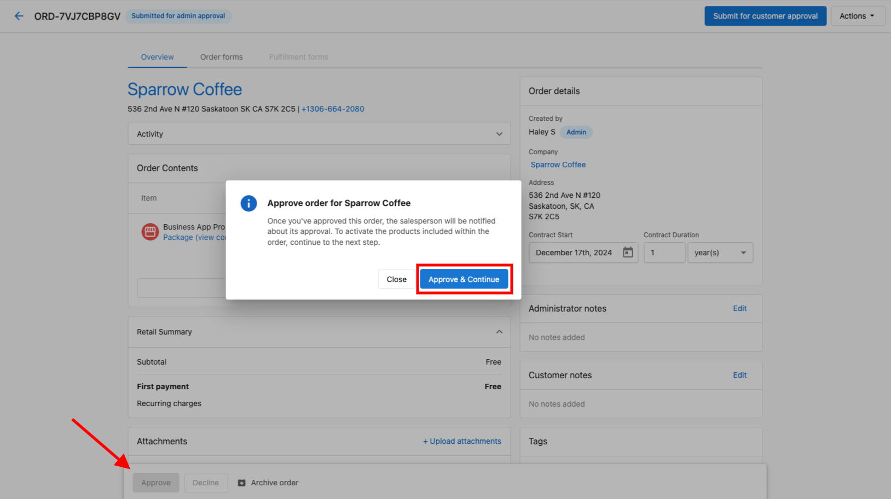
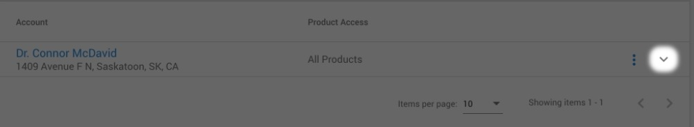

# Order Processing and Activation

## What is Order Processing and Activation?

Order processing and activation encompasses the complete workflow from order submission through product activation. This includes understanding order statuses, managing approval workflows, activating products on accounts, and resolving any activation errors that may occur. The system ensures products are properly delivered to customers while maintaining quality control through approval processes.

## Why is Order Processing Important?

Proper order processing ensures customers receive their products and services without delays while maintaining business controls and quality assurance. Understanding order statuses helps teams track progress, identify bottlenecks, and resolve issues quickly. The activation process connects orders to actual product delivery, creating subscriptions and enabling customer access to purchased services.

## What You Can Do with Order Processing

With order processing, you can:

- Track orders through various status stages
- Manage approval workflows for customer and admin approvals
- Control when and how products are activated
- Resolve activation errors when they occur
- Access activated products through multiple methods
- Schedule activations for future dates
- Monitor order progress in real-time

## Order Statuses

Understanding order statuses is crucial for managing your sales process effectively. Here are the complete order statuses and their meanings:

| **Status** | **What it means** | **Notes** |
|------------|-------------------|------------|
| Drafted | The order has been created but not submitted | Drafted orders can be archived by both salespeople and admins |
| Awaiting customer approval | The order was sent to the customer to approve or decline | Orders in this status cannot be altered. If there's an error, they can be cancelled or archived and then duplicated to edit details |
| Pending | The order has been submitted to an admin to approve or decline | Pending orders require action from an administrator to move to the next step |
| Approved | The order was approved by the customer or admin | Intermediary status used for actions like collecting payment before activation |
| Processing | The products in the order are being activated | This status generally appears for only a few moments |
| Scheduled activation | The order was approved and set to activate on a future date | Products will not be activated until the scheduled date |
| Activated | All products in the order were activated | Products and services have been successfully activated |
| Activation errors | Some products couldn't be activated and action is needed | Hover over the "Activation Error" badge to see details. Action is typically needed to correctly activate products |
| Declined | The customer or admin has declined the order | Includes a reason provided by whoever declined the order |
| Archived | The order is kept for historical purposes only | These orders are only visible by filtering and are not visible in Business App |
| Cancellation request | A salesperson or admin has requested cancellation | Includes a reason for the cancellation request |
| Canceled | The order has been canceled | Useful for tracking churn. Note: canceling an order does not cancel retail or wholesale subscriptions |
| Resubmitted | A salesperson has sent a previously rejected order for approval again | Used when addressing decline reasons and resubmitting |

**Orders can be accessed via:**
- Partner Center > Commerce > Orders
- Partner Center > Accounts > Account Details > Orders Card  
- Partner Center > Companies > Company Details > Orders Card

## Approval Workflows

### Manual vendor approval

Some marketplace products require the vendor to manually approve the order before it can be activated. When this is the case, the order will show a **"Manual vendor approval required"** indicator on the relevant line item. No action is required from you — the vendor is notified automatically. Activation proceeds once the vendor approves on their end.

If an order has been waiting on vendor approval for longer than expected, contact the vendor directly through **Marketplace > [Product] > Contact Us**.

### Where Orders Go After Submission

Based on partner configuration, orders can be sent to one of two places:

**Customer Approval Workflow:**
1. You're prompted to choose a contact for order delivery
2. Order is delivered to your selected contact
3. Delivery can be tracked in the Order Activity card
4. You can resend using "Resubmit for Customer Approval" button

**Admin Approval Workflow:**
1. Order enters "Pending" status when submitted
2. Administrator with "Can Manage Orders" permissions reviews the order
3. Admin either approves or declines the order

## How to approve an order without activating products

Some partners prefer to collect payment before activating products — for example, during staged onboarding or when a customer needs to pay before services begin. You can approve a sales order and collect payment without activating the products by leaving the billing agreement checkbox unchecked.

**Step-by-step:**

1. Create and submit the sales order as usual.
2. When approving the order, you will see a **billing agreement checkbox** ("I understand that I will be billed for activated products").
3. **Leave this checkbox unchecked** and proceed to approve the order.
4. The order moves to **Approved** status. Products are not activated. The customer can be invoiced at this point.
5. To activate the products later, a Partner Center admin must return to the order, check the billing agreement checkbox, and select an activation timing option.

:::info
Products remain in **Approved** status until a Partner Center admin explicitly agrees to billing and activates them. Approval alone — without the billing agreement — does not trigger activation.
:::

## Post-activation: notifications, refunds, and SMB-initiated orders

### Activation email notifications

Activation emails to clients are **off by default**. To notify clients when a product activates, set up an Automation:

1. Go to **Automations > Create Automation**
2. Set the trigger to an order or product activation event
3. Add a **Send Email** or **Send Notification** action targeting the client contact

This replaces the legacy activation email behavior and gives you full control over the message content and timing.

### Rejected-order refunds are automatic

If an order fails to activate and is rejected, any payment collected for that order is automatically refunded as a **credit note**. You do not need to request a refund manually.

To find the credit note:
- Go to **Administration > My Billing** to see the credit applied to your account
- Go to **Commerce > Financial Documents > Credit Notes** for the formal credit note document

### Reviewing SMB-initiated orders before activation

If your clients can place orders themselves (through the store), those orders activate automatically by default. To hold SMB-initiated orders for Partner review before activation:

1. Go to **Administration > Order Settings > Default Content**
2. Add a custom form with an **Administrative Questions** section to every order
3. Mark a required field as hidden from the customer — the order cannot activate until an admin fills in that field

This effectively gates activation on an admin completing the internal field, giving you a review step before products go live.

### Stair-step pricing and bulk activations

If your products use stair-step pricing (where the first tier is free and the price increases with volume), activating large batches of accounts at once can trigger the higher tier unexpectedly. **Recommendation:** use a **free-unit discount** instead of a free first tier to avoid unintended charges during bulk activations.

## Product Activation Process

### Does an Approved Order Automatically Activate Products?

**Not immediately!** Additional steps are required after approval:

1. **Approve the Order**: Review and approve the order first

2. **Billing Agreement**: Check the box to agree to be billed for selected products

3. **Choose Activation Timing**: Select when products should be activated:
   - **Activate Immediately**: Products activate right away
   - **Activate on Contract Start Date**: Products activate when contract begins

4. **Confirmation**: Products activate according to your selected timing

:::tip
Products will NOT activate until you explicitly agree to billing and choose an activation option.
:::

## Accessing Activated Products

Once products are activated, there are several ways to access them:

### Method 1: Via Permissions
1. Navigate to **Partner Center > Business Details > Clients & Prospects**
2. Find the business and click the edit icon (three dots)
3. Go to **Permissions > Settings**
4. Activated products and services display in this section

### Method 2: Via Impersonation
1. Navigate to **Partner Center > Business Details > Clients & Prospects**
2. Find the business and click the impersonate icon (three dots)
3. Look for the red banner confirming successful impersonation
4. Business products and services display under **Apps**

### Method 3: Via Business Details
1. Navigate to **Partner Center > Business Details > Clients & Prospects**
2. Click on the business name
3. Click on the **Products & Services** tab
4. All active products and services display here

### Method 4: Via Order Details Page
1. Navigate to **Partner Center > Commerce > Orders**
2. Find the order with the activated product
3. Click **View** next to the order
4. Click on the order item that says **Setup**, **Access**, or **Launch**

## Handling Activation Errors

### What is an Activation Error?

The **Activation Error** status appears when there's a problem activating one or more items on an order. This status ensures you're aware of issues requiring attention before the order can be fully activated.

### How to Resolve Activation Errors

1. **Open the order** with Activation Error status
2. **Check the Fulfillment card** in the order:
   - Red badge appears next to affected items
   - Hover over badge for error details
3. **Get additional information**:
   - Go to the Account Group
   - Review rejection reason in the Products card
4. **Take corrective action**:
   - Select `Edit and resubmit` from the menu (kebab icon), **OR**
   - Dismiss the error, resolve the issue, and submit a new order
5. **Complete the process**:
   - After submitting corrected order and reviewing subscriptions
   - Return to the error order
   - Select kebab menu and choose `Ignore All Errors`
   - Status updates to **Activated**

:::warning
Only ignore errors after reviewing and resolving issues that could affect product delivery.
:::

Will Activation Error stop my entire order from activating?

It may affect only specific items with errors, but the order remains in Activation Error status until resolved or ignored.

Can I fix only one item and leave others in error?

Yes. You can edit and resubmit individual line items in account details, then choose to ignore specific errors on the order after reviewing them.

Where can I find error details?

Details appear in the Fulfillment card (red badge tooltip) and in the Products card of Account details.

When should I use "Ignore All Errors"?

Use it only after confirming that remaining issues will not impact your customer's services.

Can I prevent Activation Errors?

Most errors occur due to missing information, incorrect form entries, or account setup issues. Reviewing all order details before submission can help prevent them.

What happens if I select "Activate on Contract Start Date"?

Products will be scheduled for activation when the contract officially begins. Ensure the start date is correctly configured to avoid delays.

How long does the Processing status last?

The Processing status generally appears for only a few moments while products are being activated in the system.

Can I change activation timing after approval?

Once you've agreed to billing terms and selected activation timing, you cannot change it. You would need to create a new order if different timing is required.

What's the difference between Canceled and Archived orders?

Canceled orders are specifically marked as canceled (useful for tracking churn), while Archived orders are simply moved out of active view for historical purposes. Neither status cancels existing subscriptions.

Can I disable auto-activation when a customer pays during approval?

No. When a customer pays during the approval step, product activation triggers automatically — this cannot be disabled. If you need to delay activation after payment, use one of these workarounds:

- **Set a future contract start date** on the order line items so products activate on that date instead of immediately
- **Use a manual invoice flow** instead of the customer-approval payment flow, then activate manually when ready

The MatchCraft Ads Express order form shows a timeout page — what do I do?

This happens when MatchCraft Ads Express is not yet activated on the account before the order form is accessed. To resolve it:

1. Activate **MatchCraft Ads Express** on the account first
2. Then submit the order — the order form will load correctly

"Proceed to next step" is grayed out for an add-on product — why?

This usually means the parent product is **suspended** in Vendor Center. To resolve it:

1. Go to **Vendor Center > Products** and check if the parent product is suspended
2. Resume activations on that product
3. Return to the order — the "Proceed to next step" button should become active

An order shows "Deferred" status — what does that mean?

**Deferred** means the order approval email failed to deliver to the recipient. This is typically an email deliverability issue. To resolve it:

- Check that the recipient email address is correct and reachable
- Confirm your sending domain has valid **SPF** and **DMARC** records configured
- Try resending the order to a different contact or email address

If deliverability is confirmed but the issue persists, contact support.

