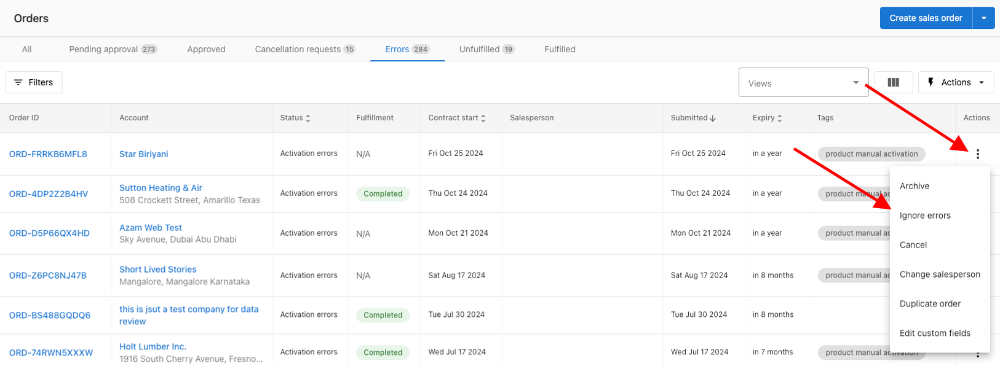

# Orders FAQs

**Q: What is the difference between a Sales order and an Order?**

**A:** Orders can only be created via Partner Center by Administrators. Orders will have no approvals or steps and products will be instantly activated.

Sales Orders can be created by Salespeople and Administrators and have a greater level of control and ability to customize the sales and ordering process. Drafts can be created resumed at a later time, The can be put into a pending or approved status prior to activating the order (and activating products, wholesale and retail subscriptions) and they will retail all retail dollars inputted for historical reference.

**Q: Should I create a Sales Order or an Order?**

**A:** A Sales Order allows for a more tailored sales and ordering process. You can use Sales Orders to create drafts of orders that you can come back you, send the order directly to your customer for approval or submit orders for admin approval.  
Submitted for admin approval allows for more flexibility in the ordering process to utilize additional order statuses and steps.

A sales order will also ensure that you have a historic record, for both you and your customer, of the retail pricing for that order.

**Q: Do orders always show retail price?**

**A:** No - Sales orders will show the retail price that has been set in the system. With Orders you are able to set a retail price but it will not be historically stored on the order when reviewing after processing.

**Q: Why do I see "Activation warnings" when reviewing an order?**

**A:** Activation Warnings may be displayed beside products for a number of reasons. Most commonly is if the product is already activated on the account, a required product is missing or there is an issue with the set dates. You will need to resolve the issues in order to move forward or activation errors may occur.

**Q: Why is my order in "Activation Error" status?**

**A:** An "Activation Error" status will occur anytime a product fails to activate on the order. This is important as it is the system letting you know that action will need to be taken in order to ensure both you and your customer have the correct products activated.

You can see what the error is by hovering over the "Activation Error" badge on the Fulfilment card in the order, you can also get additional details by going to the Account Details page and there will be an additional error message on the product that failed to activate.

**Q: How do I ignore activation errors in orders?**

**A:** If you have an order with activation errors, you can choose to ignore those errors by selecting the "Ignore Errors" on the individual items in the Fulfilment card of the order Or choosing "Ignore All errors" from the orders Actions button.

### **Ignore individual errors**

1. Go to into the order
2. Expand the "Fulfilment" card 
3. Click on the kebab at the end of the row for the item with the activation error and select **Ignore Errors.**
4. Once the error is ignored the line items badge will change to "Activated" , Please note that this will not activate the product itself, it is just for record keeping and organizational purposes. 

### **Ignore all errors within one Order**

- Go to **Partner Center > Commerce > Orders.**
- You can filter to orders with these errors under **Order Filters > Status > Activation errors.**
- Click on the kebab at the end of the row for the order with the activation error > **Ignore All Errors.**
- 

**Q: What happens if I decline an order cancellation request?**

**A:** If you or another admin declines an order cancellation request, the order will go back to its prior state. For example, if a Salesperson submitted the request when the order was pending, the order will go back to pending when the cancellation request is denied.

**Note:** Canceling an order will not cancel any products.