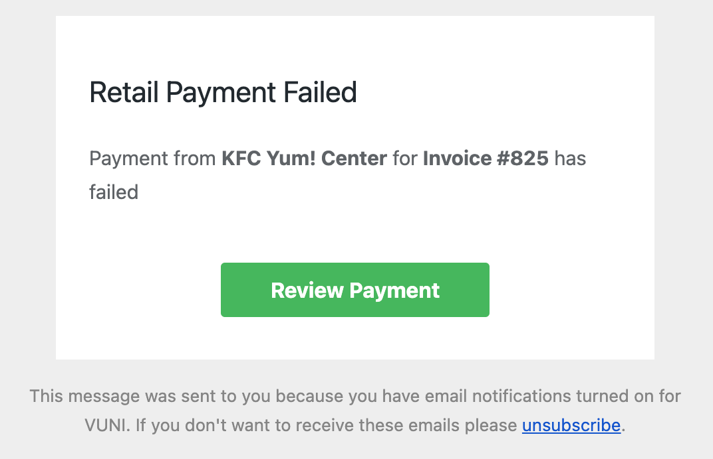
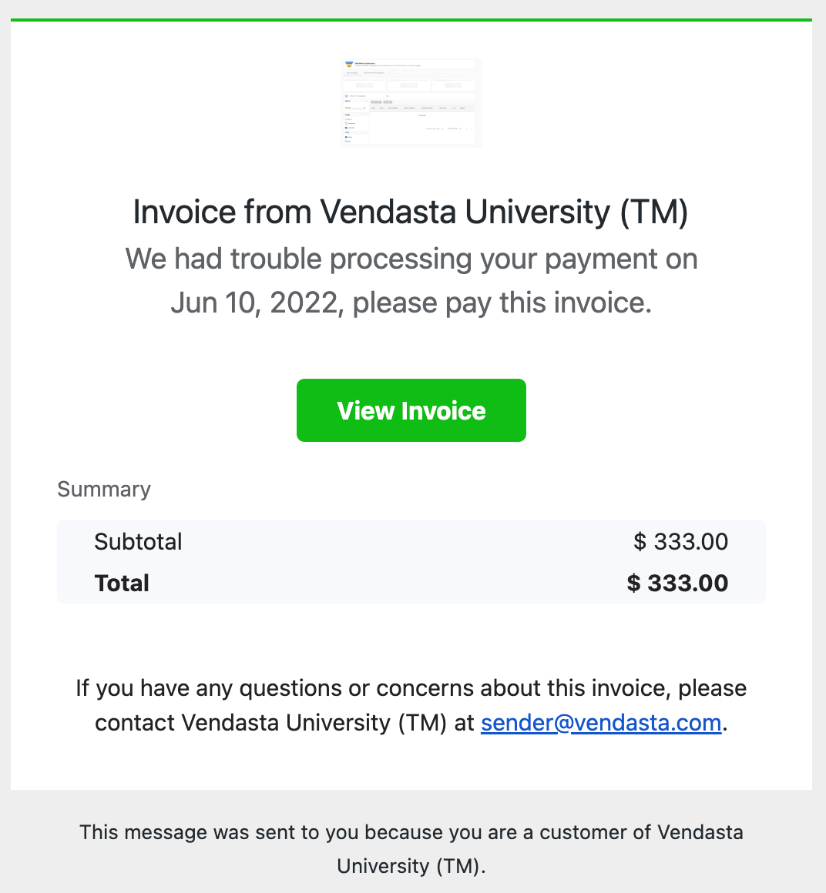
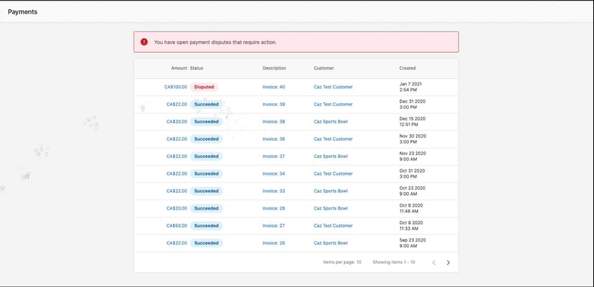
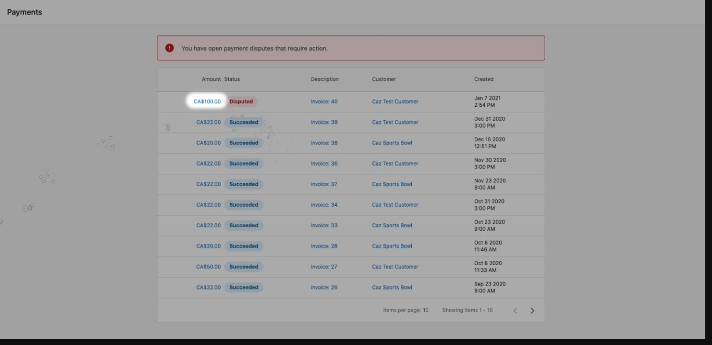
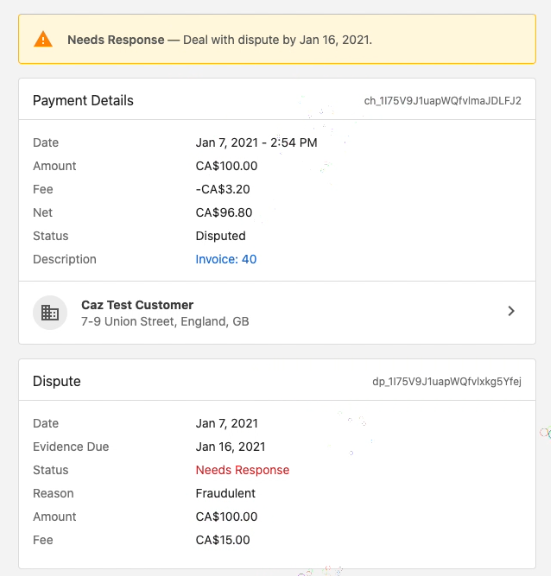
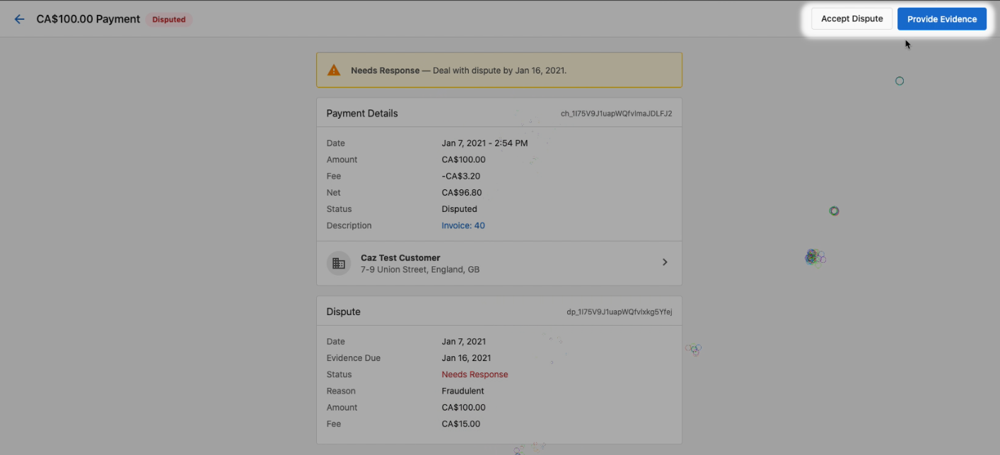
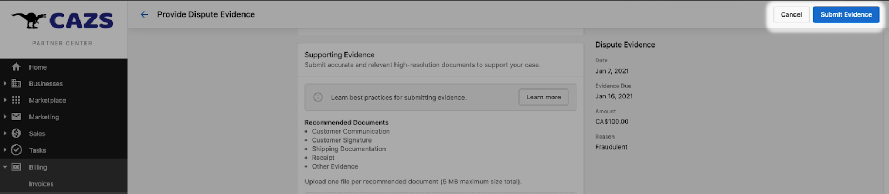
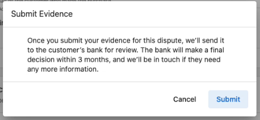

# Managing payments

This guide covers how to manage your payment processes, including setting up notifications for payment activity and handling billing disputes effectively.

## Payment notifications

Partners using Vendasta Payments can be notified in-platform when one of their clients pays an invoice or makes a purchase via the Shopping Cart. If a payment fails, Partners will receive a notification via email. Note that only Partner Center admins can receive these notifications.

Invoice and payment notifications can be set up or changed using the **Notification Settings** page in Partner Center.

### Setting up payment notifications

To access **Notification Settings** in Partner Center:

- Click the **Notifications** icon in the top bar
- Click the **Settings** icon
- Scroll down to the **Billing** section

Under the **Retail Payments** setting, check the "App" notification under the "Platform Settings" column to be notified when a client pays an invoice or makes a purchase via the Shopping Cart.

Partners can also be notified when an invoice is automatically generated by enabling notifications for **Invoice Auto-generated**.

<iframe src="https://drive.google.com/file/d/1QCuWbYPr-6vgiTE8piETC4h82woiNYgL/preview" width="640" height="480"></iframe>

### Payment Notification FAQ

**Will I be notified if a payment was successful or not?**

**Yes** - Both you and your customer will be notified of successful/failed payments.

Sample email to a Partner showing failed payment:

Sample email to the Customer showing failed payment:

## Billing disputes

If a customer disputes a charge on their credit card statement, you'll be notified via a charge dispute action in the Merchant Portal. Taking care of the dispute is part of the responsibilities that come along with offering credit card payments.

This section will show you how to navigate charge disputes, respond to them, and provide evidence to support your case.

### Finding disputes

Disputes can be reviewed in your Merchant Portal by navigating to **Disputes** in the left-hand menu. 

You'll see a list of all disputes, or individual charges that need attention.

### Understanding the Details of a Dispute

Select a dispute case to view all related information.

This includes:
- **Status** - The current dispute status
- **Amount** - The amount being disputed
- **Due By** - The date by which you must respond
- **Reason** - Why the customer has initiated the dispute
- **Warning** - An important note that the transaction amount plus a $25 dispute fee will be deducted from your merchant account if you choose not to respond

### Responding to a Dispute

Here's how to properly respond to a dispute:

1. Click the **Respond** button in the upper right corner of the dispute details

2. You'll be presented with a form where you can submit evidence to support your case

3. The specific evidence fields to complete will vary based on the reason for the dispute
4. After completing the form, click **Submit evidence**

### Possible outcomes

After you've submitted your evidence, there are two possible outcomes:

1. **You win the dispute** - The customer's bank resolves the dispute in your favor and releases the funds back to you
2. **You lose the dispute** - The bank decides in the customer's favor and the funds are returned to them

### Dispute prevention best practices

To help prevent disputes:

- Use a clear business name that customers will recognize on their credit card statement
- Clearly communicate your return and refund policies
- Provide excellent customer service and respond quickly to customer inquiries
- Keep detailed records of all transactions and customer communications
- Issue refunds promptly when requested and appropriate

By following these guidelines and responding properly to disputes, you can protect your business while maintaining good customer relationships.
