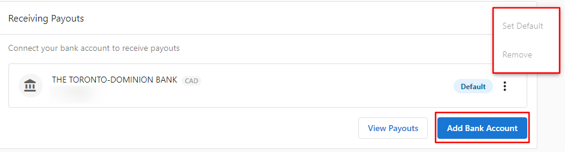

# Change Bank Account for Payouts

If there is only one bank account connected in Vendasta Payments, you won't be able to replace the account unless you add a new bank account first. 

Go to the **Administration** tab > **Vendasta Payments** > click on '**Add Bank Account**' under Receiving Payout to add a new account. Once the new account is added, you can then set it as the default, then the '**remove**' option will be available to remove the old bank account.

The currency of the payout goes in line with Stripe country codes, i.e, US, CA, AU, GB, NZ, CZ. Any country setting in billing contacts other than these six will make the payout section "Vendasta Payments is currently unsupported in your area."

<iframe src="https://drive.google.com/file/d/1-J4kiqCAF4avzPm7RZWKw0SjDV_S3HIz/preview" width="640" height="480"></iframe>