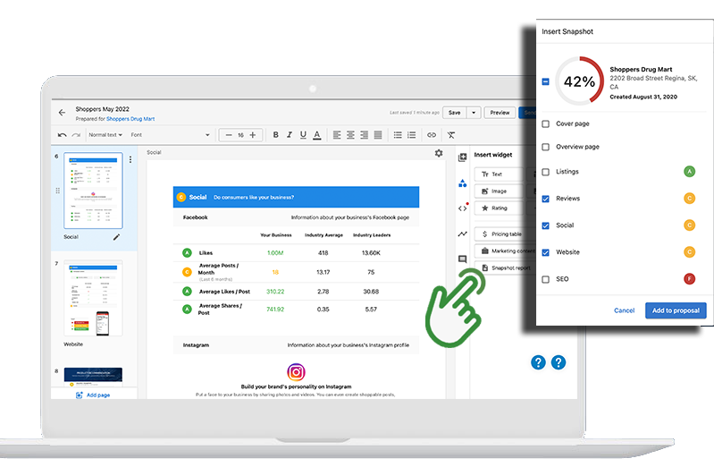

## Why is it important to add a Snapshot Report to Proposals?

The importance of a business's online presence and the associated digital solutions can be difficult to understand. The Snapshot Report integration with Proposals helps you get the conversation started with customized content highlighting pain points specific to the prospect and how you can alleviate them. By presenting a business' areas for improvement alongside your recommended solutions, you can help your prospects understand the value of your proposal.

## How does adding Snapshot Reports to Proposals work?

1. If you haven't already, generate a Snapshot Report* for your prospect.
2. Go to **Partner Center > Commerce > Proposals > Manage Proposals.**
3. Choose a template or create a new proposal from scratch.
4. Select the recipient account.
5. Open the **Insert widget** panel and press **Snapshot report**.
6. Select the desired sections of the report.

Once inserted in the proposal, the sections become widgets that can be rearranged as needed.

*Tip: Generate the Snapshot Report ahead of time. We recommend this for two reasons:

- Snapshot Reports are a great prospecting tool. Make a strong first impression by arriving at first meetings prepared with insights on where your prospective client's opportunities for growth lie and a recommended plan of action. Once you have their attention, it's time to build a proposal.
- Snapshot Reports can take up to 24 hours to generate. Ensure the report is ready in advance to avoid delays in issuing proposals to your prospects.

## Try it out!

Ready to create a proposal? Head over to **Partner Center > Commerce > Proposals** to get started.