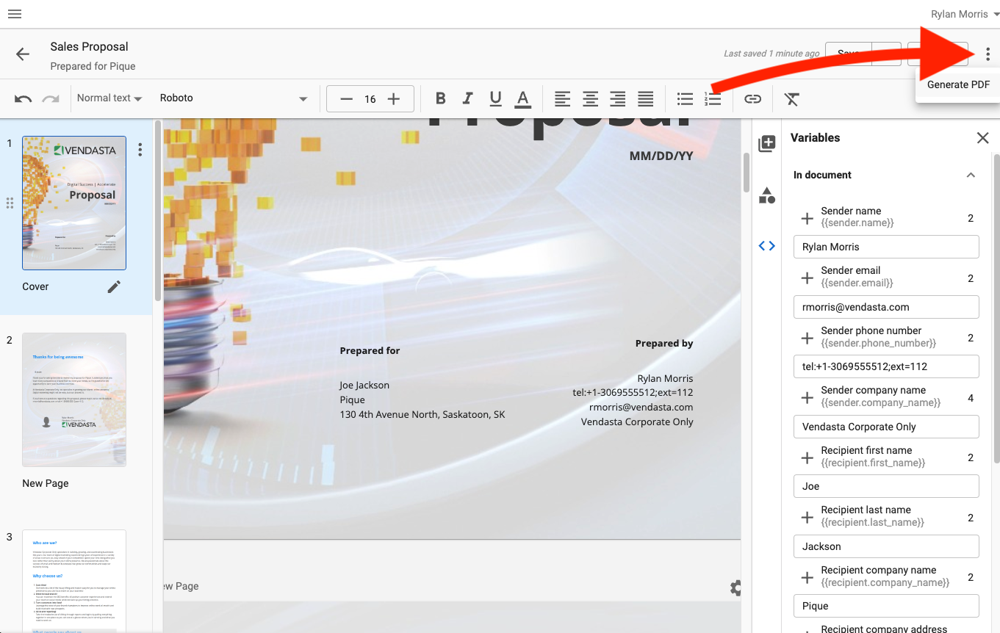
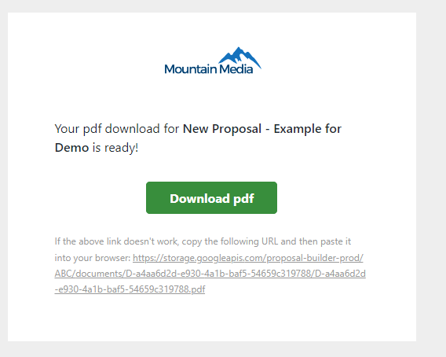
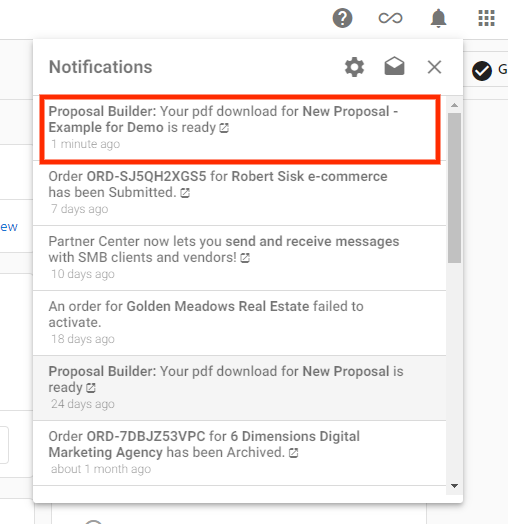
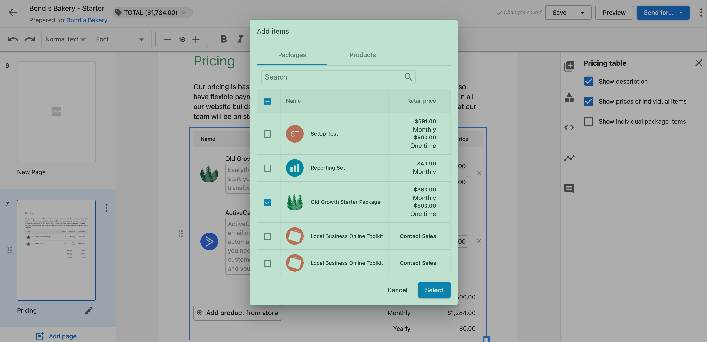
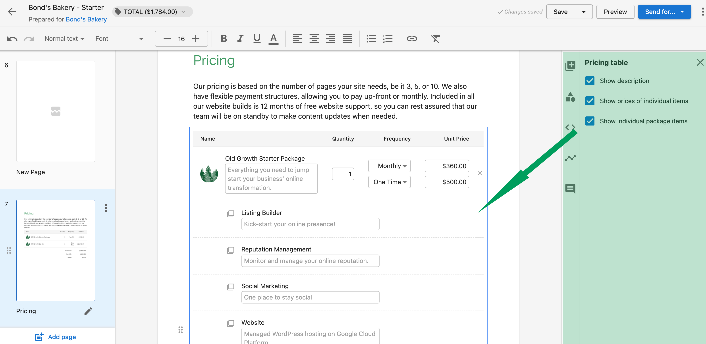

# Proposal Builder Overview

The Proposal Builder is a powerful tool within Commerce that allows you to create professional proposals for your clients. With customizable templates and easy-to-use features, you can efficiently create, edit, and track proposals throughout the sales process.

## Key Features

### Generate Professional PDFs

Transform your proposals into polished, professional PDFs that can be shared with your clients.

### Notification System

#### Email Notifications

Receive email notifications when clients view or interact with your proposals.

#### In-App Notifications

Get real-time updates within the platform when clients take action on your proposals.

## Pricing Options

| Feature | Description | Visual |
|---------|-------------|--------|
| Retail Pricing | Display the standard retail price of your products and services |  |
| Flexible Display Options | Customize how pricing information appears in your proposals |  |

## Getting Started

To access the Proposal Builder:

1. Navigate to the Commerce section in your Vendasta dashboard
2. Select "Proposals" from the menu options
3. Click "Create New Proposal" to begin

## Managing Proposals

From the Proposals dashboard, you can:

- View all current proposals and their statuses
- Edit existing proposals
- Duplicate proposals to save time
- Archive proposals that are no longer needed

## Best Practices

- Keep proposals concise and focused on client needs
- Use consistent branding throughout your proposals
- Include clear calls to action
- Follow up promptly after sending proposals
- Review analytics to understand client engagement with your proposals