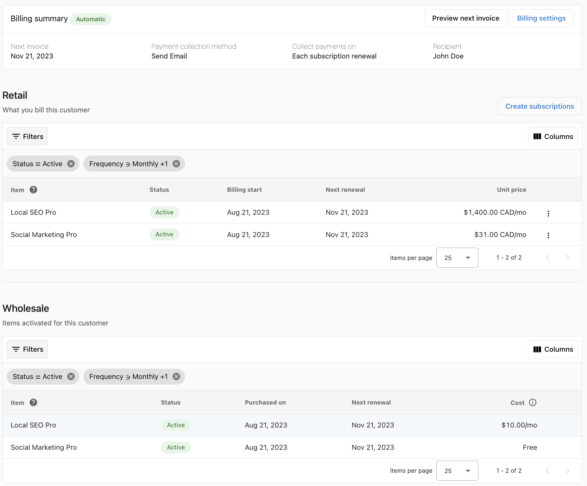
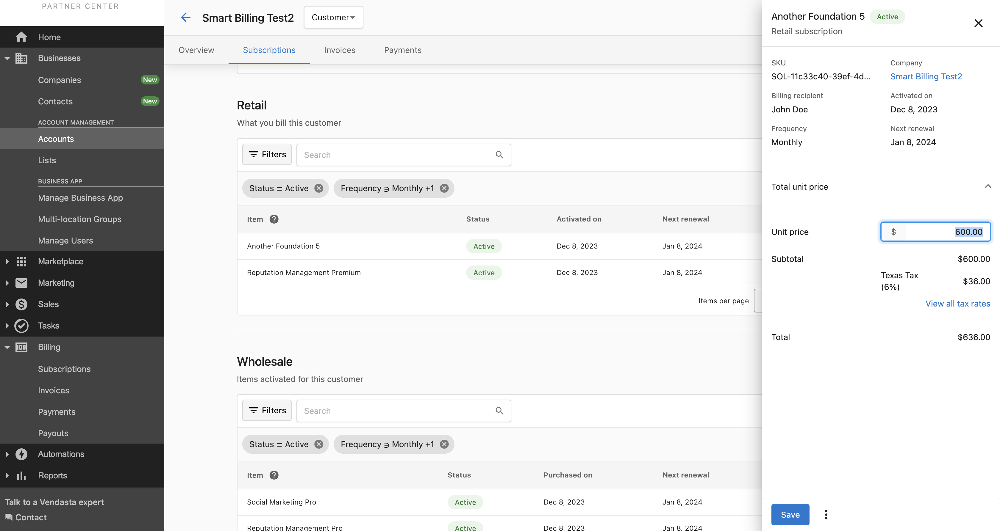
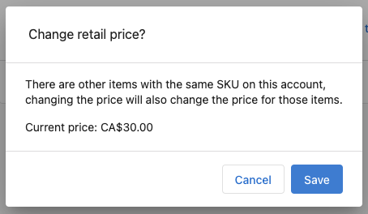
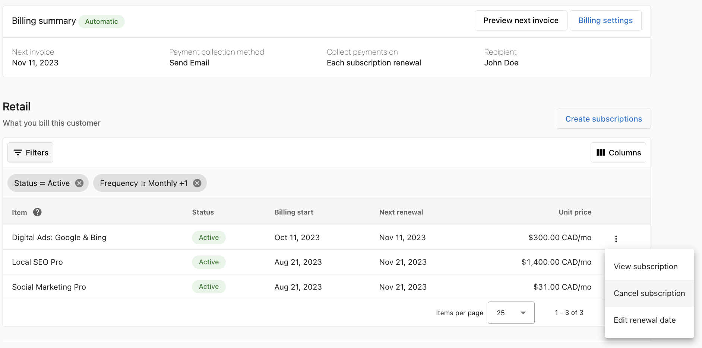
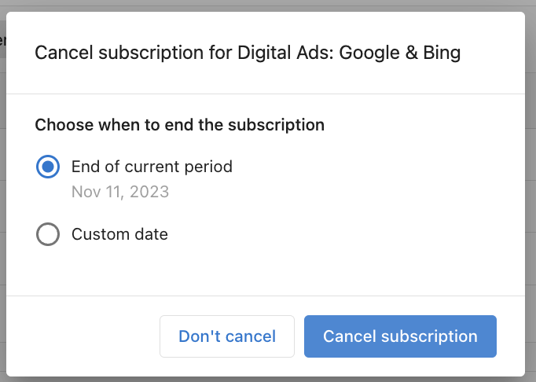

import Tabs from '@theme/Tabs';
import TabItem from '@theme/TabItem';

<iframe src="//www.loom.com/embed/76b0b4515c6b45b1a84d628ec8a0c9a0" width="560" height="315" frameborder="0" allowfullscreen></iframe>

## What is subscription billing?

Subscription is a recurring billing model where customers are billed regularly (weekly, monthly, or yearly) in order to continue to access products and services.

Every activated product or service in an order creates equivalent subscriptions for the partner-to-vendasta transaction (aka Wholesale subscription) and another for the partner-to-client transaction (aka retail subscription). The subscriptions will automatically generate invoices for payment.

**NOTE:** Subscription billing replaces the old "bill by active" model. All customer accounts set to "bill by active" are transitioning to Subscription billing.

## What is the difference between subscription billing and recurring invoices (benefits of retail subscription)?

Subscriptions are a form of automatic recurring billing, created from orders. They contain the order information such as price, SKU, tax rates, frequency, etc. Unlike recurring invoices that need to be manually created, the subscriptions are automatically created, saving precious time and effort.

## What can I do with subscription billing?

- **Streamlined Billing & Automated Invoicing:** The automated recurring billing feature generates customer invoices seamlessly from orders, saving you precious time and effort.
- **Customizable sale price:** You can override the default store price and sell at any negotiated customer-level price. The sale price is automatically stamped down for recurring subscription billing.
- **Personalized Invoice Scheduling:** Take charge of your billing experience with the powerful invoice scheduling features. Customize payment terms (Due date), offer multiple payment methods, and add memo notes for a professional & personal touch.
- **Enhanced Financial Transparency:** Gain a comprehensive view of costs and retail revenue per client account in one consolidated interface, empowering you to make informed business decisions.
- **Complete Control:** Enjoy full control over client subscriptions. View, update, or cancel subscriptions effortlessly, ensuring a seamless customer experience every step of the way.
- **Preview Your Next Invoice:** Stay one step ahead with the unique preview feature. Get a sneak peek into your upcoming client invoice before it's sent to your customers, ensuring accuracy and peace of mind.

## Who can use subscription billing?

All partners on the Vendasta platform can use retail subscriptions to manage their customer billing whether or not they have merchant services enabled. You would be able to easily track recurring revenue on every account you sell to.

## How do I set up subscription billing (automatic recurring billing)?

### Option 1: Default setting for all new accounts

**Option 1: Default setting for all new accounts.** This option will apply to all accounts created after saving this this setting. Existing customer accounts do not obey these default settings, however, you can complete the setup on each individual account.

Note that regardless of the default settings, you can still customize the settings per account.

1. Toggle the Retail Subscriptions button to ON. This button alone will ensure that a subscription is created every time you activate a product. You can choose this option if you only wish to track customer billing without generating an invoice.
2. Toggle the Subscription billing button to ON, to turn on customer invoicing (optional).
3. Next setup the payment collection option:
   1. Select the payment collection method
      1. **Create a draft invoice:** This option creates the invoice and saves it on the platform as a draft. You can reference the invoice and manually send it to the customer for payment.
      2. **Email payable invoice to billing recipient:** With this option, the platform generates and emails the invoice to the customer to pay. Upon receiving the invoice by email, the customer can enter their credit card details to complete the payment.

4. Subscription renewal - Invoices will be sent out on the day a subscription renews at 3:00 M UTC. Subcriptions sharing a renewal day will be sent on the same invoice.

**i. Use a default renewal date for all subscriptions -** To ensure new subscriptions will be sent on the same invoice you should set a default renewal date. Setting a default renewal day will align all subscriptions generated through order activations to have the same renewal day. Since those subscriptions will share a renewal day, they will be sent on the same invoice.

**Note:** Renewal dates for existing subscriptions on the account will not be automatically updated. To align all your existing subscriptions to the preferred date, simply edit the renewal date on the subscriptions to match your preferred date.

**Memo:** You can enter a default note that is added to all invoices generated from subscriptions. Note that you can still customize the memo notes on an account level.

2. Click the Save button to save the settings.

*Note: These settings will apply to all newly added customer accounts going forward.*

### Option 2: Account-level billing settings

Under an account setting, you can configure how the individual account is invoiced or charged automatically for products and services with recurring subscriptions.

1. In Partner Center, go to the customer account you wish to manage.
2. On the top panel click **Subscriptions** to open the subscription page.
3. In the top right-hand corner, click "Billing Settings".
4. Toggle the Retail Subscriptions button to ON. This button alone will ensure that a subscription is created every time you activate a product. You can choose this option if you only wish to track customer billing without generating an invoice.
5. Toggle the Subscription billing button to ON, to turn on customer invoicing (optional).
6. Next setup the payment collection option:
   1. Select the payment collection method
      1. **Create a draft invoice:** This option creates the invoice and saves it on the platform as a draft. You can reference the invoice and manually send it to the customer for payment.
      2. **Email payable invoice to billing recipient:** With this option, the platform generates and emails the invoice to the customer to pay. Upon receiving the invoice by email, the customer can enter their credit card details to complete the payment.
      3. **Automatically charge payment method on file:** Finally, this option automatically debits the customer's credit card on file. For this option, you will need to save the customer's credit card details to be debited.
   2. The "Collect On" field will let you set up when your customer will be invoiced.
      1. **Each subscription renewal** will generate an invoice on the day a product or service renews. Where multiple renewals occur on the same day, a single invoice consolidates all the invoices into one.
      2. **The same day of the month** will consolidate all product renewals in the past 30 days into one single invoice for your customer. E.g. If you choose to send on the 30th of the month, then a single invoice containing all product renewals in the last 30 days will be generated on the 30th of every month. Where the days in the month are not up to 30 days e.g. Feb, the invoice is generated on the last day of the month (28th or 29th as applicable).
   3. **Memo:** You can enter a default note that is added to all invoices generated from subscriptions. Note that you can still customize the memo notes on an account level.
7. Click the Save button to save the settings.

*Note: These settings will be applied only to this customer account.*

## How do I receive payment from my customer?

Retail subscriptions will generate invoices for your customers according to the billing settings you have set up for the account. Refer to the payment collection method in the setup section above.

## How do I change the price of a retail subscription?

The unit price of a retail subscription is the amount the customer will be billed every billing period. The unit price can be edited while the subscription is still active and changes to it will apply to all subsequent billing periods.

1. Open the retail subscription you'd like to edit by clicking the row or selecting "View subscription" in the kebab.
2. Click the unit price of the retail subscription, enter the new price, and click save.

**NOTE:** If a product can be activated more than once on an account, pricing changes to one retail subscription will applied to the others.

## How do I sell custom products?

For your custom products, simply add them to your store in the platform.

- In Partner Center, go to Marketplace>Products and click Create Product in the top right corner.
- After the product is successfully created, you can add it to an order or activate it for your customer.

## I canceled a product, how do I stop billing my client? (Subscription Cancellation)

You can cancel the retail subscription on a product or service and it will stop billing your client. The status will change to Inactive. All other Active subscriptions will continue to generate invoices to bill your client.

- Go to the kebab on the retail subscription you wish to cancel and select Cancel Subscription.
  - You can cancel the subscription at the end of the current cycle or you can select a custom date.

## Product version upgrades and downgrades

A product version was changed either by upgrade or downgrade, what should I do?

Each version will create its retail subscription. So you need to cancel the older version so that it is not added to your customer's upcoming invoice.

*Refer to subscription cancellation steps above, for how to cancel a subscription.*

## Failed product activation of rejected orders

When a product or products in an order fails to activate due to any reason ranging from failed payment, vendor rejection, etc; the created retail subscription needs to be manually canceled so that they are not added to the customer invoice.

*Refer to subscription cancellation steps above, for how to cancel a subscription.*

## Will Subscription billing stop my recurring invoices?

No. Recurring invoices are not impacted by subscription billing. However, you might want to make sure you are not double billing your client on the same products with retail subscriptions and recurring invoices.

## I use the "bill by active" option and not recurring invoices on some customer accounts, how does this impact me?

The "Bill by active" billing option will be upgraded to support subscription billing and all its features. Your customer billing will not be impacted in any way, instead, you will now have access to all the new features designed to give you full control over your customer billing. E.g

- The retail subscription price is now displayed.
- Retail subscriptions can now be managed (edit price, cancel subscription)
- Upcoming invoices can be previewed.
- A new section for wholesale subscriptions has been added to the page to give you full context of your cost and revenue.
- *NOTE: With subscription billing, you need to make sure to stop billing your customer when you cancel a product or service. Follow the subscription cancellation steps above.*

