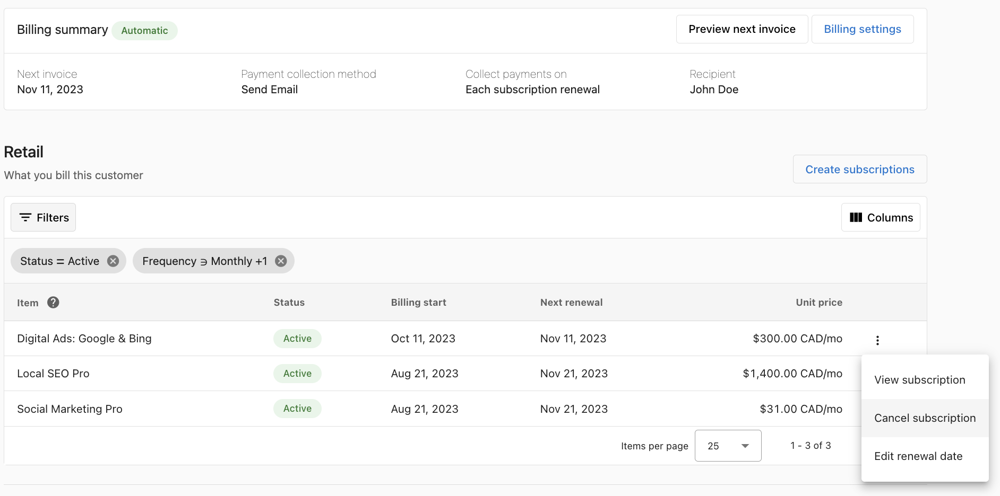
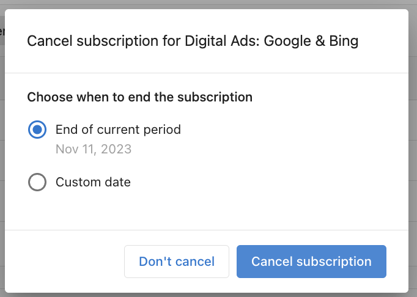
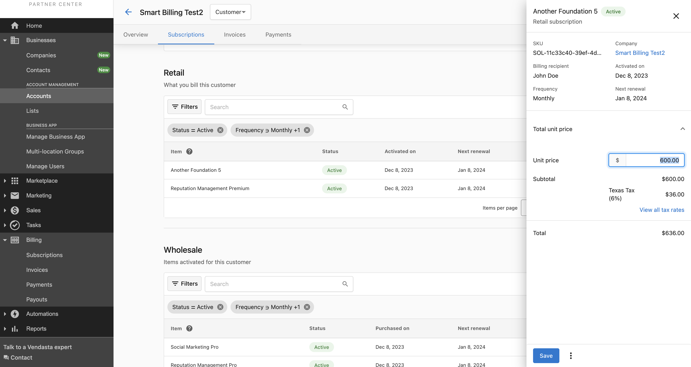

<iframe src="//www.loom.com/embed/76b0b4515c6b45b1a84d628ec8a0c9a0" width="560" height="315" frameborder="0" allowfullscreen></iframe>

## What is Subscription Management?

Subscription management in Vendasta's Commerce platform provides automated recurring billing for your customers. This replaces manual invoice creation with streamlined, automatic billing that generates customer invoices seamlessly from orders.

Subscription billing is a recurring billing model where customers are billed regularly (weekly, monthly, or yearly) to continue accessing products and services. Every activated product or service creates equivalent subscriptions for both partner-to-Vendasta transactions (wholesale subscriptions) and partner-to-client transactions (retail subscriptions).

## Why Use Subscription Management?

Subscription billing offers significant advantages over traditional billing methods:

### Key Benefits

- **Streamlined Billing & Automated Invoicing**: Automated recurring billing generates customer invoices seamlessly from orders, saving time and effort
- **Customizable Sale Prices**: Override default store prices and sell at negotiated customer-level prices with automatic recurring billing
- **Personalized Invoice Scheduling**: Customize payment terms, due dates, payment methods, and memo notes for professional invoicing
- **Enhanced Financial Transparency**: Comprehensive view of costs and retail revenue per client account in one consolidated interface
- **Complete Control**: Full control over client subscriptions - view, update, or cancel subscriptions effortlessly
- **Preview Next Invoice**: Unique preview feature lets you see upcoming client invoices before they're sent

### Subscription vs. Recurring Invoices

Subscriptions are automatic recurring billing created from orders, containing order information such as price, SKU, tax rates, and frequency. Unlike recurring invoices that need manual creation, subscriptions are automatically created, saving time and effort.

:::note
Subscription billing replaces the old "bill by active" model. All customer accounts set to "bill by active" are transitioning to subscription billing.
:::

## How to Set Up Subscription Billing

### Option 1: Default Settings for All New Accounts

Configure default settings that apply to all accounts created after saving. Existing accounts can be configured individually.

1. **Enable Retail Subscriptions**: Toggle the Retail Subscriptions button to ON to ensure a subscription is created every time you activate a product
2. **Enable Subscription Billing**: Toggle the Subscription billing button to ON to turn on customer invoicing (optional)
3. **Setup Payment Collection**:
   - **Create a draft invoice**: Creates the invoice and saves it as a draft for manual sending
   - **Email payable invoice to billing recipient**: Generates and emails the invoice to the customer for payment

4. **Configure Subscription Renewal**: Invoices are sent at 3:00 PM UTC on renewal days. Subscriptions sharing a renewal day will be consolidated into one invoice

5. **Set Default Renewal Date**: Align all subscriptions to have the same renewal day so they appear on the same invoice

6. **Add Default Memo**: Enter a default note added to all invoices generated from subscriptions

7. Click **Save** to apply settings to all newly created accounts

### Option 2: Account-Level Billing Settings

Configure billing settings for individual customer accounts:

1. Navigate to the customer account in Partner Center
2. Click **Subscriptions** in the top panel
3. Click **Billing Settings** in the top right corner
4. **Enable Retail Subscriptions**: Toggle ON to create subscriptions when activating products
5. **Enable Subscription Billing**: Toggle ON to turn on customer invoicing
6. **Setup Payment Collection Options**:
   - **Create a draft invoice**: Manual invoice sending
   - **Email payable invoice to billing recipient**: Automatic email to customer
   - **Automatically charge payment method on file**: Automatic credit card charging (requires saved payment method)

7. **Configure Collection Timing**:
   - **Each subscription renewal**: Invoice on product renewal day
   - **Same day of the month**: Consolidate all renewals into one monthly invoice

8. **Add Account Memo**: Custom note for this account's invoices
9. Click **Save** to apply settings to this account only

## Managing Existing Subscriptions

### Billing Settings Overview

When viewing a subscription, billing information displays the configuration specified when creating the subscription. You may need to edit this information for updated credit cards or payment method changes.

#### Default Settings
By default, subscriptions are billed automatically using the pre-configured payment processor on the first day of the billing cycle.

#### Account-Level Settings
Configure specific settings for handling subscriptions at the account level.

### How to Edit Subscription Prices

You can edit subscription prices at any time. The platform displays when new prices take effect - changes do not apply to the current billing cycle.

**To edit a subscription price:**

1. Find the subscription in **Commerce > Subscriptions**
2. Click on the subscription you want to modify
3. Click the **EDIT PRICE** button next to the current price
4. Enter the new subscription price in the relevant fields
5. Click **SAVE**

A price change icon will appear next to the price, indicating that a price change will occur on the next billing cycle.

:::note
If a product can be activated more than once on an account, pricing changes to one retail subscription will be applied to the others.
:::

### How to Cancel Subscriptions

You can cancel subscriptions at any time with two options:

#### Cancel at End of Period
Allows the subscription to remain active until the end of the current billing cycle.

#### Cancel with Custom Date
Specify a specific date when the subscription should end.

**To cancel a subscription:**

1. Go to the kebab menu (⋮) on the retail subscription you wish to cancel
2. Select **Cancel Subscription**
3. Choose cancellation timing (end of period or custom date)
4. Select which products to cancel (allows partial cancellation)
5. Confirm the cancellation

:::note
When cancelling a subscription, you can select which products to cancel, allowing you to keep some products active while cancelling others.
:::

### How to Add Products to Subscriptions

**To add products to an existing subscription:**

1. Navigate to the subscription in **Commerce > Subscriptions**
2. Click on the subscription you want to modify
3. Click **ADD PRODUCTS**
4. Select the additional products to add
5. Configure the product settings as needed
6. Click **SAVE**

Newly added products will be prorated for the remaining time in the current billing cycle.

### How to Remove Products from Subscriptions

**To remove products without cancelling the entire subscription:**

1. Navigate to the subscription in **Commerce > Subscriptions**
2. Click on the subscription you want to modify
3. Find the product you wish to remove
4. Click the menu icon (three dots) next to the product
5. Select **Remove**
6. Confirm the removal

Removing products follows the same cancellation rules as cancelling subscriptions - you can choose to remove the product at the end of the billing period or on a specific date.

## Frequently Asked Questions

Who can use subscription billing?

All partners on the Vendasta platform can use retail subscriptions to manage their customer billing whether or not they have merchant services enabled. You can easily track recurring revenue on every account you sell to.

How do I receive payment from my customer?

Retail subscriptions will generate invoices for your customers according to the billing settings you have set up for the account. Payment is collected based on your chosen payment collection method:

- **Draft invoices**: You manually send invoices to customers
- **Email invoices**: Customers receive invoices by email and can pay online
- **Automatic charging**: Payment methods on file are automatically charged

How do I sell custom products?

For custom products, add them to your store in the platform:

1. In Partner Center, go to **Marketplace > Products**
2. Click **Create Product** in the top right corner
3. After the product is created, add it to an order or activate it for your customer

What happens with product version upgrades and downgrades?

Each version creates its own retail subscription. You need to cancel the older version so it's not added to your customer's upcoming invoice.

Refer to the subscription cancellation steps above for how to cancel a subscription.

What should I do when product activation fails or orders are rejected?

When products in an order fail to activate due to failed payment, vendor rejection, etc., the created retail subscription needs to be manually cancelled so they are not added to the customer invoice.

Refer to the subscription cancellation steps above for how to cancel a subscription.

Will subscription billing stop my recurring invoices?

No. Recurring invoices are not impacted by subscription billing. However, make sure you are not double billing your client on the same products with retail subscriptions and recurring invoices.

I use "bill by active" - how does subscription billing impact me?

The "Bill by active" billing option will be upgraded to support subscription billing and all its features. Your customer billing will not be impacted - instead, you'll have access to new features:

- Retail subscription prices are now displayed
- Retail subscriptions can be managed (edit price, cancel subscription)
- Upcoming invoices can be previewed
- New wholesale subscriptions section provides full cost and revenue context

:::note
With subscription billing, make sure to stop billing your customer when you cancel a product or service by following the subscription cancellation steps.
:::

How do I change the price of a retail subscription?

The unit price of a retail subscription is the amount the customer will be billed every billing period. The unit price can be edited while the subscription is active, and changes apply to all subsequent billing periods.

1. Open the retail subscription you'd like to edit by clicking the row or selecting "View subscription" in the kebab menu
2. Click the unit price of the retail subscription
3. Enter the new price and click save

If a product can be activated more than once on an account, pricing changes to one retail subscription will be applied to the others.

I cancelled a product - how do I stop billing my client?

You can cancel the retail subscription on a product or service to stop billing your client. The status will change to Inactive. All other Active subscriptions will continue to generate invoices.

Follow the subscription cancellation steps in the management section above.

## Important Notes

- Subscription renewal invoices are sent at 3:00 PM UTC on renewal days
- Subscriptions sharing a renewal day will be consolidated into one invoice
- Price changes do not apply to the current billing cycle
- Newly added products are prorated for the remaining billing cycle time
- Product removals follow the same timing rules as subscription cancellation
- Default settings apply only to newly created accounts after saving
- Account-level settings override default settings for specific accounts
