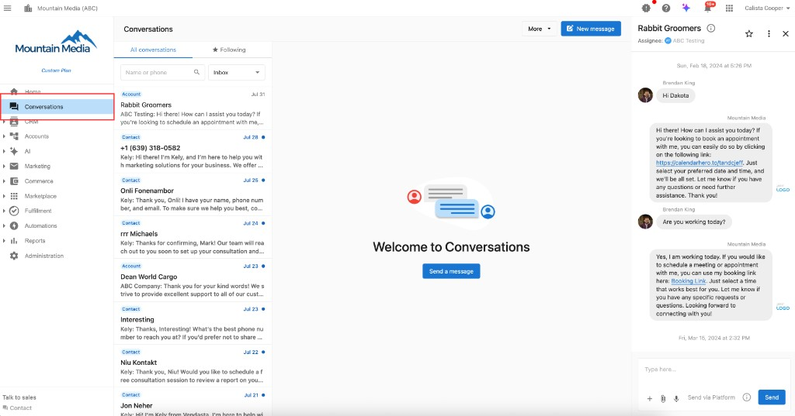
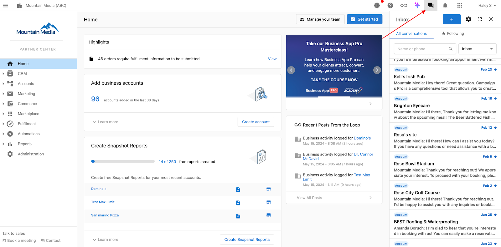
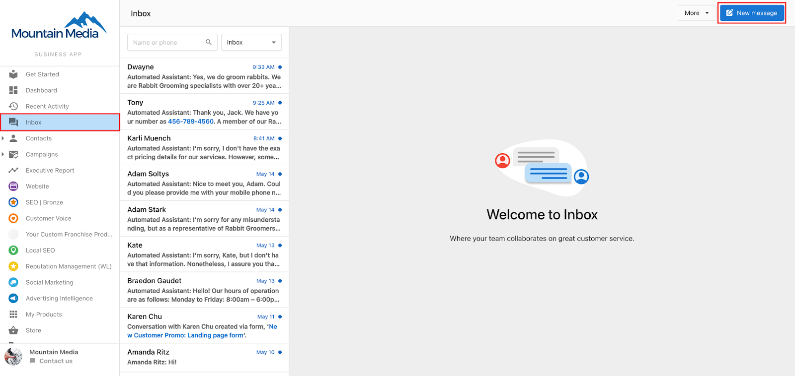
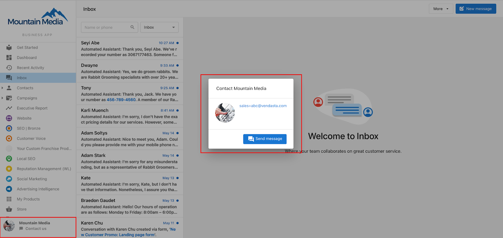
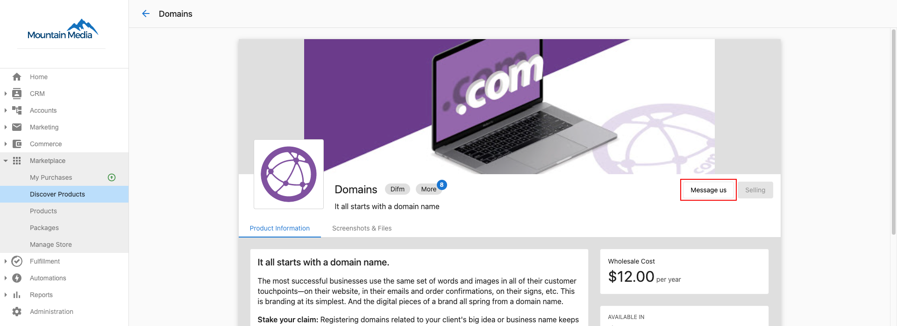
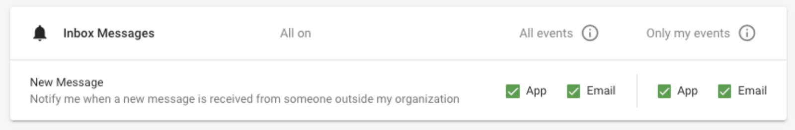
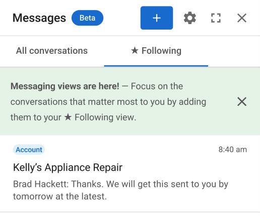

# How to Use Conversations in Partner Center

Conversations in Partner Center provides shared messaging channels for your entire team to communicate with clients, vendors, and Vendasta representatives. Unlike email threads that become unwieldy and lose context, Conversations ensures seamless team collaboration where any member can respond to client messages.

## **Starting Conversations with Clients**

1. **Start a conversation** by clicking the message icon next to any account in Partner Center
2. **Choose the recipient** from the pop-up menu showing available accounts  
3. **Send your message** - clients receive it in **Business App > Conversations** along with email notifications

Your clients will see the message in their Business App interface:

### **Receiving Messages from Clients**

Clients can reach you through the 'Contact Us' button in Business App. Enable notifications in Partner Center to stay on top of all incoming messages.

## **Communicating with Vendors**

Connect directly with marketplace vendors for product support and sales assistance:

1. **Navigate to any product** in the marketplace
2. **Click "Contact Us"** on the vendor's Product Details page (when chat support is enabled)
3. **Start your conversation** for immediate vendor assistance

## **Contacting Vendasta Support**

Reach Vendasta representatives directly through Conversations:

1. **Click the contact card** in the bottom left of Partner Center navigation
2. **Select "Send Message"** to start a conversation with Vendasta support

## **Setting Up Notifications**

Stay on top of all communications by configuring notifications properly:

1. **Click the Bell Icon** in Partner Center
2. **Select the Settings Gear**
3. **Enable "All events"** to receive notifications for all conversations
4. **Enable "Only my events"** to get alerts for conversations you're following
5. **Configure notification preferences** (email, browser alerts, etc.)

## **Using Conversation Automations**

Streamline your communication workflow with automated responses and triggers:

- **Auto-respond** when messages are received
- **Send triggered messages** when specific events occur
- **Set up follow-up sequences** for consistent client communication
- **Integrate with CRM** for automated lead management

[Learn more about setting up automation workflows here.](./automations-available-for-conversations.mdx)

## **Key Features Available**

- **Unlimited in-platform messaging** with all ecosystem participants
- **Side-panel view** that stays accessible across all Partner Center pages  
- **File sharing** for documents and media attachments
- **Following view** for managing priority conversations
- **Team collaboration** with shared channel access

## **Managing Priority Conversations with Following**

Use the ★ Following feature to focus on your most important conversations:

### **How to Follow Conversations**

1. **Look for the star button (★)** in any conversation header
2. **Click the star** to start following that conversation  
3. **Access your Following view** to see only conversations you're actively tracking
4. **Enable "Only My Events"** in notification settings to get alerts only for followed conversations

### **Automatic Following**

You'll automatically follow conversations when:
- **Sending a message** in any conversation (can be unfollowed anytime)
- **Assigned as Salesperson** to an account (follows all past and future conversations)

### **Notification Routing**

Message notifications direct you to the appropriate center based on your permission level:
1. **Partner Center Admin/Vendor Center users** → Partner Center
2. **Digital Agent** → Task Manager  

## **Client Access Through Business App**

Your clients communicate with you through Business App at no additional cost. To customize or disable this feature, [configure these settings](/administration/platform-settings/customize-business-app) in Partner Center administration.