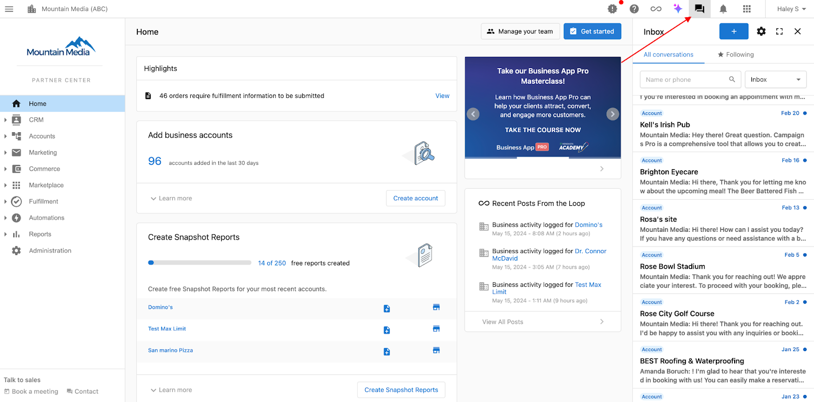
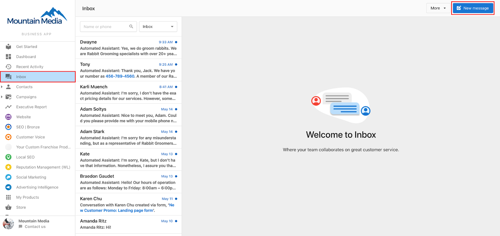
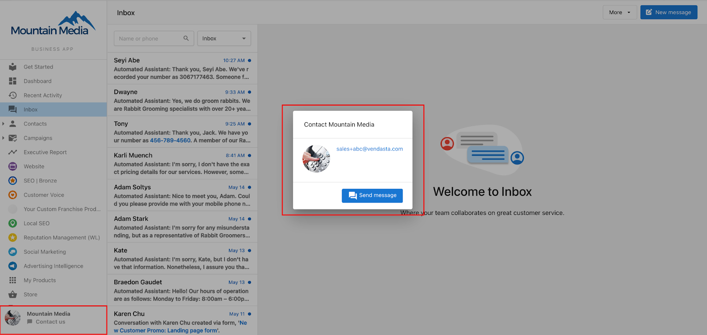
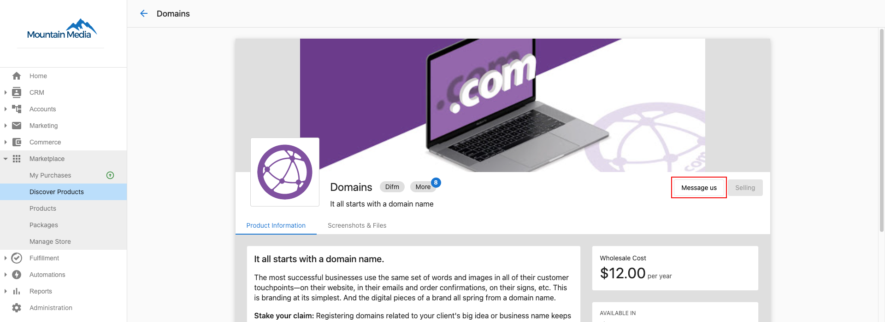
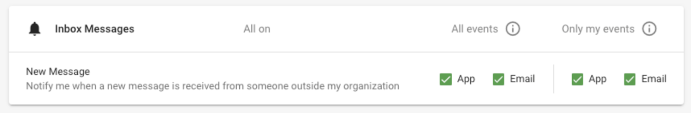
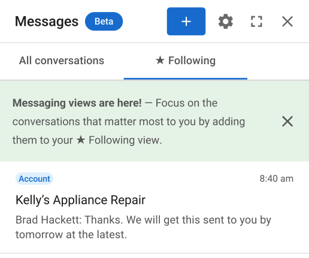

# Conversations in Partner Center

### **What is Conversations in Partner Center?**

Chat directly with your clients through Partner Center. Conversations lets you send and receive messages through the platform to your clients in Business App. You can communicate with everyone in the platform ecosystem - from your team members to client accounts, vendors, and Vendasta Account Managers.

### **Why is Conversations in Partner Center important?**

While email is still the most common form of business communication, managing client communications via email can be challenging, especially for large teams. Email threads become unwieldy, context gets lost, and team members can miss important details if they weren't cc'd.

Conversations solves these challenges with open shared channels that your entire team can access. Anyone on your team can pick up the chat and ensure clients get fast, top-tier service - even if someone is out sick or leaves your company.

You can also connect directly with Vendors for sales assistance and product support through the marketplace.

With SMS and AI-powered responses, Conversations becomes your powerful omni-channel tool—ensuring no message goes unanswered, no matter the channel.

### **How to use Conversations in Partner Center**

1. Start a conversation by clicking the message icon next to any account. A pop-up menu will show you a list of accounts to choose from.

2. Your clients will receive the message in **Business App > Conversations** along with an email notification. They can reply or start new messages.

**Client-to-Partner Messaging:** Your clients can reach you through the 'contact us' button in Business App. Make sure to enable notifications in Partner Center so you don't miss any chats. See "How to enable notifications" below for setup instructions.

**Vendor Communication:** Talk directly with Vendors using Conversations for product support and sales assistance. Vendors can help you with after-sales support and answer any questions about their products or services.

When a Vendor has chat support enabled, just click "Contact Us" on their Product Details page to start a conversation.

**Message with Vendasta:** Need to reach a Vendasta representative? Click the contact card in the bottom left of Partner Center navigation and select "Send Message."

### **How to Enable Conversations Notifications**

Stay on top of your communications by enabling notifications in Partner Center. Click the **Bell Icon**, then select the **Settings Gear**. Enable both "All events" and "Only my events" to make sure you don't miss any messages.

### **Automations**

Make your communication more efficient with automation triggers and actions. You can set up workflows to automatically respond when messages come in or send messages when specific events happen. [Learn more about automation options here.](./automations-available-for-conversations)

Features:
- Unlimited in-platform messaging
- Side-panel view that stays with you across all pages
- In-platform and email notifications
- File sharing
- Following view

### **Following View**

Focus on the conversations that matter most to you with the ★ Following view. When you follow a conversation, it appears in your personal following view and you can get notifications for new messages by enabling "Only My Events" in your notification settings.

### **How to Follow a Conversation**

Look for the star button (★) in the conversation header when you're in Partner Center, Task Manager, or Vendor Center. Click it to start following that conversation.

You'll automatically follow conversations in these cases:
- When you send a message in a conversation (you can unfollow anytime)
- When you're assigned as a Salesperson to an account (you'll follow all past and future conversations with that account)

**Why does my message notification link to different centers?**

We direct you to the most appropriate center based on your highest permission level:
1. Partner Center Admin, Vendor Center users → Partner Center
2. Digital Agent → Task Manager
3. Salesperson → Sales Center

### **Conversations in Business App**

Your clients can communicate with you through Business App at no extra cost. [Configure these settings](../../../administration/platform-settings/customize-business-app/customize-business-app) to customize or disable this feature.