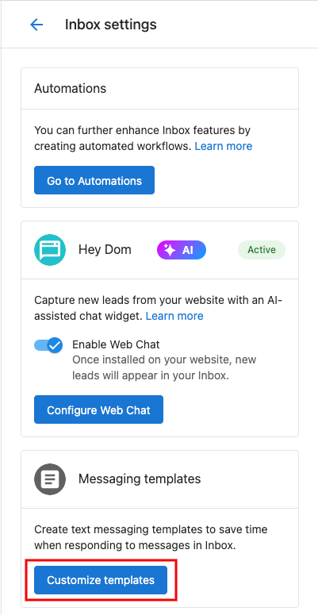
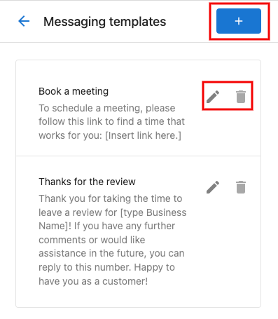
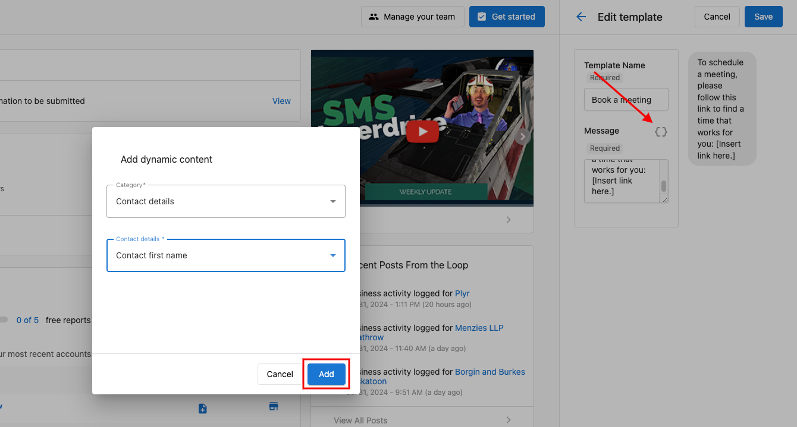
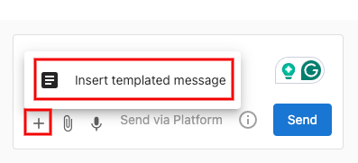
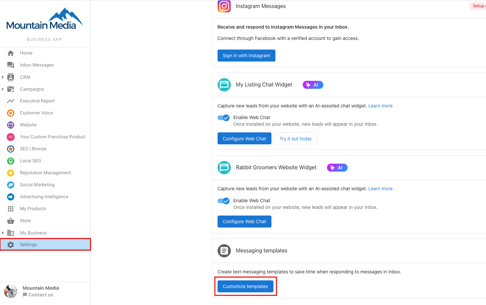

Save time and maintain consistency in your communications by creating reusable message templates. Add dynamic components to automatically personalize each message, making your responses both efficient and personal.

## Using Conversations Templates

Here's how to set up and use message templates:

1. Go to **Partner Center > Conversations > Settings > Customize Templates**

2. Create new templates, edit existing ones, or remove unused templates using the trash icon

3. Make your templates dynamic by clicking the dynamic component icon in the editor. Choose your components and click **Add**

4. To use a template while messaging, click the + button at the bottom of your message composer and select "Insert Templated Message"

## Business App Templates

Need to customize templates in Business App? Follow the same steps under **Business App > Administration > Conversations Settings > Customize Templates**

